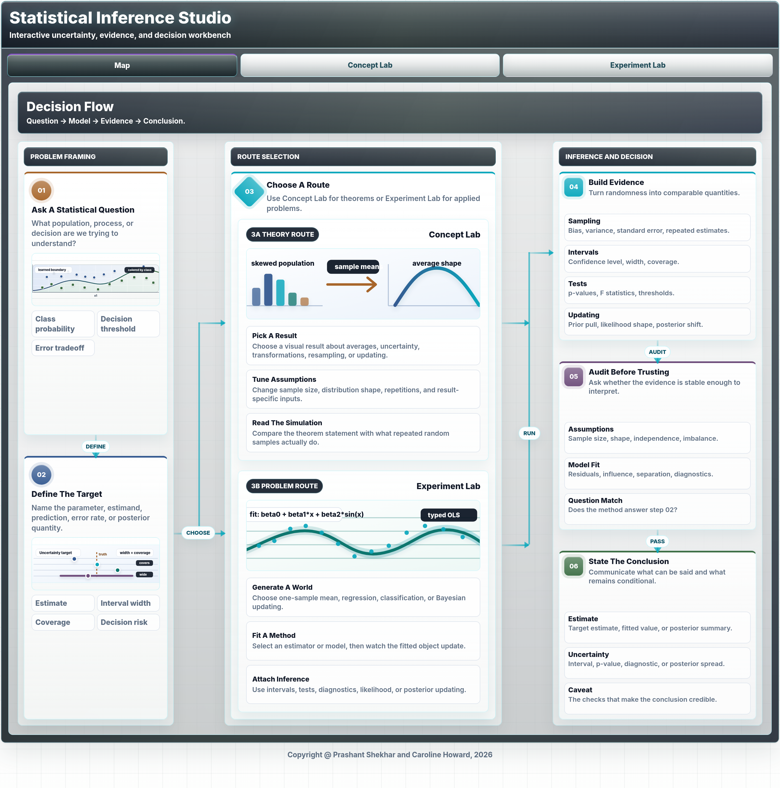
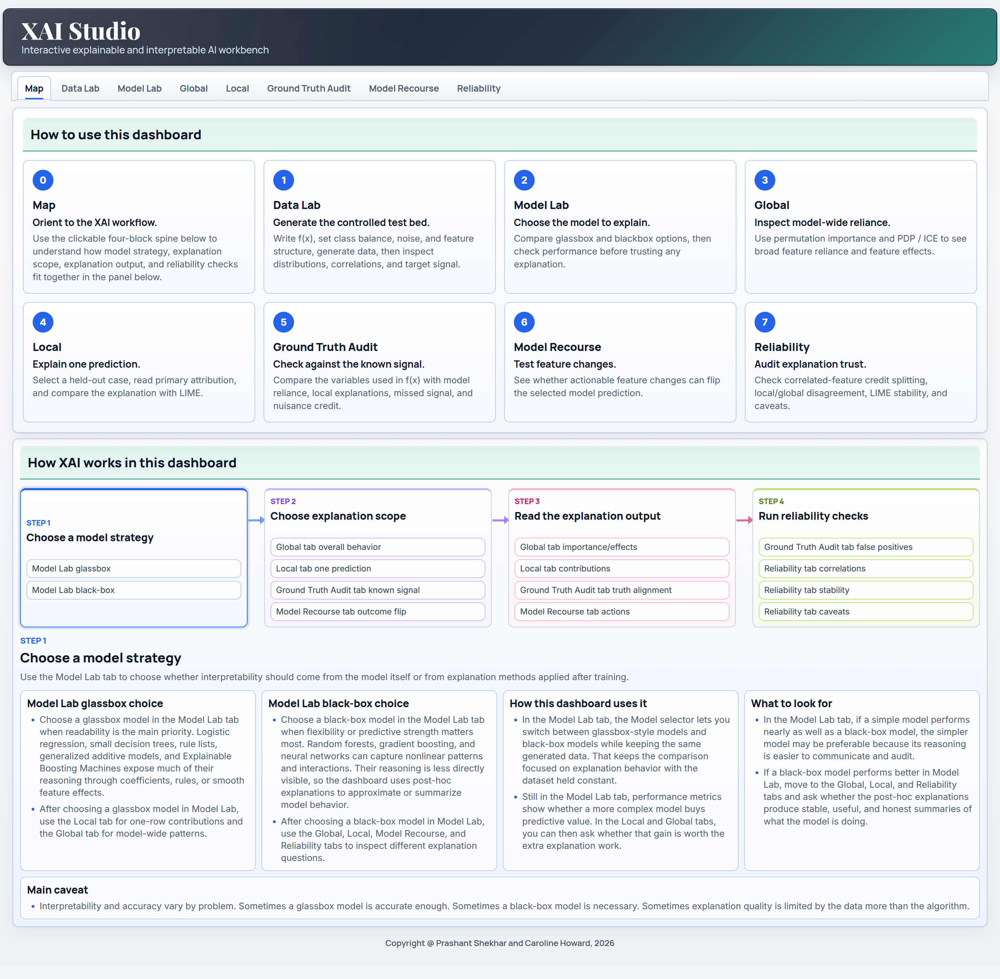
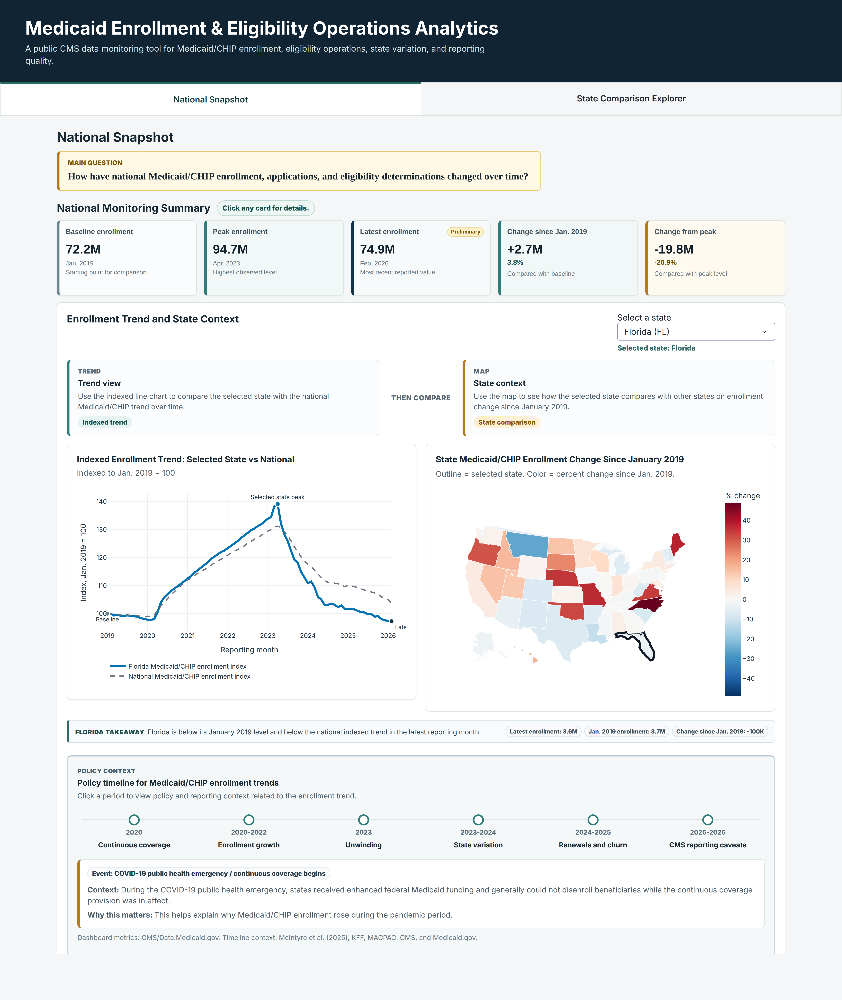

These dashboards turn the same agenda behind my courses and projects into live, public tools. They let readers change assumptions, inspect simulations, compare methods, and connect statistical or machine-learning output to interpretation, uncertainty, and decision quality.

::: {.resource-opening}
**The dashboards are hosted as public web apps, including Hugging Face Spaces. They are meant to make abstract methods inspectable, interactive, and easier to teach.**
:::

## Statistical Inference Studio

::: {.dashboard-preview-row}
<figure class="dashboard-preview-figure">

<figcaption>Figure: Interactive statistical inference studio for connecting data-generating assumptions, repeated sampling, uncertainty, and decision interpretation.</figcaption>
</figure>

::: {.dashboard-preview-copy}
Statistical Inference Studio is an interactive dashboard for teaching statistical inference through simulations and guided visual explanations. It is designed around the habit I emphasize in decision science: define the target, study sampling behavior, quantify uncertainty, evaluate evidence, and then translate results into an action or recommendation.

The dashboard includes a map of the inference workflow, a Concept Lab for core results, and an Experiment Lab for simulation-based investigation. The Concept Lab covers ideas such as the law of large numbers, central limit theorem, standard errors, consistency, the t distribution, chi-square variance results, the delta method, bootstrap logic, Bayes rule, and multiple testing. The Experiment Lab makes repeated-sampling behavior visible across regression and classification settings, so learners can see the difference between raw data, estimators, sampling distributions, intervals, tests, power, likelihood, and model diagnostics.

::: {.dashboard-methods}
Best use: teaching, self-study, simulation-based intuition, uncertainty communication, and checking whether an inference statement answers the decision question being asked.
:::

::: {.dashboard-actions}
[Open dashboard](https://p-shekhar-statistical-inference-studio.hf.space){.btn .btn-primary target="_blank" rel="noopener noreferrer"}
:::
:::
:::

## XAI Studio

::: {.dashboard-preview-row}
<figure class="dashboard-preview-figure">

<figcaption>Figure: Interactive XAI studio for comparing glassbox models, black-box models, global explanations, local explanations, recourse, and reliability checks.</figcaption>
</figure>

::: {.dashboard-preview-copy}
XAI Studio is an interactive explainable and interpretable AI workbench built with Dash. It uses a controlled generated classification problem as lab material, which makes it possible to compare explanation methods against known signal and evaluate how well each explanation reflects the underlying data-generating structure.

The dashboard walks through the main interpretation decisions an analyst has to make. Users can choose a model strategy, compare glassbox and black-box behavior, inspect global feature importance, read PDP and ICE curves, analyze local attributions with SHAP-style or coefficient-based explanations, compare LIME with the primary local explanation, audit against the generated ground truth, search for model recourse, and review reliability issues such as correlated features, local-global disagreement, and LIME stability.

::: {.dashboard-methods}
Best use: interpretable ML teaching, XAI method comparison, model audit demonstrations, recourse discussion, and reliability-first explanation workflows.
:::

::: {.dashboard-actions}
[Open dashboard](https://p-shekhar-xai-studio.hf.space){.btn .btn-primary target="_blank" rel="noopener noreferrer"}
:::
:::
:::

## Medicaid Operations Analytics

::: {.dashboard-preview-row}
<figure class="dashboard-preview-figure">

<figcaption>Figure: Medicaid and CHIP operations dashboard for monitoring enrollment trends, eligibility activity, state-level variation, and reporting context.</figcaption>
</figure>

::: {.dashboard-preview-copy}
Medicaid Enrollment and Eligibility Operations Analytics is a public Plotly dashboard built around CMS Medicaid and CHIP reporting data. It translates a large administrative time series into a decision-oriented monitoring workflow: national trend summaries, state comparison, indexed enrollment changes, policy context, and reporting caveats are placed on the same screen so the reader can separate signal from operational noise.

The dashboard is designed for public-sector analytics, health policy monitoring, and operational interpretation. Users can compare a selected state with the national trend, inspect how enrollment has changed since January 2019, and connect observed movement to policy periods such as continuous coverage, unwinding, renewals, and churn. The dashboard makes the analytic chain visible by showing what changed, where it changed, how large the change is, and how policy context should shape the interpretation.

::: {.dashboard-methods}
Best use: public data monitoring, state comparison, policy-context teaching, health operations analytics, and communicating uncertainty around administrative reporting.
:::

::: {.dashboard-actions}
[Open dashboard](https://carolinehoward-medicaid-enrollment-policy-dashboard.hf.space/){.btn .btn-primary target="_blank" rel="noopener noreferrer"}
:::
:::
:::
