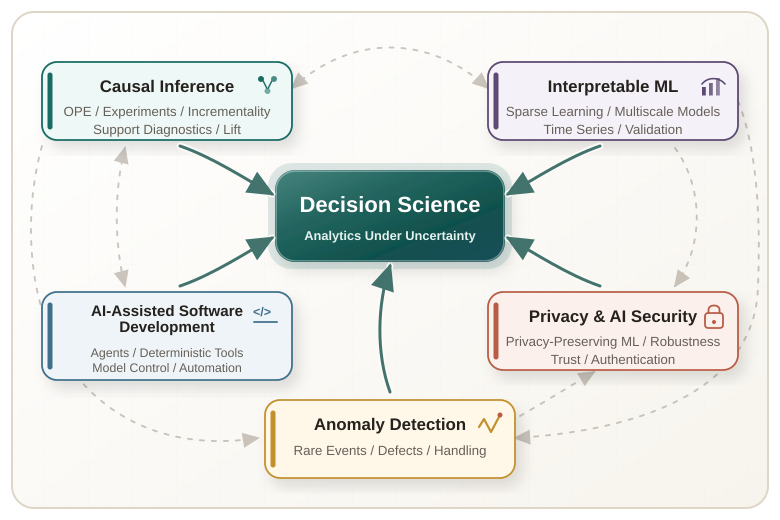
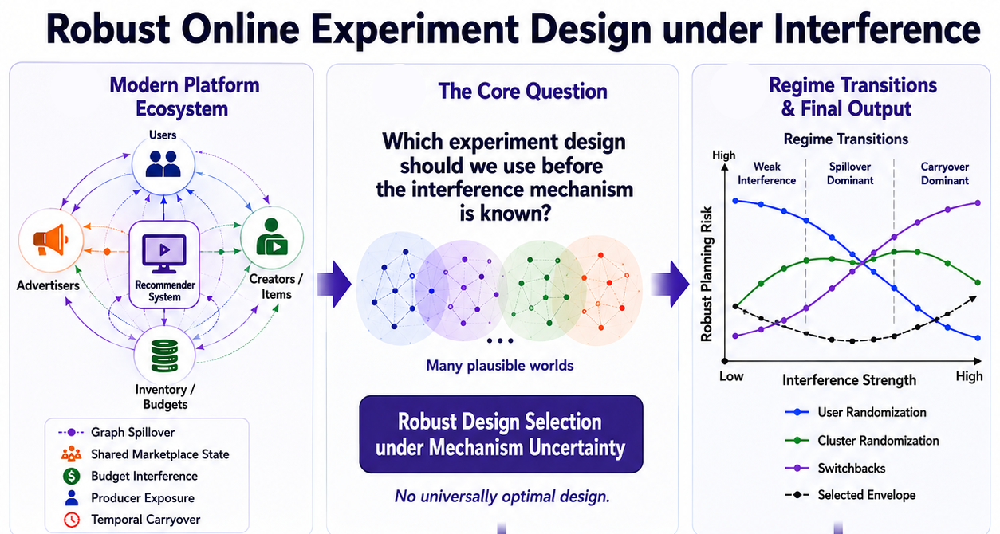
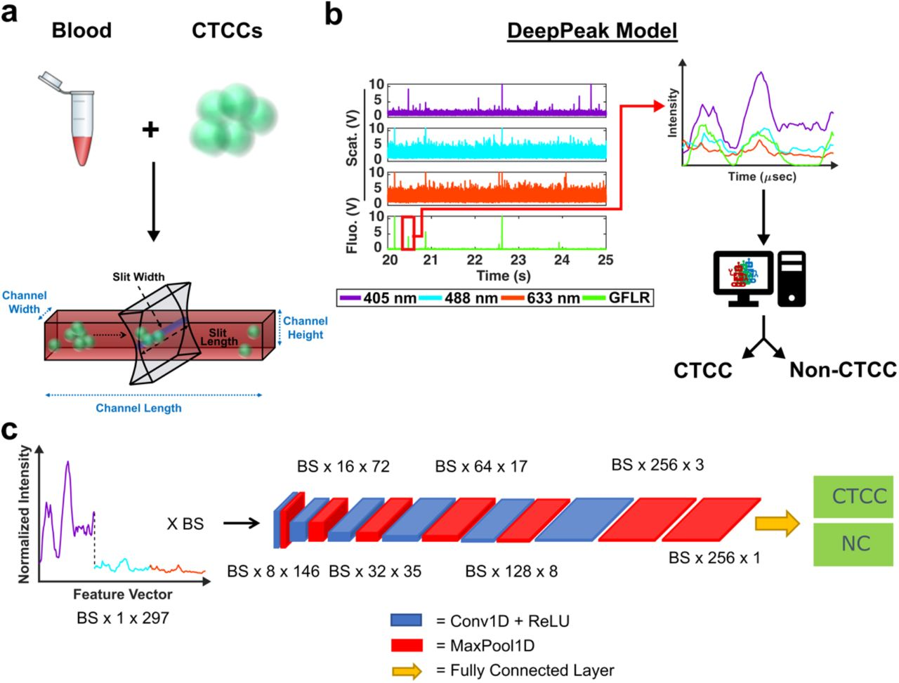

```{=html}
<section class="home-intro">
  <div class="intro-copy">
    <h1>Causal, ML, and AI Systems for Decision Science</h1>
    <p>I am an Assistant Professor of Data Science and Mathematics at <a href="https://erau.edu/" target="_blank" rel="noopener noreferrer">Embry-Riddle Aeronautical University</a>. My work brings causal inference, interpretable machine learning, privacy-aware AI, anomaly detection, and AI-assisted software systems together for analytics under uncertainty.</p>
    <div class="intro-actions">
      <a class="btn btn-primary" href="projects/">View Projects</a>
      <a class="btn btn-outline btn-icon" href="https://scholar.google.com/citations?hl=en&user=Xt9-KRIAAAAJ&view_op=list_works&sortby=pubdate" target="_blank" rel="noopener noreferrer">Google Scholar</a>
    </div>
  </div>
  <figure class="decision-graphic-wrap">
    
  </figure>
</section>
```

## What I Build

::: {.home-build-grid}
::: {.home-build-card}
### Causal and Statistical Decision Systems

Causal measurement and policy evaluation for advertising, marketplaces, auctions, pricing, recommendations, and ranking systems, using experiments, off-policy evaluation, difference-in-differences, synthetic controls, incrementality analysis, and uncertainty quantification.
:::

::: {.home-build-card}
### Interpretable and Reliable ML Systems

Machine learning for decision support that can be explained, validated, and stress-tested, using transparent models, feature attribution, forecasting, surrogate modeling, counterfactual explanations, and uncertainty quantification.
:::

::: {.home-build-card}
### Privacy-Aware and Secure AI Systems

Machine learning systems for privacy-sensitive and security-critical settings, where data leakage, adversarial risk, authentication, robustness, and deployment cost are part of the technical design.
:::

::: {.home-build-card}
### Anomaly Detection and Handling

Decision-oriented monitoring for rare events, defects, distribution shifts, biomedical signals, manufacturing inspection, and public data streams, with models designed to support reliable alerts.
:::
:::

## Representative Work

::: {.home-project-grid}
::: {.home-project-card}
<a class="home-project-image home-project-image-cover" href="projects/robust-online-experiment-design/">

</a>

### [Robust Online Experiment Design](projects/robust-online-experiment-design/)

Online experiments in ads, recommendations, and member-experience systems can fail when exposure propagates through budgets, inventory, graphs, or time. This project treats experiment design as a robust pre-launch decision under interference uncertainty.
:::

::: {.home-project-card}
<a class="home-project-image" href="projects/privacy-preserving-federated-learning/">

</a>

### [Privacy-Preserving Federated Learning](projects/privacy-preserving-federated-learning/)

Federated learning keeps raw data local, but gradients can still leak sensitive information. This work studies encrypted and selectively encrypted training workflows for distributed AI systems, and develops theoretical guarantees for risk quantification.
:::

::: {.home-project-card}
<a class="home-project-image home-project-image-extra-inset" href="projects/label-free-cancer-cell-detection/">

</a>

### [Label-Free Cancer Cell Detection](projects/label-free-cancer-cell-detection/)

Rare circulating tumor cell clusters are clinically meaningful but difficult to detect in whole blood. This project connects label-free flow-cytometry signals, machine learning, and threshold decisions for high-stakes rare-event detection.
:::

::: {.home-project-card}
<a class="home-project-image" href="projects/multiscale-basis-learning/">

</a>

### [Interpretable Multiscale Basis Learning](projects/multiscale-basis-learning/)

This work builds interpretable multiscale representations for scientific and engineering data, reducing complexity while preserving the structure needed for reliable prediction, approximation, and decision support.
:::
:::

[View all projects](projects/){.btn .btn-primary}

## Interactive Decision Tools

::: {.home-dashboard-grid}
::: {.home-dashboard-card}
<a class="home-dashboard-image" href="dashboards/#statistical-inference-studio">

</a>

### [Statistical Inference Studio](dashboards/#statistical-inference-studio)

An interactive dashboard for sampling behavior, intervals, tests, diagnostics, likelihood, Bayes rule, and uncertainty communication.
:::

::: {.home-dashboard-card}
<a class="home-dashboard-image" href="dashboards/#xai-studio">

</a>

### [XAI Studio](dashboards/#xai-studio)

A model-interpretability workbench for comparing glassbox models, black-box models, global explanations, local explanations, recourse, and reliability checks.
:::

::: {.home-dashboard-card}
<a class="home-dashboard-image" href="dashboards/#medicaid-operations-analytics">

</a>

### [Medicaid Operations Analytics](dashboards/#medicaid-operations-analytics)

A public CMS data dashboard for enrollment trends, state comparison, eligibility operations, reporting quality, and policy-context interpretation.
:::
:::

## My Lecture Notes and Tutorials

::: {.home-curriculum-grid}
::: {.home-curriculum-card}
### [Lecture Notes](notes/)

A structured curriculum in statistical inference, core causal inference, advanced causal inference, machine learning, and AI for decision science.
:::

::: {.home-curriculum-card}
### [Tutorials](tutorials/)

Applied Python tutorials for causal inference packages, with emphasis on estimands, assumptions, diagnostics, robustness, and reporting.
:::

::: {.home-curriculum-card}
### [Resources](resources.qmd)

A working library of books, software, datasets, and learning paths for students and collaborators interested in these topics.
:::
:::

## How I Approach Problems

```{=html}
<section class="home-workflow" aria-label="Evidence-to-decision workflow">
  <article class="home-workflow-step">
    <div class="home-workflow-marker">01</div>
    <h3>Question</h3>
    <p>Define the decision, estimand, and operational action before choosing a method.</p>
  </article>
  <article class="home-workflow-step">
    <div class="home-workflow-marker">02</div>
    <h3>Evidence</h3>
    <p>Map what the data can support, where it is thin, and which assumptions carry the argument.</p>
  </article>
  <article class="home-workflow-step">
    <div class="home-workflow-marker">03</div>
    <h3>Model</h3>
    <p>Use statistical, causal, or machine-learning structure that matches the decision problem.</p>
  </article>
  <article class="home-workflow-step">
    <div class="home-workflow-marker">04</div>
    <h3>Diagnostics</h3>
    <p>Stress-test support, uncertainty, sensitivity, robustness, and likely failure modes.</p>
  </article>
  <article class="home-workflow-step">
    <div class="home-workflow-marker">05</div>
    <h3>Decision</h3>
    <p>Turn the analysis into a recommendation, guardrail, launch rule, or next experiment.</p>
  </article>
  <div class="home-workflow-outcome">
    <span>Outcome</span>
    <strong>Defensible analytics for decisions under uncertainty</strong>
  </div>
</section>
```

## Working With Me

```{=html}
<section class="home-collab">
  
  <div class="home-collab-body">
    <p>I am interested in collaborations involving causal inference, interpretable machine learning, public-interest analytics, AI reliability, anomaly detection, and decision systems under uncertainty. Students, collaborators, and industry partners are welcome to reach out.</p>
    <div class="home-contact-actions" aria-label="Contact links">
      <a class="home-contact-link home-contact-primary" href="mailto:shekharp.erau@gmail.com"><i class="bi bi-envelope" aria-hidden="true"></i>Email</a>
      <a class="home-contact-link" href="https://www.linkedin.com/in/prashant-shekhar-36586a28/" target="_blank" rel="noopener noreferrer">LinkedIn</a>
      <a class="home-contact-link" href="https://scholar.google.com/citations?hl=en&user=Xt9-KRIAAAAJ&view_op=list_works&sortby=pubdate" target="_blank" rel="noopener noreferrer">Google Scholar</a>
      <a class="home-contact-link" href="https://github.com/p-shekhar" target="_blank" rel="noopener noreferrer"><i class="bi bi-github" aria-hidden="true"></i>GitHub</a>
    </div>
  </div>
</section>
```
