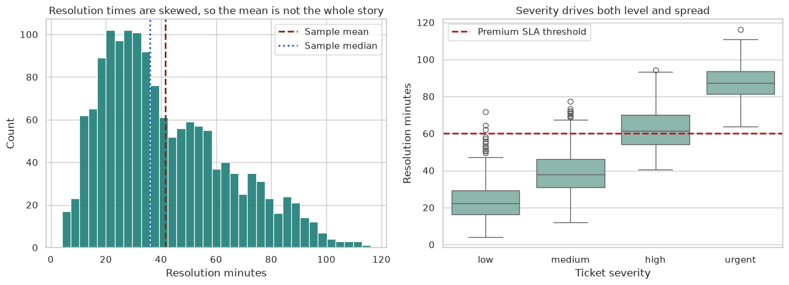
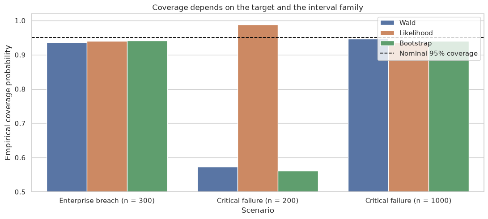

Statistical Inference is the entry point for the lecture curriculum. It builds the quantitative habits needed for later causal, machine-learning, and AI courses, including careful data description, uncertainty reasoning, assumption checks, and evidence-to-decision translation.

This module is designed for readers who want statistical work to feel connected to action. The first course builds the language of data, variation, bias, and modeling. The second course turns that language into formal inference, where likelihoods, intervals, tests, Bayesian updating, and decision reports support defensible analysis.

The two courses work as a pair. One trains the eye to see structure in data. The other trains the judgment to recognize where evidence is strong, weak, or incomplete.

<article class="course-preview-row">
<h2><a href="statistical-foundations-data-science/"><strong>Course 1:</strong> Statistical Foundations for Data Science</a></h2>
<figure class="course-preview-figure">

<figcaption>Figure: A skewed service-resolution distribution used to show why summary statistics need context before they become decision evidence (adapted from Lecture 04: Distributions, Variability, and Tail Risk).</figcaption>
</figure>

This course builds the habits behind responsible data analysis. It covers units and variables, randomness, distributions, sampling problems, simulation, and careful communication about what a model can support.

</article>
<article class="course-preview-row">
<h2><a href="statistical-inference-decision-science/"><strong>Course 2:</strong> Statistical Inference for Decision Science</a></h2>
<figure class="course-preview-figure">

<figcaption>Figure: Empirical interval coverage across scenarios, illustrating that uncertainty methods must be matched to the decision setting (adapted from Lecture 04: Confidence Intervals: Wald, Likelihood, and Bootstrap).</figcaption>
</figure>

This course moves from descriptive analysis to evidence claims. It covers likelihood, uncertainty intervals, testing, resampling, regression inference, Bayesian updating, missing data, model checking, and value-of-information reasoning.

</article>

