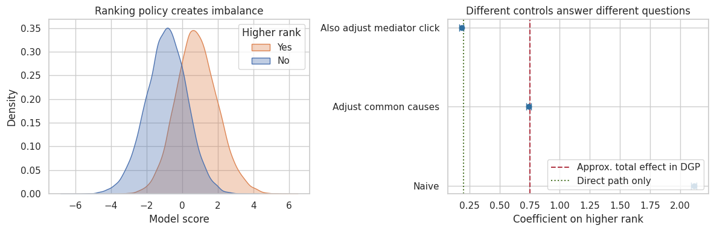
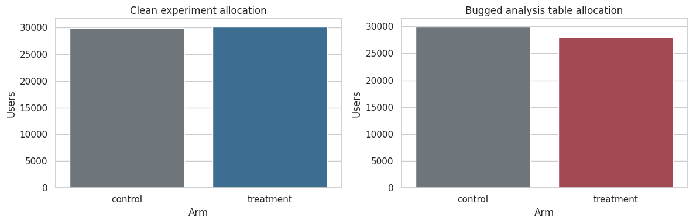
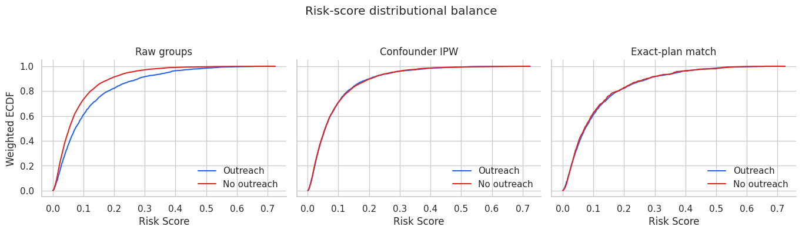
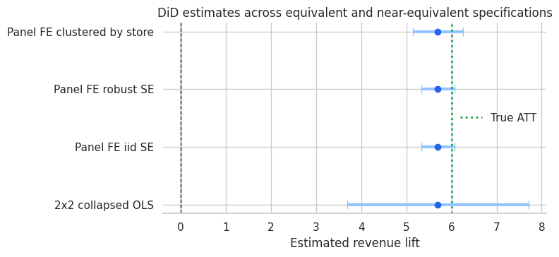

Core Causal Inference is the backbone of the lecture curriculum. It develops the conceptual grammar needed for the rest of the site, including causal questions, interventions, estimands, randomization, credible adjustment, and quasi-experimental variation.

The sequence is split into four courses. Together they move from causal language to design practice. The reader first learns how to define the question, then how to create evidence through experiments, how to repair observational comparisons, and how to use policy variation in applied settings.

This module is the conceptual center of the site. Everything later, from causal ML to AI-assisted analysis, depends on getting this design logic right.

<article class="course-preview-row">
<h2><a href="foundations/"><strong>Course 1:</strong> Foundations of Causal Inference</a></h2>
<figure class="course-preview-figure">

<figcaption>Figure: A ranking-policy imbalance plot used to make confounding visible before any estimator is introduced (adapted from Lecture 08: Confounders, Mediators, Colliders, and Selection Bias).</figcaption>
</figure>

This course builds the language of causal reasoning, moving from interventions and potential outcomes to estimands, identification assumptions, DAGs, and common adjustment mistakes.

</article>
<article class="course-preview-row">
<h2><a href="experiments/"><strong>Course 2:</strong> Randomized Experiments and Product Experimentation</a></h2>
<figure class="course-preview-figure">

<figcaption>Figure: A clean-versus-bugged allocation diagnostic, showing why experiment validity depends on the assignment running as designed (adapted from Lecture 02: A/B Testing and Product Experimentation).</figcaption>
</figure>

This course treats randomized evidence as an operational workflow. It covers experiment design, power, guardrail metrics, clustered assignment, noncompliance, interference, and clear reporting for launch decisions.

</article>
<article class="course-preview-row">
<h2><a href="observational-adjustment/"><strong>Course 3:</strong> Observational Adjustment</a></h2>
<figure class="course-preview-figure">

<figcaption>Figure: Balance diagnostics across raw, weighted, and matched comparisons, showing how adjustment is audited visually (adapted from Lecture 05: Covariate Balance Diagnostics).</figcaption>
</figure>

When treatment assignment comes from observed behavior, credibility depends on measured confounding, overlap, and diagnostics. This course covers regression adjustment, propensity scores, matching, weighting, balance checks, doubly robust estimation, TMLE, and sensitivity analysis.

</article>
<article class="course-preview-row">
<h2><a href="quasi-experiments/"><strong>Course 4:</strong> Quasi-Experiments and Natural Experiments</a></h2>
<figure class="course-preview-figure">

<figcaption>Figure: DiD estimates across near-equivalent specifications, highlighting how design credibility is checked through specification comparisons (adapted from Lecture 01: Difference-in-Differences).</figcaption>
</figure>

This course studies designs that exploit timing, thresholds, instruments, shocks, or policy variation. Topics include difference-in-differences, event studies, staggered adoption, synthetic control, regression discontinuity, instrumental variables, encouragement designs, and interrupted time series.

</article>

