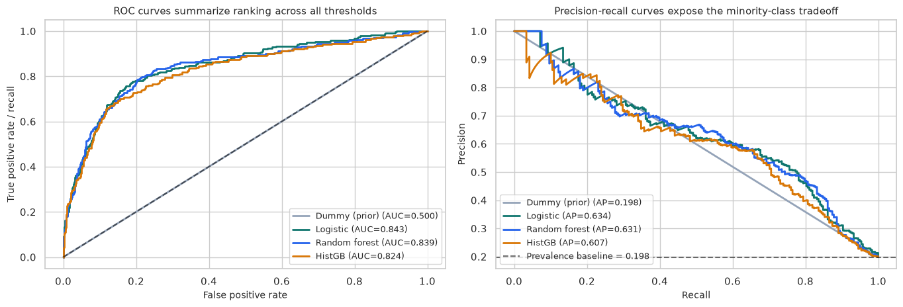
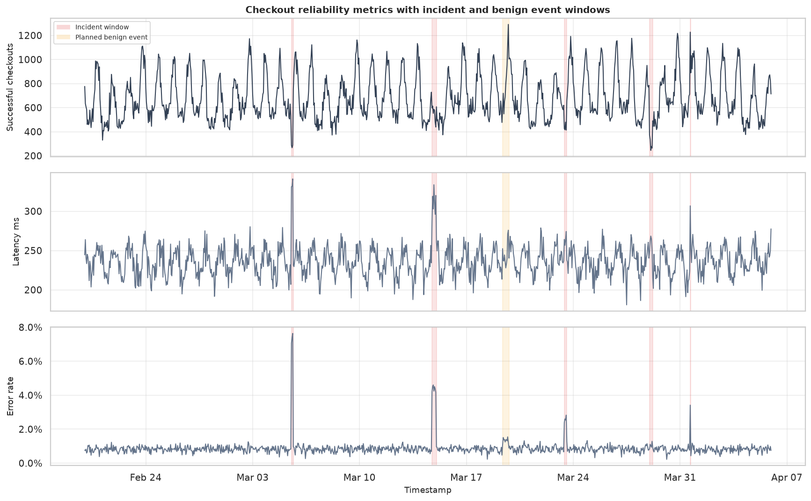
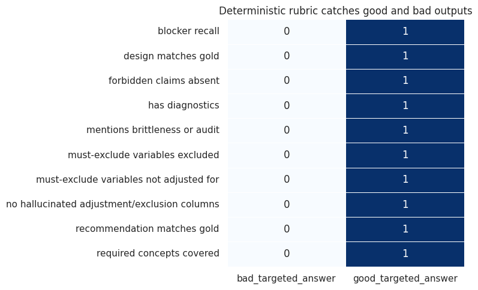

AI and Machine Learning complements the statistics and causal curriculum with courses on predictive modeling, explanation, anomaly detection, and AI-assisted causal work. The common theme is decision science: models are useful when they support auditable choices, expose uncertainty, and remain connected to operational guardrails.

The module has four courses. The first covers supervised and unsupervised machine learning foundations for operational decision systems. The second develops interpretable ML and XAI as reviewable explanation workflows. The third treats anomaly detection as a triage and monitoring problem. The fourth shows how LLMs, RAG, agents, and structured evaluation can assist causal analysts while preserving identification discipline.

The through-line is practical governance. A useful model can score, cluster, explain, detect, or draft while making uncertainty and failure modes visible enough for responsible use.

<article class="course-preview-row">
<h2><a href="machine-learning-basics-decision-science/"><strong>Course 1:</strong> Machine Learning Basics for Decision Science</a></h2>
<figure class="course-preview-figure">

<figcaption>Figure: ROC and precision-recall curves, used to connect model performance to threshold choice and operational cost (adapted from Lecture 09: Classification Metrics, Thresholds, and Confusion Matrices).</figcaption>
</figure>

A supervised and unsupervised learning course for decision systems, covering framing, leakage, baselines, regularization, trees, metrics, calibration, clustering, monitoring, and guardrails.

</article>
<article class="course-preview-row">
<h2><a href="interpretable-ml-and-xai/"><strong>Course 2:</strong> Interpretable ML and XAI</a></h2>
<figure class="course-preview-figure">

<figcaption>Figure: SHAP attribution under different baselines, showing how explanation choices affect the story a model appears to tell (adapted from Lecture 08: SHAP Values: Intuition, Computation, and Failure Modes).</figcaption>
</figure>

A mathematically grounded interpretability course covering transparent baselines, feature effects, SHAP, LIME, recourse, explanation stability, fairness, governance, and stakeholder communication.

</article>
<article class="course-preview-row">
<h2><a href="anomaly-detection-decision-systems/"><strong>Course 3:</strong> Anomaly Detection for Decision Systems</a></h2>
<figure class="course-preview-figure">

<figcaption>Figure: Incident windows on checkout reliability metrics, showing why anomaly detection is a monitoring and triage workflow (adapted from Lecture 10: Time-Series Anomaly Detection).</figcaption>
</figure>

A decision-focused anomaly detection course covering statistical detectors, distance and density methods, isolation forests, reconstruction, time series, thresholds, triage, root-cause analysis, and governance.

</article>
<article class="course-preview-row">
<h2><a href="ai-for-causal-inference/"><strong>Course 4:</strong> AI for Causal Inference</a></h2>
<figure class="course-preview-figure">

<figcaption>Figure: An evaluation rubric heatmap for AI-generated causal outputs, emphasizing auditability over novelty (adapted from Lecture 22: Evaluating AI Outputs in Causal Workflows).</figcaption>
</figure>

A course on using local LLMs, RAG, structured outputs, agents, diagnostics, code generation, sensitivity workflows, and evaluation to support causal analysts while preserving identification judgment.

</article>

