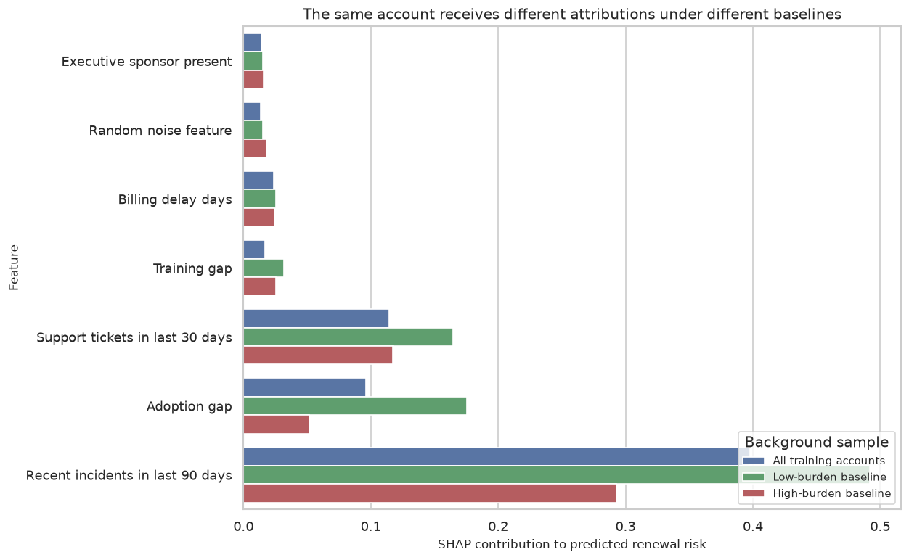

This course treats interpretability as part of the model governance workflow. Explanations are studied as objects that need mathematical grounding, stability checks, causal caution, and clear communication.

By the end, a reader should be able to use transparent models as baselines, read feature effects and interaction patterns, compare SHAP and LIME-style explanations, assess recourse, evaluate explanation stability, and communicate model behavior with appropriate caution about what explanations prove.

::: {.course-page-figure}

{fig-alt="SHAP attribution comparison under different baselines"}

:::

## Lecture Sequence

<article class="notebook-guide-item">

<a href="../../../notebooks/lectures/03_ai_machine_learning/02_interpretable_ml_and_xai/01_why_interpretability_matters_in_decision_systems.html" data-site-path="notebooks/lectures/03_ai_machine_learning/02_interpretable_ml_and_xai/01_why_interpretability_matters_in_decision_systems.html">01. Why Interpretability Matters in Decision Systems</a>

This lecture connects Why Interpretability Matters in Decision Systems to model behavior, explanation stability, stakeholder review, and decision limits.

</article>
<article class="notebook-guide-item">

<a href="../../../notebooks/lectures/03_ai_machine_learning/02_interpretable_ml_and_xai/02_transparent_models_as_first_class_baselines.html" data-site-path="notebooks/lectures/03_ai_machine_learning/02_interpretable_ml_and_xai/02_transparent_models_as_first_class_baselines.html">02. Transparent Models as First-Class Baselines</a>

This lecture develops Transparent Models as First-Class Baselines with examples that make assumptions, diagnostics, and interpretation visible.

</article>
<article class="notebook-guide-item">

<a href="../../../notebooks/lectures/03_ai_machine_learning/02_interpretable_ml_and_xai/03_reading_models_coefficients_odds_ratios_and_response_surfaces.html" data-site-path="notebooks/lectures/03_ai_machine_learning/02_interpretable_ml_and_xai/03_reading_models_coefficients_odds_ratios_and_response_surfaces.html">03. Reading Models: Coefficients, Odds Ratios, and Response Surfaces</a>

This lecture uses Reading Models: Coefficients, Odds Ratios, and Response Surfaces to clarify the analyst's question, evidence, assumptions, and decision implications.

</article>
<article class="notebook-guide-item">

<a href="../../../notebooks/lectures/03_ai_machine_learning/02_interpretable_ml_and_xai/04_shape_constraints_monotonicity_and_business_logic.html" data-site-path="notebooks/lectures/03_ai_machine_learning/02_interpretable_ml_and_xai/04_shape_constraints_monotonicity_and_business_logic.html">04. Shape Constraints, Monotonicity, and Business Logic</a>

This lecture connects shape constraints and monotonicity to business logic, plausibility, and model review.

</article>
<article class="notebook-guide-item">

<a href="../../../notebooks/lectures/03_ai_machine_learning/02_interpretable_ml_and_xai/05_tree_models_path_logic_and_segment_rules.html" data-site-path="notebooks/lectures/03_ai_machine_learning/02_interpretable_ml_and_xai/05_tree_models_path_logic_and_segment_rules.html">05. Tree Models, Path Logic, and Segment Rules</a>

This lecture frames Tree Models, Path Logic, and Segment Rules as a decision problem and asks what evidence can be trusted, challenged, and communicated.

</article>
<article class="notebook-guide-item">

<a href="../../../notebooks/lectures/03_ai_machine_learning/02_interpretable_ml_and_xai/06_global_explanations_partial_dependence_ice_and_ale.html" data-site-path="notebooks/lectures/03_ai_machine_learning/02_interpretable_ml_and_xai/06_global_explanations_partial_dependence_ice_and_ale.html">06. Global Explanations: Partial Dependence, ICE, and ALE</a>

This lecture builds intuition for Global Explanations: Partial Dependence, ICE, and ALE and ties the result to model choice, uncertainty, and action.

</article>
<article class="notebook-guide-item">

<a href="../../../notebooks/lectures/03_ai_machine_learning/02_interpretable_ml_and_xai/07_permutation_importance_and_model_reliance.html" data-site-path="notebooks/lectures/03_ai_machine_learning/02_interpretable_ml_and_xai/07_permutation_importance_and_model_reliance.html">07. Permutation Importance and Model Reliance</a>

This lecture applies Permutation Importance and Model Reliance with emphasis on diagnostics, tradeoffs, and evidence limits.

</article>
<article class="notebook-guide-item">

<a href="../../../notebooks/lectures/03_ai_machine_learning/02_interpretable_ml_and_xai/08_shap_values_intuition_computation_and_failure_modes.html" data-site-path="notebooks/lectures/03_ai_machine_learning/02_interpretable_ml_and_xai/08_shap_values_intuition_computation_and_failure_modes.html">08. SHAP Values: Intuition, Computation, and Failure Modes</a>

This lecture develops SHAP Values: Intuition, Computation, and Failure Modes as a practical pattern for analysis, diagnostics, and decision support.

</article>
<article class="notebook-guide-item">

<a href="../../../notebooks/lectures/03_ai_machine_learning/02_interpretable_ml_and_xai/09_lime_local_surrogates_and_neighborhood_sensitivity.html" data-site-path="notebooks/lectures/03_ai_machine_learning/02_interpretable_ml_and_xai/09_lime_local_surrogates_and_neighborhood_sensitivity.html">09. LIME, Local Surrogates, and Neighborhood Sensitivity</a>

This lecture connects LIME, Local Surrogates, and Neighborhood Sensitivity to local explanation quality, stability, and review.

</article>
<article class="notebook-guide-item">

<a href="../../../notebooks/lectures/03_ai_machine_learning/02_interpretable_ml_and_xai/10_interactions_heterogeneity_and_nonlinear_structure.html" data-site-path="notebooks/lectures/03_ai_machine_learning/02_interpretable_ml_and_xai/10_interactions_heterogeneity_and_nonlinear_structure.html">10. Interactions, Heterogeneity, and Nonlinear Structure</a>

This lecture develops Interactions, Heterogeneity, and Nonlinear Structure with examples that make assumptions, diagnostics, and interpretation visible.

</article>
<article class="notebook-guide-item">

<a href="../../../notebooks/lectures/03_ai_machine_learning/02_interpretable_ml_and_xai/11_counterfactual_explanations_and_actionable_recourse.html" data-site-path="notebooks/lectures/03_ai_machine_learning/02_interpretable_ml_and_xai/11_counterfactual_explanations_and_actionable_recourse.html">11. Counterfactual Explanations and Actionable Recourse</a>

This lecture uses Counterfactual Explanations and Actionable Recourse to clarify the analyst's question, evidence, assumptions, and decision implications.

</article>
<article class="notebook-guide-item">

<a href="../../../notebooks/lectures/03_ai_machine_learning/02_interpretable_ml_and_xai/12_explaining_ranking_prioritization_and_policy_scores.html" data-site-path="notebooks/lectures/03_ai_machine_learning/02_interpretable_ml_and_xai/12_explaining_ranking_prioritization_and_policy_scores.html">12. Explaining Ranking, Prioritization, and Policy Scores</a>

This lecture studies ranking and prioritization scores through explanation, auditability, and decision impact.

</article>
<article class="notebook-guide-item">

<a href="../../../notebooks/lectures/03_ai_machine_learning/02_interpretable_ml_and_xai/13_explanation_stability_across_resamples_and_retrains.html" data-site-path="notebooks/lectures/03_ai_machine_learning/02_interpretable_ml_and_xai/13_explanation_stability_across_resamples_and_retrains.html">13. Explanation Stability Across Resamples and Retrains</a>

This lecture frames Explanation Stability Across Resamples and Retrains as a decision problem and asks what evidence can be trusted, challenged, and communicated.

</article>
<article class="notebook-guide-item">

<a href="../../../notebooks/lectures/03_ai_machine_learning/02_interpretable_ml_and_xai/14_when_explanations_conflict_with_causal_reasoning.html" data-site-path="notebooks/lectures/03_ai_machine_learning/02_interpretable_ml_and_xai/14_when_explanations_conflict_with_causal_reasoning.html">14. When Explanations Conflict with Causal Reasoning</a>

This lecture builds intuition for When Explanations Conflict with Causal Reasoning and ties the result to model choice, uncertainty, and action.

</article>
<article class="notebook-guide-item">

<a href="../../../notebooks/lectures/03_ai_machine_learning/02_interpretable_ml_and_xai/15_fairness_governance_and_auditability_of_explanations.html" data-site-path="notebooks/lectures/03_ai_machine_learning/02_interpretable_ml_and_xai/15_fairness_governance_and_auditability_of_explanations.html">15. Fairness, Governance, and Auditability of Explanations</a>

This lecture applies Fairness, Governance, and Auditability of Explanations with emphasis on diagnostics, tradeoffs, and evidence limits.

</article>
<article class="notebook-guide-item">

<a href="../../../notebooks/lectures/03_ai_machine_learning/02_interpretable_ml_and_xai/16_communicating_explanations_to_stakeholders.html" data-site-path="notebooks/lectures/03_ai_machine_learning/02_interpretable_ml_and_xai/16_communicating_explanations_to_stakeholders.html">16. Communicating Explanations to Stakeholders</a>

This lecture develops Communicating Explanations to Stakeholders as a practical pattern for analysis, diagnostics, and decision support.

</article>
<article class="notebook-guide-item">

<a href="../../../notebooks/lectures/03_ai_machine_learning/02_interpretable_ml_and_xai/17_capstone_an_interpretable_decision_pipeline.html" data-site-path="notebooks/lectures/03_ai_machine_learning/02_interpretable_ml_and_xai/17_capstone_an_interpretable_decision_pipeline.html">17. Capstone: An Interpretable Decision Pipeline</a>

Brings the interpretability course together through a full decision pipeline with model review, explanation, and communication.

</article>

