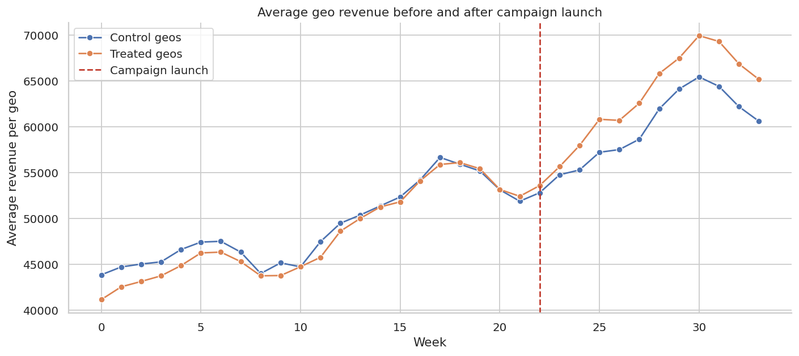

This course translates causal designs into the decisions companies actually make. The examples are framed around marketing incrementality, pricing, recommendations, retention, feature rollouts, marketplaces, policy settings, and the final step that often matters most: turning an estimate into a decision memo.

The objective is to show how causal inference becomes operational work. By the end of the course, a reader should be able to map business questions to estimands, choose designs that match available variation, identify the operational constraints around launch decisions, and communicate results in a way that separates evidence, assumptions, risks, and recommendations.

::: {.course-page-figure}

{fig-alt="Revenue trend before and after a campaign launch"}

:::

## Lecture Sequence

<article class="notebook-guide-item">

<a href="../../notebooks/lectures/02_advanced_causal_inference/02_industry_applications/01_marketing_incrementality.html" data-site-path="notebooks/lectures/02_advanced_causal_inference/02_industry_applications/01_marketing_incrementality.html">01. Marketing Incrementality</a>

This lecture connects Marketing Incrementality to business context, estimand choice, diagnostics, tradeoffs, and recommendation quality.

</article>
<article class="notebook-guide-item">

<a href="../../notebooks/lectures/02_advanced_causal_inference/02_industry_applications/02_pricing_and_promotions.html" data-site-path="notebooks/lectures/02_advanced_causal_inference/02_industry_applications/02_pricing_and_promotions.html">02. Pricing and Promotions</a>

This lecture develops Pricing and Promotions with examples that make assumptions, diagnostics, and interpretation visible.

</article>
<article class="notebook-guide-item">

<a href="../../notebooks/lectures/02_advanced_causal_inference/02_industry_applications/03_recommendation_systems_and_ranking.html" data-site-path="notebooks/lectures/02_advanced_causal_inference/02_industry_applications/03_recommendation_systems_and_ranking.html">03. Recommendation Systems and Ranking</a>

This lecture uses Recommendation Systems and Ranking to clarify the analyst's question, evidence, assumptions, and decision implications.

</article>
<article class="notebook-guide-item">

<a href="../../notebooks/lectures/02_advanced_causal_inference/02_industry_applications/04_customer_retention_and_churn_interventions.html" data-site-path="notebooks/lectures/02_advanced_causal_inference/02_industry_applications/04_customer_retention_and_churn_interventions.html">04. Customer Retention and Churn Interventions</a>

This lecture connects retention and churn interventions to targeting, timing, treatment cost, and customer-level decision rules.

</article>
<article class="notebook-guide-item">

<a href="../../notebooks/lectures/02_advanced_causal_inference/02_industry_applications/05_product_launches_and_feature_rollouts.html" data-site-path="notebooks/lectures/02_advanced_causal_inference/02_industry_applications/05_product_launches_and_feature_rollouts.html">05. Product Launches and Feature Rollouts</a>

This lecture frames Product Launches and Feature Rollouts as a decision problem and asks what evidence can be trusted, challenged, and communicated.

</article>
<article class="notebook-guide-item">

<a href="../../notebooks/lectures/02_advanced_causal_inference/02_industry_applications/06_marketplace_and_platform_interventions.html" data-site-path="notebooks/lectures/02_advanced_causal_inference/02_industry_applications/06_marketplace_and_platform_interventions.html">06. Marketplace and Platform Interventions</a>

This lecture builds intuition for Marketplace and Platform Interventions and ties the result to model choice, uncertainty, and action.

</article>
<article class="notebook-guide-item">

<a href="../../notebooks/lectures/02_advanced_causal_inference/02_industry_applications/07_health_education_and_policy_applications.html" data-site-path="notebooks/lectures/02_advanced_causal_inference/02_industry_applications/07_health_education_and_policy_applications.html">07. Health, Education, and Policy Applications</a>

This lecture applies Health, Education, and Policy Applications with emphasis on diagnostics, tradeoffs, and evidence limits.

</article>
<article class="notebook-guide-item">

<a href="../../notebooks/lectures/02_advanced_causal_inference/02_industry_applications/08_from_causal_estimate_to_decision_memo.html" data-site-path="notebooks/lectures/02_advanced_causal_inference/02_industry_applications/08_from_causal_estimate_to_decision_memo.html">08. From Causal Estimate to Decision Memo</a>

This lecture develops From Causal Estimate to Decision Memo as a practical pattern for analysis, diagnostics, and decision support.

</article>

