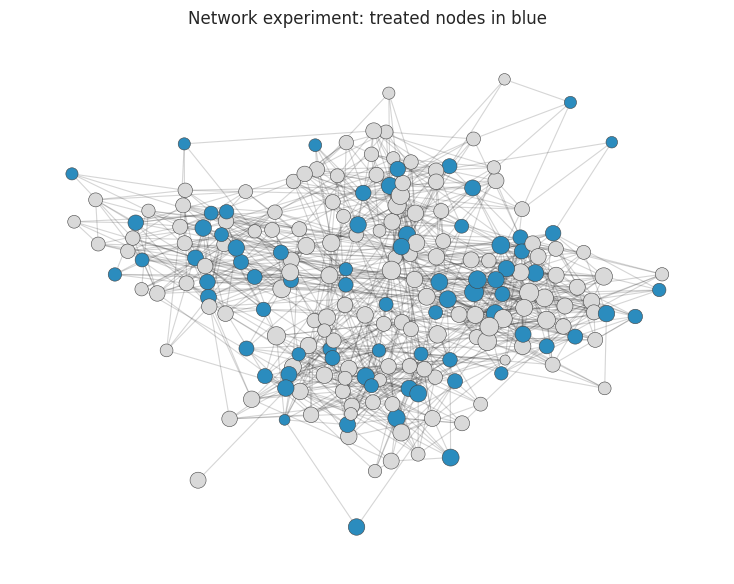

This course collects the advanced topics that separate routine effect estimation from mature causal practice. The focus is on the complications that appear once projects move beyond a clean single-treatment, single-outcome, no-missingness setting: mechanisms, principal strata, missing data, measurement error, generalization, interference, panels, discovery, Bayesian workflows, and AI-system complications.

The objective is to help readers diagnose where standard causal workflows bend or break. By the end of the course, a reader should be able to explain which complication is present, how it changes the estimand or identifying assumptions, which diagnostics are useful, and how to communicate uncertainty when the design remains credible despite imperfections.

::: {.course-page-figure}

{fig-alt="Network experiment plot with treated nodes highlighted"}

:::

## Lecture Sequence

<article class="notebook-guide-item">

<a href="../../notebooks/lectures/02_advanced_causal_inference/03_advanced_topics/01_mediation_analysis.html" data-site-path="notebooks/lectures/02_advanced_causal_inference/03_advanced_topics/01_mediation_analysis.html">01. Mediation Analysis</a>

This lecture connects Mediation Analysis to mechanisms, assumptions, and uncertainty in causal explanation.

</article>
<article class="notebook-guide-item">

<a href="../../notebooks/lectures/02_advanced_causal_inference/03_advanced_topics/02_principal_stratification.html" data-site-path="notebooks/lectures/02_advanced_causal_inference/03_advanced_topics/02_principal_stratification.html">02. Principal Stratification</a>

This lecture develops Principal Stratification with examples that make assumptions, diagnostics, and interpretation visible.

</article>
<article class="notebook-guide-item">

<a href="../../notebooks/lectures/02_advanced_causal_inference/03_advanced_topics/03_missing_data_and_causal_inference.html" data-site-path="notebooks/lectures/02_advanced_causal_inference/03_advanced_topics/03_missing_data_and_causal_inference.html">03. Missing Data and Causal Inference</a>

This lecture uses Missing Data and Causal Inference to clarify the analyst's question, evidence, assumptions, and decision implications.

</article>
<article class="notebook-guide-item">

<a href="../../notebooks/lectures/02_advanced_causal_inference/03_advanced_topics/04_measurement_error.html" data-site-path="notebooks/lectures/02_advanced_causal_inference/03_advanced_topics/04_measurement_error.html">04. Measurement Error</a>

This lecture studies measurement error as a threat to estimands, identification, and uncertainty interpretation.

</article>
<article class="notebook-guide-item">

<a href="../../notebooks/lectures/02_advanced_causal_inference/03_advanced_topics/05_transportability_and_external_validity.html" data-site-path="notebooks/lectures/02_advanced_causal_inference/03_advanced_topics/05_transportability_and_external_validity.html">05. Transportability and External Validity</a>

This lecture frames Transportability and External Validity as a decision problem and asks what evidence can be trusted, challenged, and communicated.

</article>
<article class="notebook-guide-item">

<a href="../../notebooks/lectures/02_advanced_causal_inference/03_advanced_topics/06_interference_and_spillovers.html" data-site-path="notebooks/lectures/02_advanced_causal_inference/03_advanced_topics/06_interference_and_spillovers.html">06. Interference and Spillovers</a>

This lecture builds intuition for Interference and Spillovers and ties the result to model choice, uncertainty, and action.

</article>
<article class="notebook-guide-item">

<a href="../../notebooks/lectures/02_advanced_causal_inference/03_advanced_topics/07_panel_data_complications.html" data-site-path="notebooks/lectures/02_advanced_causal_inference/03_advanced_topics/07_panel_data_complications.html">07. Panel Data Complications</a>

This lecture applies Panel Data Complications with emphasis on diagnostics, tradeoffs, and evidence limits.

</article>
<article class="notebook-guide-item">

<a href="../../notebooks/lectures/02_advanced_causal_inference/03_advanced_topics/08_causal_discovery_with_caveats.html" data-site-path="notebooks/lectures/02_advanced_causal_inference/03_advanced_topics/08_causal_discovery_with_caveats.html">08. Causal Discovery, With Caveats</a>

This lecture develops Causal Discovery, With Caveats as a practical pattern for analysis, diagnostics, and decision support.

</article>
<article class="notebook-guide-item">

<a href="../../notebooks/lectures/02_advanced_causal_inference/03_advanced_topics/09_bayesian_causal_inference.html" data-site-path="notebooks/lectures/02_advanced_causal_inference/03_advanced_topics/09_bayesian_causal_inference.html">09. Bayesian Causal Inference</a>

This lecture connects Bayesian Causal Inference to mechanisms, missingness, measurement, transport, interference, and uncertainty-aware reporting.

</article>
<article class="notebook-guide-item">

<a href="../../notebooks/lectures/02_advanced_causal_inference/03_advanced_topics/10_causal_inference_with_llm_ai_systems.html" data-site-path="notebooks/lectures/02_advanced_causal_inference/03_advanced_topics/10_causal_inference_with_llm_ai_systems.html">10. Causal Inference with LLM and AI Systems</a>

This lecture develops Causal Inference with LLM and AI Systems with examples that make assumptions, diagnostics, and interpretation visible.

</article>

