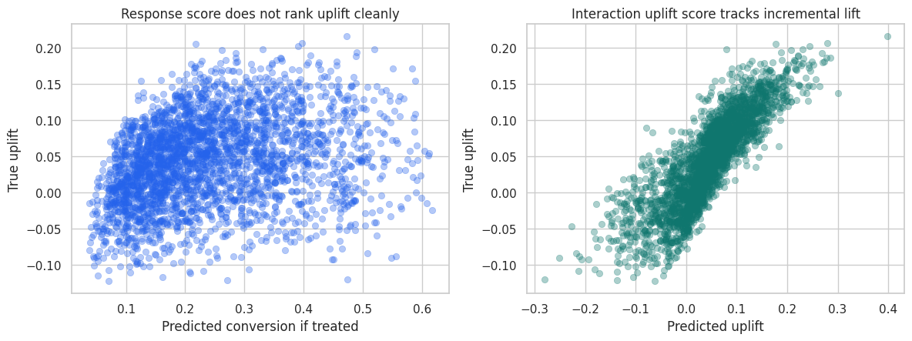

Advanced Causal Inference is the second major module in the lecture sequence. It assumes the reader has worked through the core causal inference material, then moves toward the professional settings where causal work becomes more technical, more operational, and more decision-facing.

The module has three courses. Causal Machine Learning covers modern estimation and policy-learning workflows once the estimand is clear. Industry Applications shows how causal designs map to product, marketing, marketplace, and policy decisions. Advanced Topics covers the complications that mature causal projects must confront, including mechanisms, missingness, measurement error, transportability, interference, panels, discovery, Bayesian workflows, and AI-system complications.

Here the goal is to estimate effects and decide which effect matters, which method is credible, and how the result changes a real decision.

<article class="course-preview-row">
<h2><a href="../02-causal-machine-learning/"><strong>Course 1:</strong> Causal Machine Learning</a></h2>
<figure class="course-preview-figure">

<figcaption>Figure: Predicted uplift against true uplift, showing why causal ML is judged by treatment-effect recovery and policy value (adapted from Lecture 02: CATE and Uplift Modeling).</figcaption>
</figure>

This course focuses on heterogeneous treatment effects, CATE and uplift modeling, meta-learners, causal forests, Double ML, policy learning, treatment targeting, off-policy evaluation, and validation.

</article>
<article class="course-preview-row">
<h2><a href="../03-industry-applications/"><strong>Course 2:</strong> Industry Applications of Causal Inference</a></h2>
<figure class="course-preview-figure">

<figcaption>Figure: Campaign-launch revenue trends, connecting causal design to the kind of business question that teams actually face (adapted from Lecture 01: Marketing Incrementality).</figcaption>
</figure>

This course translates causal inference into applied decision workflows for marketing incrementality, pricing, promotions, ranking, retention, product launches, marketplaces, public-sector applications, and leadership decision summaries.

</article>
<article class="course-preview-row">
<h2><a href="../04-advanced-topics/"><strong>Course 3:</strong> Advanced Topics in Causal Inference</a></h2>
<figure class="course-preview-figure">

<figcaption>Figure: A network experiment where spillovers make the usual independent-unit assumption visibly fragile (adapted from Lecture 06: Interference and Spillovers).</figcaption>
</figure>

This course studies the issues that make advanced causal projects difficult: mediation, principal stratification, missing data, measurement error, transportability, interference, panel complications, causal discovery, Bayesian causal inference, and AI-system complications.

</article>

