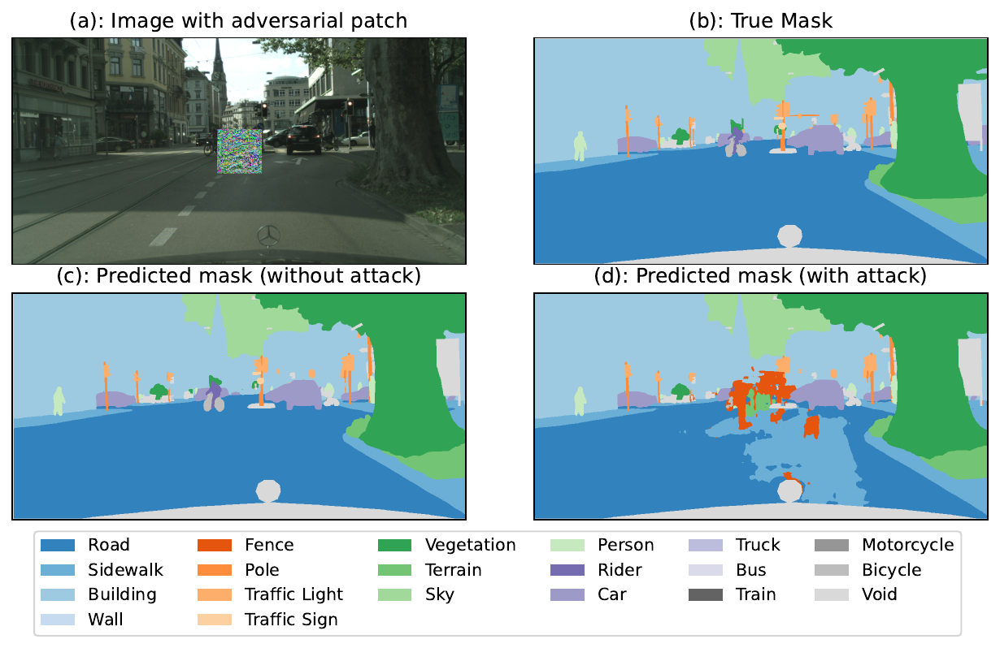

<figure class="project-page-figure">

<figcaption>Figure 1: Adversarial patch example showing how a localized perturbation can change semantic segmentation output even when much of the scene appears visually intact.</figcaption>
</figure>

## Problem

Real-time semantic segmentation models support perception in autonomous systems. Physical-world adversarial patches create a practical security problem because an attacker may not know the exact deployed model. The central question is whether a patch crafted against one segmentation model can transfer to another.

Figure 1 sets up this robustness question with one concrete failure mode. A localized patch changes the predicted segmentation mask around safety-relevant scene regions, even though much of the input image still looks ordinary to a human observer. In an autonomous-driving setting, that kind of failure can make road pixels appear as sidewalk, fence, or another non-drivable class, which could trigger unnecessary braking or other unsafe downstream behavior.

## Contribution

This project studies adversarial patch transferability across real-time semantic segmentation architectures for autonomous driving [1]. In particular:

- Develops an expectation-over-transformation adversarial patch attack tailored to real-time semantic segmentation.
- Uses an adaptive attack loss that reduces hyperparameter dependence and makes the patch robust to image transformations.
- Compares transferability across CNN-based segmentation models and a vision-transformer model.
- Studies per-class degradation, which matters because road, sidewalk, vehicle, sky, and object classes have different safety implications.
- Shows that a patch can generalize across unseen images and resolutions, while cross-model transfer remains limited and architecture-dependent.

## Evidence

[1] evaluates the attack on Cityscapes-style driving scenes across state-of-the-art segmentation models such as PIDNet variants and SegFormer. The results show a clear distinction between within-model robustness and cross-model transfer. Patches generalize across unseen scenes and resolutions, but they do not transfer equally across architectures.

The failure patterns also differ by model family. CNN-based segmenters tend to show more localized disruptions, while the transformer-based model can show broader scene-level effects. Some visually simple classes, such as sky, are more resilient than classes whose boundaries and local context are more complex.

The decision value of the study is that it separates clean segmentation performance from adversarial resilience. A perception model can score well on ordinary validation scenes and still require stress testing against localized attacks, transferability, and class-specific failure modes.

## Selected Publications

::: {.citation-list}
- **[1]** **Shekhar, P.** (2025). Do adversarial patches generalize? Attack transferability study across real-time segmentation models in autonomous vehicles. In *2025 IEEE Security and Privacy Workshops (SPW)*. IEEE. <https://doi.org/10.1109/SPW67851.2025.00045>
:::
