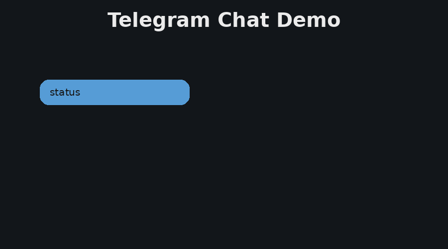
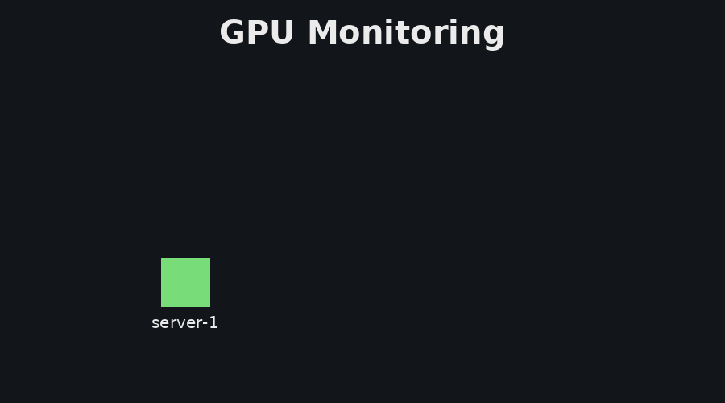
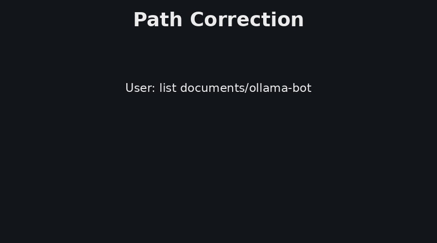
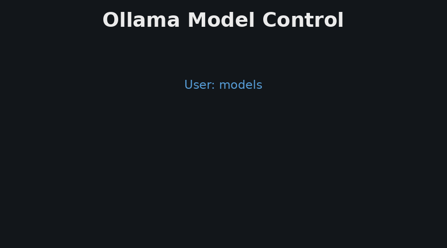

<figure class="project-page-figure">

<figcaption>Figure 1: Agentic AI lab manager architecture connecting a control plane, read-only server agents, Telegram interaction, secure Tailscale server-to-server communication, and local open-source Ollama models for research-computing intelligence. The central control plane routes chat requests to infrastructure, file, and log specialists, calls read-only server agents over a private network, and uses local models to summarize facts returned by deterministic tools.</figcaption>
</figure>

## Problem

Modern data science and AI work often lives across several machines. One server may host local models, another may run training jobs, another may store datasets, logs, and experiment outputs. The operational questions are simple, but the workflow is fragmented. A researcher may need to know which server is least busy, what is using GPU memory, whether a log contains an error, which model is active, or what files are available in a results directory.

This project treats research-computing operations as an AI-assisted software systems problem. It creates a controlled assistant whose answers are grounded in explicit tool calls, bounded file access, server telemetry, and local model reasoning.

Figure 1 shows the core design. The system separates the user-facing chat layer, the orchestration layer, the deterministic tool layer, and the per-server agents. The servers communicate through secure Tailscale channels, so the control plane can query remote agents without exposing the lab-management surface to the open internet. That separation is important because infrastructure visibility should come from measured facts, while the language model should help route, explain, and summarize those facts.

<figure class="project-page-figure">

<figcaption>Figure 2: Telegram interaction flow. The user can ask operational questions in ordinary language, while the control plane translates the request into a structured intent and returns a concise answer.</figcaption>
</figure>

## Contribution

This project develops a local-intelligence-based agentic operations assistant for research computing. It is meant for settings where a lab or ML workstation cluster has multiple machines, GPUs, files, logs, and model endpoints that need to be monitored without turning the assistant into an uncontrolled remote shell. The implementation is organized around a central TypeScript control plane, lightweight read-only server agents, shared request and response types, and a Telegram worker that gives the user a practical mobile interface.

The implementation includes the following components.

- A message router that maps natural-language requests into structured intents such as cluster status, server status, GPU memory, process inspection, directory listing, file reading, log tailing, model listing, and model switching.
- Specialist services for infrastructure, files, and logs, which keep the orchestration logic understandable instead of hiding everything inside a single prompt.
- Server agents that expose CPU, RAM, disk, uptime, GPU, process, file, and log endpoints through a narrow Fastify API.
- Path allowlists, optional shared-secret authentication, bearer-token control-plane access, command-line redaction for process inspection, and read-only behavior for remote machines.
- Local LLM integration through Ollama, including model listing, active-model reporting, model switching from chat, and persistent model choice across restarts.
- Conversation memory for follow-up questions such as "and server-3?", "read it", or "what was the last file we looked at?"
- Systemd deployment files and operational scripts for checking cluster health, updating remote agents, rebuilding services, and recovering from failed user-level services.

<figure class="project-page-figure">

<figcaption>Figure 3: GPU and server monitoring. The assistant can answer infrastructure questions by calling telemetry endpoints instead of relying on model memory.</figcaption>
</figure>

## Evidence

The current repository implements the full service split shown in Figure 1. The `apps/server-agent` service exposes bounded health, metrics, GPU, process, file, and log routes. The `apps/control-plane` service holds the message router, specialist orchestration, tool execution, Ollama client, and conversation state. The `apps/telegram-worker` service handles polling and replies for the Telegram interface. Shared contracts live in `packages/shared-types`, which keeps the tools and responses consistent across services. The intended deployment uses Tailscale for secure private connectivity among the managed machines, so the control plane and server agents communicate inside a protected network boundary.

The most important design choice is that the system is read-only by default. Remote chat access is limited to monitoring, diagnosis, file reads under allowlists, and log inspection. Shell execution, remote writes, process killing, and service restarts stay outside the conversational interface. That boundary makes the assistant useful for operational awareness while keeping destructive operations outside the agent loop.

Figure 3 shows one operational path, where the user asks about GPU and server load. The answer is based on current telemetry from the server agents. Figure 4 shows two additional reliability features, path correction and live model switching. Path correction helps the user recover from small directory-name mistakes, while model switching supports local experimentation with different Ollama models without redeploying the control plane.

<figure class="project-page-figure">

<figcaption>Figure 4: Path correction flow. When a user gives a near-matching path, the assistant suggests a likely correction and asks for confirmation before reading from that location.</figcaption>
</figure>

<figure class="project-page-figure">

<figcaption>Figure 5: Live model switching. The control plane can list local Ollama models, report the active model, switch the active model from chat, and persist that choice across restarts.</figcaption>
</figure>

## Repository and Implementation

::: {.citation-list}
- Project repository: [p-shekhar/AI_lab_manager](https://github.com/p-shekhar/AI_lab_manager)
- Main stack: TypeScript, Fastify, Zod, Telegram bot polling, Ollama, Tailscale-friendly service boundaries, shared type contracts, and user-level systemd deployment.
:::
