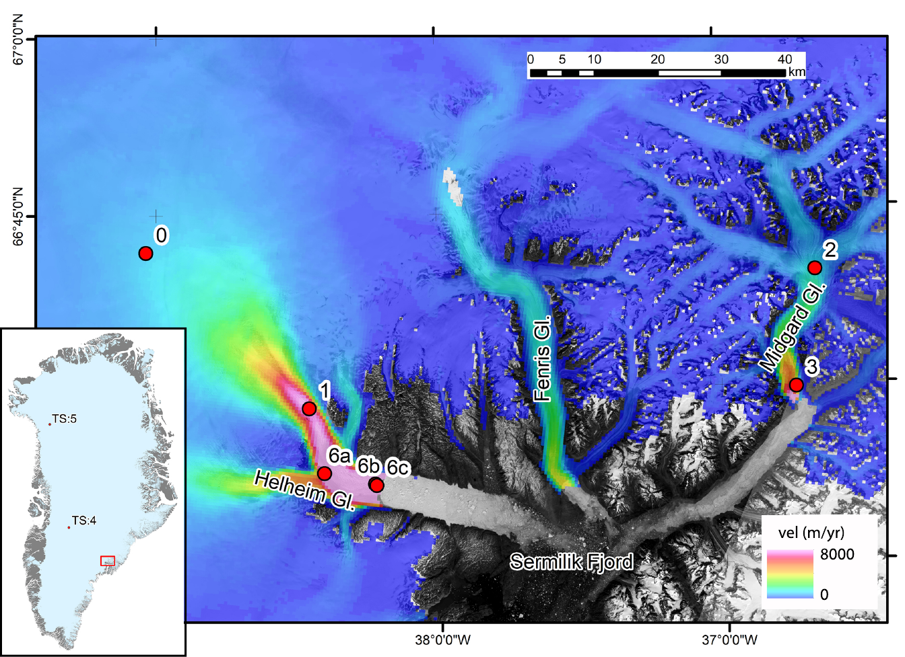
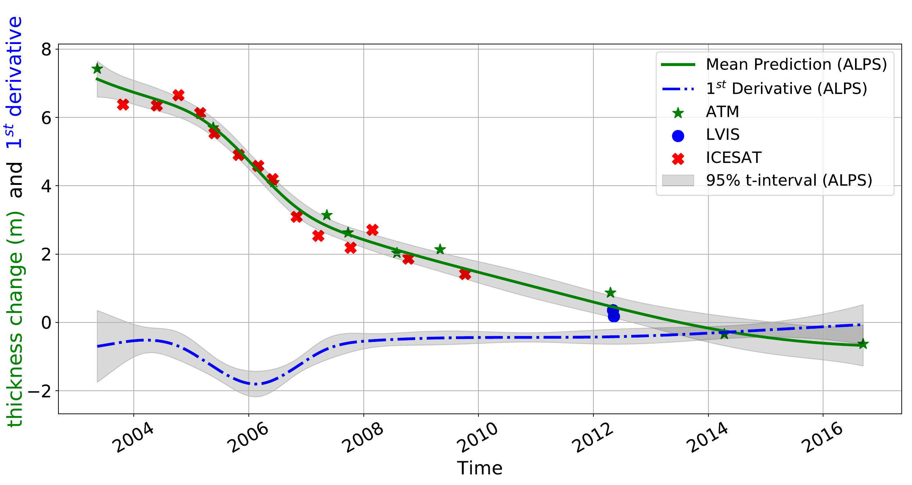

<figure class="project-page-figure">

<figcaption>Figure 1: Approximation by Localized Penalized Splines (ALPS) modeling choices for land-ice thickness-change time series. Left: the time series is fitted with different smoothing parameters, where generalized cross-validation (GCV) selects the compromise between underfitting and overfitting. Very large and very small smoothing choices give high GCV values, while the selected solution balances smoothness with fidelity to the observations. Right: the same time series example compares equidistant knots with data-dependent, quantile-based knots across combinations of B-spline degree and penalty order. The insets show the corresponding basis-function distributions, with circle markers for observations and star markers for knots; data-dependent knots concentrate basis support where observations are dense and better preserve the rapid thinning-to-thickening reversal around mid-2005.</figcaption>
</figure>

## Problem

Land-ice time series are difficult to model because sampling is irregular, sensors differ in accuracy, outliers are common, and the scientific quantities of interest often include both levels and rates of change. ALPS stands for Approximation by Localized Penalized Splines. A useful ALPS model must smooth noise without erasing local dynamics such as glacier surges.

Interpretability matters because scientists need to understand where a change signal is coming from. In ALPS, the fitted curve, knot locations, local basis support, derivative estimates, outlier flags, and uncertainty bands each carry a specific meaning. They show which parts of the time series are well supported by observations, where the model is flexible, where rates of change accelerate, and where the analyst should be cautious.

Figure 1 makes the smoothing problem tangible. The left panel shows why the smoothing parameter has to be chosen carefully. Generalized cross-validation (GCV) is used as a data-driven criterion for choosing that smoothing level. Too much smoothing misses structure, while too little smoothing follows noise. The right panel shows why knot placement matters for irregular data. Data-dependent knots put more modeling flexibility where observations are dense and less where observations are sparse, which helps ALPS capture real local changes without turning gaps into spurious oscillations.

<figure class="project-page-figure">

<figcaption>Figure 2: Analysis area for the ALPS land-ice examples. The map shows Helheim, Fenris, and Midgard glaciers in east Greenland, with selected time-series locations marked on a 1995-2015 ice-velocity mosaic and a Landsat-8 background image. The inset places the study region within the Greenland Ice Sheet. Adapted from [1].</figcaption>
</figure>

Figure 2 gives the geographic context behind the modeling problem. ALPS is being applied to remote-sensing time series from fast-flowing outlet-glacier systems, where local thinning, thickening, velocity, and terminus-position changes can vary sharply across space and time. The map helps connect the statistical objects in Figure 1, such as knots, smoothing, and derivative estimates, to physical glacier locations.

<figure class="project-page-figure">

<figcaption>Figure 3: ALPS approximation for a land-ice thickness-change time series, with mean prediction, first derivative, observations from ATM, LVIS, and ICESat, and 95 percent t-intervals. The panel is cropped from the original comparison figure to focus on the interpretable ALPS output. Adapted from [1].</figcaption>
</figure>

Figure 3 shows why the method is useful for interpretation rather than smoothing alone. The green curve gives the fitted thickness-change trajectory, the blue curve gives the first derivative, and the gray bands show uncertainty for both quantities. This lets the analyst read the level, rate of change, data support, and uncertainty from the same model output.

## Contribution

ALPS provides a unified framework for modeling land-ice time series and related glacier-surge monitoring workflows [1, 2].

- Introduces localized penalized splines for land-ice time series derived from laser altimetry and related remote-sensing products.
- Uses localized B-spline support so local disturbances do not spread across the entire time domain.
- Adds discrete-coordinate-difference penalties, two-level outlier detection, derivative estimation, and uncertainty estimates.
- Keeps the fitted time series interpretable through visible smoothing choices, local knot placement, derivative curves, outlier decisions, and uncertainty intervals.
- Compares ALPS with polynomial and local interpolation approaches, showing that localized smoothing can preserve important local structure without chasing noise.
- Develops a workflow for filtering and interpolating dense ASTER elevation time series over the Karakoram region.
- Applies the workflow to surge events on Hispar, Khurdopin, Kyagar, and Yazghil glaciers, preserving mass-transport patterns that can be smoothed away by less targeted workflows.

## Evidence

[1] demonstrates ALPS on thickness-change, velocity, terminus-change, and longer ice-sheet elevation time series. The reported examples show that ALPS can fit irregular observations, estimate first derivatives, identify outliers, and provide uncertainty bands while remaining locally sensitive to genuine changes.

[2] applies related interpolation and filtering ideas to a 20-year ASTER DEM archive over more than 100 surge-type glaciers in the Karakoram region. The workflow supports monthly-scale elevation-change evidence and preserves surge signals for selected glaciers including Hispar, Khurdopin, Kyagar, and Yazghil.

The project supports the interpretability idea because the fitted trajectory, derivative, knot placement, outlier flags, and uncertainty bands all have scientific meaning. Together, they form a structured account of where the glacier is thinning or thickening, when the signal changes, which observations influence the local fit, and how much trust the analyst should place in the estimate.

## Selected Publications

::: {.citation-list}
- **[1]** **Shekhar, P.**, Csatho, B., Schenk, T., Roberts, C., & Patra, A. K. (2021). ALPS: A unified framework for modeling time series of land ice changes. *IEEE Transactions on Geoscience and Remote Sensing, 59*(8), 6466-6489. <https://doi.org/10.1109/TGRS.2020.3027190>
- **[2]** Beraud, L., Brun, F., Dehecq, A., Hugonnet, R., & **Shekhar, P.** (2025). Glacier surge monitoring from temporally dense elevation time series: Application to an ASTER dataset over the Karakoram region. *The Cryosphere, 19*, 5075-5094. <https://doi.org/10.5194/tc-19-5075-2025>
:::
