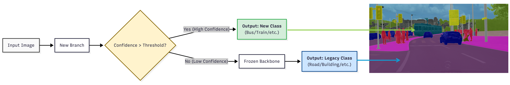

<figure class="project-page-figure">

<figcaption>Figure 1: Continual segmentation architecture for introducing new scene classes without catastrophic forgetting. The frozen base segmentation model preserves previously learned scene structure, while a boundary-guided detail branch focuses the update on high-frequency class-boundary information needed for novel objects. This design treats post-deployment novelty as a controlled model-update problem rather than a full retraining problem.</figcaption>
</figure>

## Problem

Autonomous systems encounter new object classes and operating contexts after deployment. In this project, anomaly handling means adapting the perception model after novelty appears, not merely flagging the new scene content as unusual. Retraining an entire segmentation model from scratch can be expensive, and naive fine-tuning can damage performance on previously learned classes.

The handling problem is practical. A perception system needs to absorb new scene content while preserving older scene structure that still matters for safety, such as road, sidewalk, vehicles, people, vegetation, and background regions.

Figure 1 gives the reader the deployment story at a glance. It shows a segmentation system being extended to new classes while preserving old scene knowledge, which is the central tension behind continual learning for autonomous perception.

<figure class="project-page-figure">

<figcaption>Figure 2: PILOT workflow for data-free continual semantic segmentation, where a frozen base model is extended with boundary-guided learning for new classes while preserving prior scene knowledge. Adapted from [1].</figcaption>
</figure>

Figure 2 makes the handling mechanism more concrete. Instead of treating novelty as only an alert or retraining the full segmentation model, the workflow adds new segmentation capacity through a controlled update. The original model remains the reference for the scene knowledge that should be preserved.

## Contribution

The PILOT project develops a data-free continual learning approach for real-time semantic segmentation [1].

- Introduces a replay-free continual learning framework for PIDNet-based real-time semantic segmentation.
- Freezes the original network and adds a parallel detail branch to learn high-frequency boundary information for novel classes.
- Uses only new-class data during the update, which reflects deployed settings where the original training set may not be available.
- Treats catastrophic forgetting as both a deployment risk and a benchmark metric.
- Is designed to keep inference overhead low enough for real-time autonomous-system perception.

## Evidence

[1] evaluates PILOT on a Cityscapes class-incremental segmentation setting. New classes such as bus, train, motorcycle, and bicycle are introduced sequentially while the model is expected to preserve performance on base scene classes.

The reported results show that the parallel detail branch can learn novel-class boundary information while maintaining high mean intersection-over-union on the previously learned classes. That is the key handling requirement. A perception system has to absorb new scene categories without quietly damaging road, sidewalk, vegetation, person, vehicle, and background structure that downstream autonomy still depends on.

The project treats continual segmentation as a model-lifecycle problem. The update rule, confidence behavior, class-level performance, and latency cost all matter because novelty handling becomes part of operating the perception system after deployment.

## Selected Publications

::: {.citation-list}
- **[1]** Zhou, Y., **Shekhar, P.**, Yang, T., & Liu, Y. (2026). *PILOT: A data-free continual learning approach for real-time semantic segmentation via boundary guidance*. Accepted in *Electronics* (MDPI). arXiv. <https://doi.org/10.48550/arXiv.2605.27128>
:::
