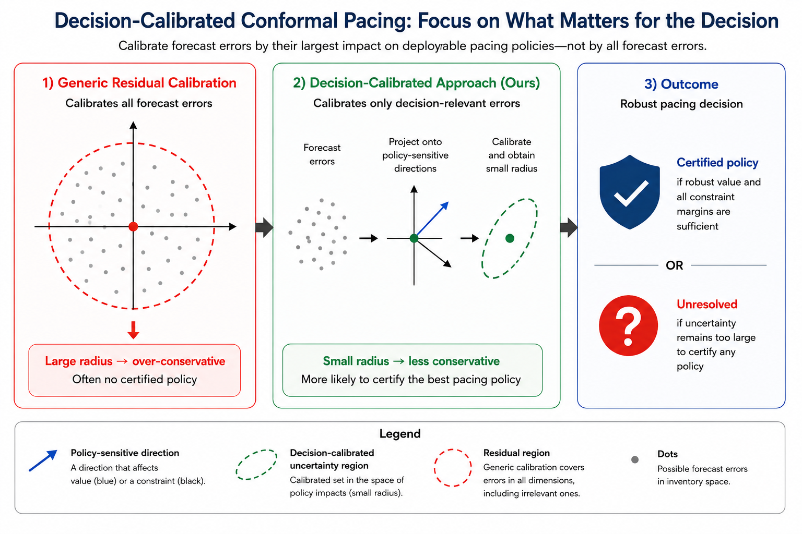
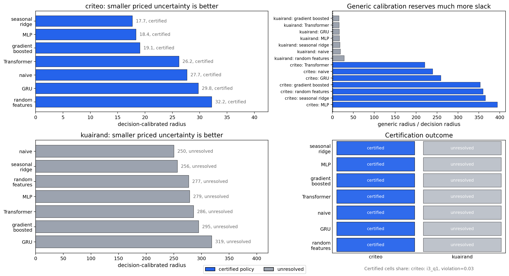

<figure class="project-page-figure">

<figcaption>Figure 1: Conformal uncertainty calibrated directly to pacing decisions.</figcaption>
</figure>

## Problem

Pacing decisions in streaming advertising depend on forecasts of future inventory, demand pressure, incremental response, and member-experience load. A small forecast error can be harmless for one pacing policy and damaging for another. Generic residual intervals do not tell the decision-maker whether a proposed pacing action is safe.

This project asks how uncertainty should be calibrated when the downstream action is the object that needs protection.

Figure 1 introduces that shift in focus. It contrasts uncertainty that is calibrated to forecast error with uncertainty calibrated to pacing decisions, where the relevant question is whether a budget, yield, or member-experience guardrail could change the action.

## Contribution

The project develops decision-calibrated conformal uncertainty for pacing decisions in streaming advertising [1]. In particular, the project:

- Defines uncertainty through the largest possible impact of forecast error on the set of deployable pacing policies.
- Proves that the resulting score is the smallest valid scalar uncertainty measure that uniformly protects the pacing policies under consideration.
- Keeps the finite-sample logic of split conformal prediction while changing the conformity score so that it is aligned with business value, delivery, budget, and member-experience constraints.
- Proves a high-dimensional separation result showing that residual calibration can become arbitrarily conservative by paying for nuisance inventory dimensions.
- Combines calibrated forecast uncertainty with response and member-experience uncertainty in a robust pacing selector that can certify a policy or return an unresolved shortlist.

<figure class="project-page-figure">

<figcaption>Figure 2: Decision-calibrated uncertainty changes the radius that matters for pacing and shows how uncertainty interacts with yield-oriented policy choice.</figcaption>
</figure>

## Evidence

Figure 2 shows the practical effect of calibrating uncertainty to the pacing decision. The project evaluates the method with public-data-calibrated pacing replays based on Criteo and KuaiRand-style settings [1]. Traditional residual conformal calibration produces large unresolved radii, 7236.7 for Criteo and 4629.4 for KuaiRand. Decision-calibrated uncertainty reduces those radii to 18.4 and 278.6 because the score pays attention to the parts of forecast error that can change the deployable action.

The Criteo replay certifies a less aggressive pacing policy than the point-forecast baseline. In held-out evaluation, the any-violation rate drops from 16.7 percent to 3.3 percent, with zero budget and member-load violations. The KuaiRand replay remains unresolved, which is useful evidence in its own right because the framework does not force a launch recommendation when uncertainty is still too large.

The results also show that the model with the lowest test mean absolute error is not necessarily the model with the smallest pacing radius. In the Criteo analysis, a temporal Transformer has the lowest forecast error, while seasonal ridge gives the smallest decision-relevant uncertainty. That distinction is the reason the project treats uncertainty as part of policy selection and reporting.

## Selected Publications

::: {.citation-list}
- **[1]** **Shekhar, P.**, & Howard, C. (2026). *Decision-calibrated conformal uncertainty for pacing decisions in streaming advertising*. arXiv. <https://doi.org/10.48550/arXiv.2606.10187>
:::
