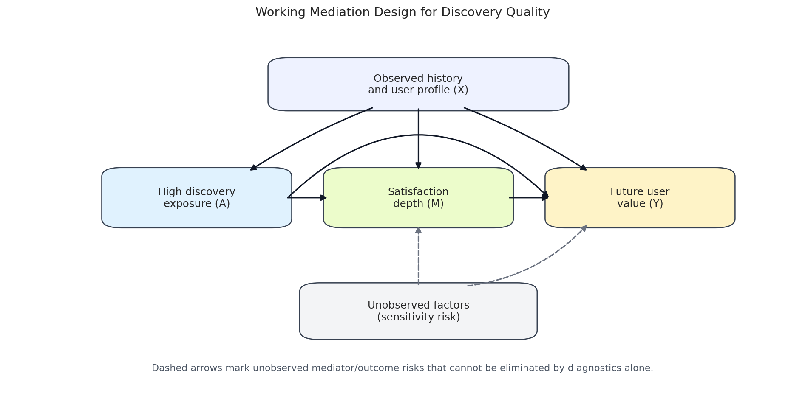

<figure class="project-page-figure">

<figcaption>Figure 1: Mediation design DAG connecting discovery exposure, quality pathways, and downstream outcomes.</figcaption>
</figure>

This lab studies whether a discovery intervention changes downstream outcomes partly through quality-related mediators. It treats mediation as a design problem. The mediator has to be constructed, validated, timed correctly, and interpreted with care before direct and indirect effects can be meaningful.

The sequence is built around the practical challenge of turning behavioral logs into a credible path analysis. It covers metric construction, mediation estimands, assumptions, direct and indirect effects, robustness checks, negative controls, SEM-style models, and ML-assisted mediation.

## Lab Sequence

<article class="notebook-guide-item">

<a href="../../notebooks/projects/project_5_discovery_quality_mediation/01_discovery_quality_problem_setup_eda.html" data-site-path="notebooks/projects/project_5_discovery_quality_mediation/01_discovery_quality_problem_setup_eda.html">01. Discovery Quality Problem Setup and EDA</a>

Introduces the discovery setting, candidate outcomes, candidate mediators, and the empirical patterns that motivate a pathway analysis.

</article>
<article class="notebook-guide-item">

<a href="../../notebooks/projects/project_5_discovery_quality_mediation/02_metric_construction_and_validation.html" data-site-path="notebooks/projects/project_5_discovery_quality_mediation/02_metric_construction_and_validation.html">02. Metric Construction and Validation</a>

Builds the quality metric used as a mediator and validates whether it behaves like a meaningful intermediate signal rather than a convenient proxy.

</article>
<article class="notebook-guide-item">

<a href="../../notebooks/projects/project_5_discovery_quality_mediation/03_mediation_estimands_and_assumptions.html" data-site-path="notebooks/projects/project_5_discovery_quality_mediation/03_mediation_estimands_and_assumptions.html">03. Mediation Estimands and Assumptions</a>

States the causal estimands and assumptions behind mediation, including timing, confounding, and the role of mediator-outcome adjustment.

</article>
<article class="notebook-guide-item">

<a href="../../notebooks/projects/project_5_discovery_quality_mediation/04_direct_indirect_total_effects.html" data-site-path="notebooks/projects/project_5_discovery_quality_mediation/04_direct_indirect_total_effects.html">04. Direct, Indirect, and Total Effects</a>

Estimates the direct pathway, mediated pathway, and total effect so the result can explain how the intervention appears to work.

</article>
<article class="notebook-guide-item">

<a href="../../notebooks/projects/project_5_discovery_quality_mediation/05_robustness_and_sensitivity.html" data-site-path="notebooks/projects/project_5_discovery_quality_mediation/05_robustness_and_sensitivity.html">05. Robustness and Sensitivity</a>

Checks whether the pathway conclusion survives alternative thresholds, mediator definitions, model choices, and placebo-style tests.

</article>
<article class="notebook-guide-item">

<a href="../../notebooks/projects/project_5_discovery_quality_mediation/06_advanced_sem_and_ml_mediation.html" data-site-path="notebooks/projects/project_5_discovery_quality_mediation/06_advanced_sem_and_ml_mediation.html">06. Advanced SEM and ML Mediation</a>

Compares structural-equation and machine-learning mediation workflows, emphasizing what each adds to interpretation and where each can become fragile.

</article>

