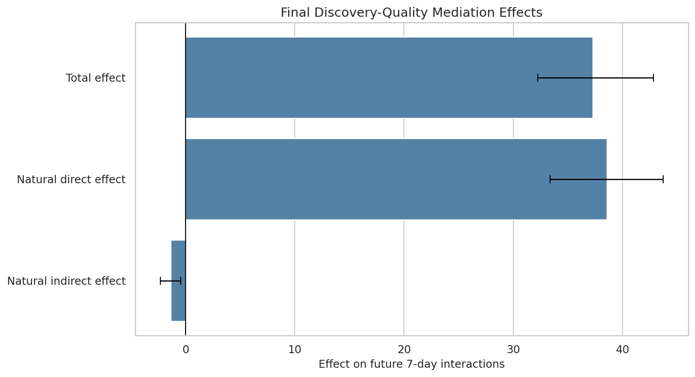
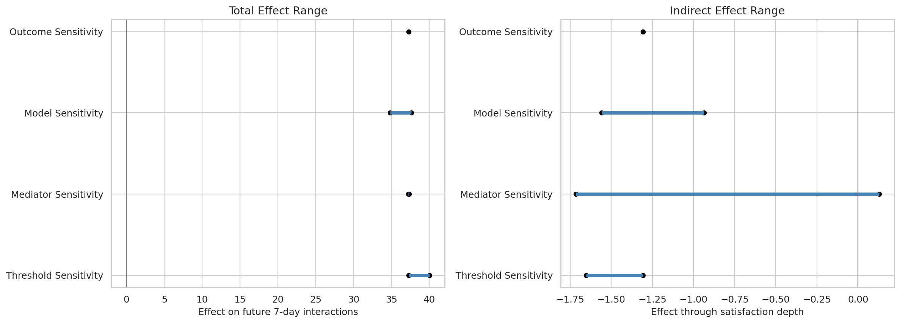
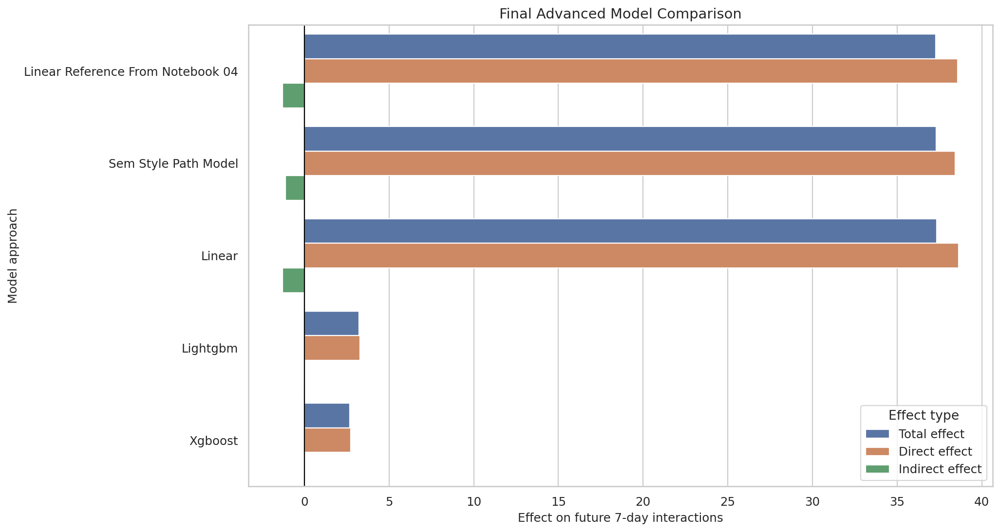

## Decision Question

How much of the effect of broader discovery exposure on longer-term user value flows through same-day satisfaction depth?

## Causal Setup

- Treatment is broader discovery exposure.
- Mediator is same-day satisfaction depth.
- Outcome is future user value and engagement.
- The main measurement challenge is that CTR may miss durable satisfaction.

## Methods

- Metric construction and validation
- Mediation estimands and assumptions
- Direct, indirect, and total effects
- Robustness and sensitivity checks
- SEM-style and ML mediation extensions

## Decision Takeaway

The project frames metric design as a causal problem. A good discovery metric should explain durable value, retention, and engagement quality, not immediate response alone.

## Selected Figures

## Notebook Sequence

<ol class="notebook-sequence">
  <li><a href="../../notebooks/projects/project_5_discovery_quality_mediation/01_discovery_quality_problem_setup_eda.html" data-site-path="notebooks/projects/project_5_discovery_quality_mediation/01_discovery_quality_problem_setup_eda.html">Discovery Quality Problem Setup and EDA</a></li>
  <li><a href="../../notebooks/projects/project_5_discovery_quality_mediation/02_metric_construction_and_validation.html" data-site-path="notebooks/projects/project_5_discovery_quality_mediation/02_metric_construction_and_validation.html">Metric Construction and Validation for Discovery Quality</a></li>
  <li><a href="../../notebooks/projects/project_5_discovery_quality_mediation/03_mediation_estimands_and_assumptions.html" data-site-path="notebooks/projects/project_5_discovery_quality_mediation/03_mediation_estimands_and_assumptions.html">Mediation Estimands and Assumptions for Discovery Quality</a></li>
  <li><a href="../../notebooks/projects/project_5_discovery_quality_mediation/04_direct_indirect_total_effects.html" data-site-path="notebooks/projects/project_5_discovery_quality_mediation/04_direct_indirect_total_effects.html">Direct, Indirect, and Total Effects for Discovery Quality</a></li>
  <li><a href="../../notebooks/projects/project_5_discovery_quality_mediation/05_robustness_and_sensitivity.html" data-site-path="notebooks/projects/project_5_discovery_quality_mediation/05_robustness_and_sensitivity.html">Robustness and Sensitivity for Discovery Quality Mediation</a></li>
  <li><a href="../../notebooks/projects/project_5_discovery_quality_mediation/06_advanced_sem_and_ml_mediation.html" data-site-path="notebooks/projects/project_5_discovery_quality_mediation/06_advanced_sem_and_ml_mediation.html">Advanced SEM and ML Mediation Models</a></li>
  <li><a href="../../notebooks/projects/project_5_discovery_quality_mediation/07_final_report_and_figures.html" data-site-path="notebooks/projects/project_5_discovery_quality_mediation/07_final_report_and_figures.html">Final Report and Figures for Discovery Quality Mediation</a></li>
</ol>

## Generated Artifacts

- [Final Project Summary](../../notebooks/projects/project_5_discovery_quality_mediation/writeup/final_project_summary.md)
- [Resume Bullets](../../notebooks/projects/project_5_discovery_quality_mediation/writeup/resume_bullets.md)
- [Artifact Index](../../notebooks/projects/project_5_discovery_quality_mediation/writeup/artifact_index.csv)
- [Final Executive Summary](../../notebooks/projects/project_5_discovery_quality_mediation/writeup/tables/final_executive_summary.csv)
- [Final Main Effects](../../notebooks/projects/project_5_discovery_quality_mediation/writeup/tables/final_main_effects.csv)
- [Final Limitations](../../notebooks/projects/project_5_discovery_quality_mediation/writeup/tables/final_limitations.csv)

## Limitations

These notebook-driven causal analyses should be read with their identification assumptions, support diagnostics, measurement choices, and sensitivity checks in view.
