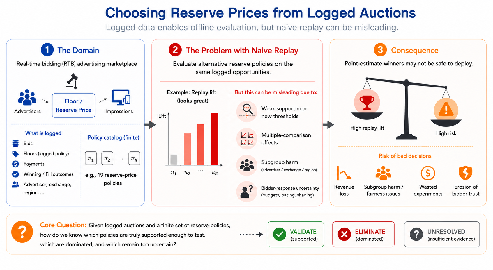
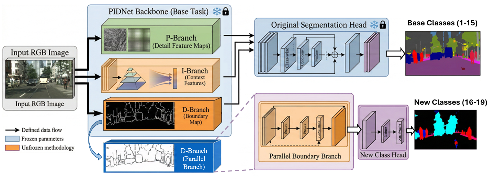
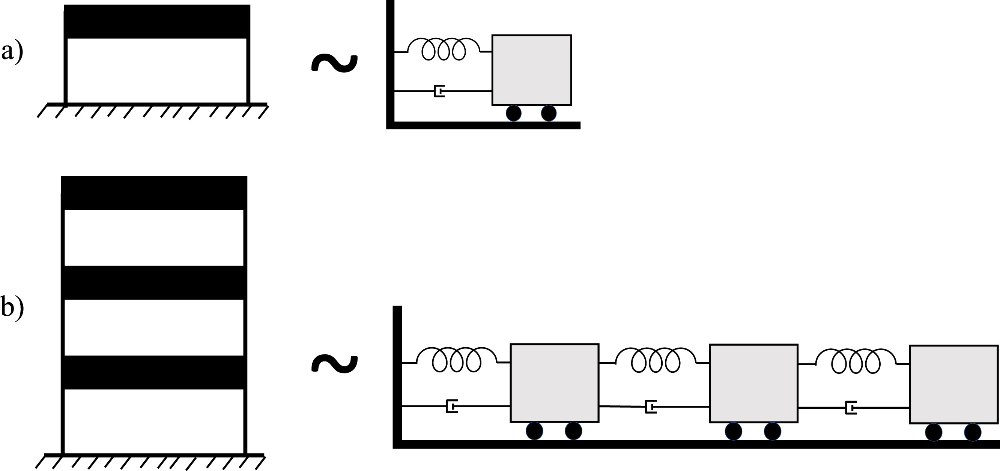
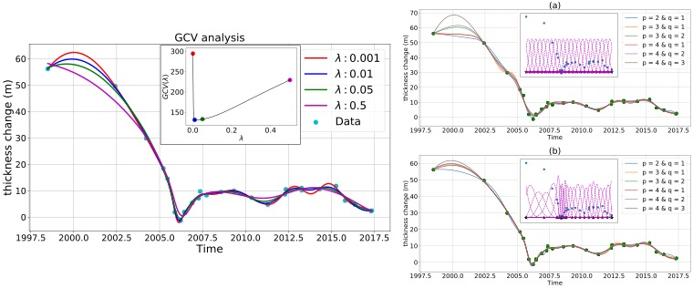
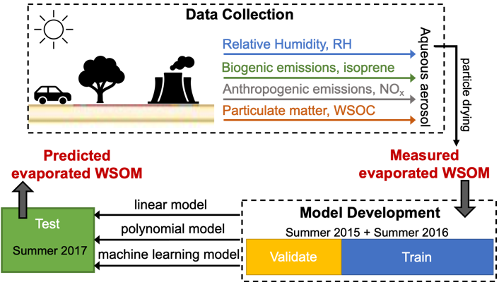
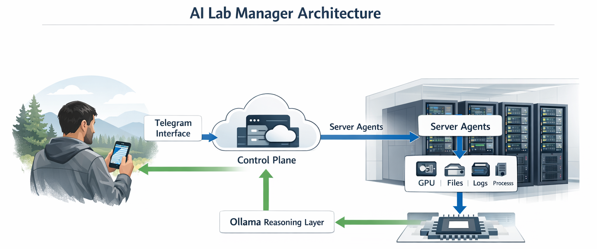

This page brings together my research and implementation work across five connected areas, (i) [causal and statistical inference in decision sciences](#causal-and-statistical-inference-in-decision-sciences), (ii) [privacy and security for AI systems](#privacy-and-security-for-ai-systems), (iii) [anomaly detection and handling](#anomaly-detection-and-handling), (iv) [interpretable machine learning](#interpretable-machine-learning), and (v) [AI-assisted software systems](#ai-assisted-software-systems). Across these domains, the central theme is building methods and systems that turn imperfect data, uncertain measurements, changing deployment conditions, and operational complexity into defensible analytical decisions. The final section, [applied causal inference labs](#applied-causal-inference-labs), collects hands-on notebook workflows that show how these ideas are implemented end to end.

**Please click the project names to read the full project summaries.**

**For a full list of publications, please see my [Google Scholar profile](https://scholar.google.com/citations?hl=en&user=Xt9-KRIAAAAJ&view_op=list_works&sortby=pubdate){target="_blank" rel="noopener noreferrer"}.**

## Causal and Statistical Inference in Decision Sciences

This area studies causal and statistical decision-making in advertising and marketplace systems. The projects cover logged real-time bidding auctions, reserve-price and floor-policy evaluation, randomized lift and incrementality measurement, online experiment design under interference, recommendation and member-experience experiments, and streaming ad pacing. Across these projects, the goal is to turn incomplete evidence into practical decisions about validation, launch readiness, rejection, or further testing.

### [**Project 1:** Support-aware Offline Policy Selection](support-aware-offline-policy-selection/)

::: {.course-preview-row .project-preview-row}
<figure class="course-preview-figure">

<figcaption>Figure: Support-aware offline policy selection workflow for marketplace reserve-price decisions.</figcaption>
</figure>

::: {.course-preview-copy}
Logged auction replay can suggest a promising reserve-price policy even when the evidence is thin around key thresholds, uneven across bidder segments, sensitive to bidder response, or partly driven by searching across many candidate policies. This project turns offline policy evaluation into a launch-readiness workflow, distinguishing policies that are credible enough for validation from policies that are dominated or still unresolved.

::: {.project-methods}
**Keywords:** support-aware offline policy evaluation, reserve-price policy selection, launch-readiness decisions, conservative lower-bound ranking, marketplace guardrails, out-of-time validation, and interference-aware experiment design.
:::
:::
:::

### [**Project 2:** Robust Online Experiment Design](robust-online-experiment-design/)

::: {.course-preview-row .project-preview-row}
<figure class="course-preview-figure">

<figcaption>Figure: Robust experiment-design selection when exposure can propagate through budgets, inventory, graphs, or time.</figcaption>
</figure>

::: {.course-preview-copy}
Ads, recommendation, and member-experience systems rarely offer clean individual treatment assignment. This project treats experiment design itself as a decision under uncertainty, comparing implementable designs by worst-case planning risk over plausible interference mechanisms.

::: {.project-methods}
**Keywords:** finite design catalogs, exposure-mapping ambiguity, Wasserstein launch-risk geometry, contamination penalties, MDE, operational cost, and estimand mismatch.
:::
:::
:::

### [**Project 3:** Privacy-Robust Incrementality Measurement](privacy-robust-incrementality/)

::: {.course-preview-row .project-preview-row}
<figure class="course-preview-figure">

<figcaption>Figure: Decision frontier for incrementality measurement when privacy-preserving reporting degrades the observed signal.</figcaption>
</figure>

::: {.course-preview-copy}
Privacy-preserving ad measurement changes the evidence available to a randomized lift test through match-rate loss, linkability loss, attribution-window loss, aggregation thresholds, and randomized reporting noise. This project asks what incrementality decisions remain certifiable after those distortions.

::: {.project-methods}
**Keywords:** privacy-robust incrementality, signal-loss modeling, observation-compatible clean worlds, partial identification, sharp decision frontiers, finite-sample certification, randomized reporting noise, aggregation-threshold suppression, and reporting-granularity design.
:::
:::
:::

### [**Project 4:** Decision-Calibrated Pacing Uncertainty](decision-calibrated-pacing/)

::: {.course-preview-row .project-preview-row}
<figure class="course-preview-figure">

<figcaption>Figure: Conformal uncertainty calibrated directly to pacing decisions.</figcaption>
</figure>

::: {.course-preview-copy}
In streaming advertising, forecast error matters because it can trigger bad pacing choices, budget violations, value loss, or member-experience overload. This project measures uncertainty by the largest impact on deployable pacing policies, then uses conformal prediction to protect decisions with finite-sample guarantees.

::: {.project-methods}
**Keywords:** decision-calibrated conformal prediction, pacing uncertainty, policy-sensitivity scores, split conformal coverage, pacing guardrails, robust policy selection, and held-out violation analysis.
:::
:::
:::

## Privacy and Security for AI Systems

This area studies machine learning systems that must work under adversaries, privacy constraints, and security-sensitive deployment settings. The common thread is trust under attack surfaces such as gradients, wireless signals, and perception pipelines.

### [**Project 1:** Privacy-Preserving Federated Learning](privacy-preserving-federated-learning/)

::: {.course-preview-row .project-preview-row}
<figure class="course-preview-figure">

<figcaption>Figure: Selective homomorphic encryption workflow for reducing gradient leakage in distributed learning.</figcaption>
</figure>

::: {.course-preview-copy}
Federated learning keeps raw data local, but gradients can still leak sensitive information through reconstruction attacks. This work studies leveled homomorphic encryption and selective encryption strategies that protect the most sensitive exchanged signals while keeping distributed learning practical.

::: {.project-methods}
**Keywords:** privacy-preserving federated learning, distributed training, encrypted gradient aggregation, selective homomorphic encryption, gradient leakage, reconstruction-risk analysis, communication-cost evaluation, and privacy-utility tradeoffs.
:::
:::
:::

### [**Project 2:** RF Fingerprinting Authentication](rf-fingerprinting-authentication/)

::: {.course-preview-row .project-preview-row}
<figure class="course-preview-figure">

<figcaption>Figure: RF fingerprinting workflow that uses signal imperfections for device authentication and rogue-transmitter detection.</figcaption>
</figure>

::: {.course-preview-copy}
Wireless devices carry hardware-level radio-frequency (RF) signal signatures that can support authentication without depending only on keys or prior trust. This project develops Siamese-network and CNN-GAN workflows for RF fingerprinting, including adversarial tests where attackers attempt to mimic genuine devices.

::: {.project-methods}
**Keywords:** I/Q signal embeddings, similarity-based classification, rogue-device thresholds, GAN-generated attacker signals, and software-defined radio experiments.
:::
:::
:::

### [**Project 3:** Adversarial Vision Attacks](adversarial-vision-attacks/)

::: {.course-preview-row .project-preview-row}
<figure class="course-preview-figure">

<figcaption>Figure: Adversarial patch transferability study for real-time semantic segmentation in autonomous-vehicle perception.</figcaption>
</figure>

::: {.course-preview-copy}
Autonomous-vehicle perception systems depend on real-time segmentation models exposed to physical-world perturbations. This project studies whether adversarial patches generalize across segmentation models, which is the security question that matters when attackers do not know the exact deployed architecture.

::: {.project-methods}
**Keywords:** patch attacks, semantic segmentation, transferability analysis, real-time perception models, and safety-oriented robustness assessment.
:::
:::
:::

## Anomaly Detection and Handling

This area focuses on systems where rare events, failures, and distribution shifts must be detected early enough to support action, then handled in a way that keeps the system reliable. The projects range from biomedical sensing to autonomous systems and manufacturing inspection. They share the same decision problem of detecting what matters, keeping alarms useful, and adapting the model or workflow when anomalous situations require a response, such as continual semantic-segmentation updates after new scene classes appear.

### [**Project 1:** Label-Free Cancer Cell Cluster Detection](label-free-cancer-cell-detection/)

::: {.course-preview-row .project-preview-row}
<figure class="course-preview-figure">

<figcaption>Figure: Flow-cytometry and machine-learning workflow for detecting rare circulating tumor cell clusters in whole blood.</figcaption>
</figure>

::: {.course-preview-copy}
Circulating tumor cell clusters are rare but clinically meaningful. This project uses backscatter flow cytometry and machine learning to detect clusters in whole blood without relying on labels as the operational detection signal.

::: {.project-methods}
**Keywords:** backscatter flow cytometry, fluorescence ground truth, rare-event classification, peak detection, and precision-sensitivity tradeoff analysis.
:::
:::
:::

### [**Project 2:** Continual Segmentation for Autonomous Systems](cav-continual-segmentation/)

::: {.course-preview-row .project-preview-row}
<figure class="course-preview-figure">

<figcaption>Figure: Continual segmentation architecture for introducing new scene classes without catastrophic forgetting.</figcaption>
</figure>

::: {.course-preview-copy}
Autonomous systems must handle new object classes and operating contexts after deployment, not merely flag them as unusual. This project treats semantic-segmentation updates as an anomaly-handling problem, using data-free continual learning and boundary guidance to add new classes while preserving the scene structure that remains safety-critical.

::: {.project-methods}
**Keywords:** continual learning, segmentation distillation, boundary guidance, catastrophic-forgetting control, and deployed-perception adaptation.
:::
:::
:::

### [**Project 3:** Manufacturing Anomaly Inspection](manufacturing-anomaly-inspection/)

::: {.course-preview-row .project-preview-row}
<figure class="course-preview-figure">

<figcaption>Figure: Automated optical inspection workflow for detecting defects in aerospace composite components.</figcaption>
</figure>

::: {.course-preview-copy}
Manufacturing quality decisions require reliable detection under scarce labels, imbalance, and geometric variation. This project combines deep learning, GAN-based data augmentation, classical classifiers, and morphing Gaussian random fields to support inspection and early design-stage shape-error reasoning.

::: {.project-methods}
**Keywords:** automated optical inspection, DCNNs, DCGAN augmentation, hybrid classifiers, Gaussian random fields, and geometric variation simulation.
:::
:::
:::

## Interpretable Machine Learning

This area connects model performance to structure that scientists, engineers, and decision-makers can inspect. The projects use basis construction, surrogate modeling, localized splines, and feature-aware prediction so that machine learning supports reasoning about mechanisms as well as prediction.

### [**Project 1:** Interpretable Multiscale Basis Learning](multiscale-basis-learning/)

::: {.course-preview-row .project-preview-row}
<figure class="course-preview-figure">

<figcaption>Figure: Multiscale basis-learning structure for hierarchical data reduction and interpretable approximation.</figcaption>
</figure>

::: {.course-preview-copy}
Large kernel and data representations often need reduction before they can support explanation or computation. This project line studies hierarchical and multiscale basis construction, using scale-aware structure to preserve meaningful approximation while making the representation easier to inspect.

::: {.project-methods}
**Keywords:** multiscale bases, greedy selection, hierarchical reduction, kernel approximation, pivoted QR, and interpretable numerical learning.
:::
:::
:::

### [**Project 2:** SVD-Enabled Surrogate Modeling](svd-surrogate-modeling/)

::: {.course-preview-row .project-preview-row}
<figure class="course-preview-figure">

<figcaption>Figure: Idealized one-story and two-story nonlinear structural systems used to study surrogate prediction of earthquake engineering demand parameters.</figcaption>
</figure>

::: {.course-preview-copy}
Performance-based earthquake engineering relies on nonlinear simulations to translate uncertain earthquakes and structural properties into engineering demand parameters. This project uses an explainable generative model for earthquake ground motions, represents records through SVD-derived basis coordinates, and trains surrogate models that predict nonlinear response for unseen motions without rerunning the full simulation workflow.

::: {.project-methods}
**Keywords:** explainable generative earthquake modeling, singular value decomposition, ground-motion basis weights, data augmentation, nonlinear structural surrogates, and engineering-demand prediction.
:::
:::
:::

### [**Project 3:** ALPS Land-Ice Time-Series Modeling](alps-land-ice-time-series/)

::: {.course-preview-row .project-preview-row}
<figure class="course-preview-figure">

<figcaption>Figure: Localized spline modeling for irregularly sampled land-ice elevation and thickness time series.</figcaption>
</figure>

::: {.course-preview-copy}
Glaciological time series combine irregular sampling, sensor differences, outliers, and local change patterns. ALPS, Approximation by Localized Penalized Splines, makes land-ice change interpretable through knots, local basis support, derivative estimates, outlier flags, and uncertainty bands while reconstructing surge dynamics.

::: {.project-methods}
**Keywords:** localized B-splines, penalized smoothing, outlier detection, derivative estimation, glacier surge monitoring, and uncertainty quantification.
:::
:::
:::

### [**Project 4:** Atmospheric Aerosol Machine Learning](aerosol-machine-learning/)

::: {.course-preview-row .project-preview-row}
<figure class="course-preview-figure">

<figcaption>Figure: Feature-aware machine-learning workflow for interpreting water-soluble organic aerosol mass.</figcaption>
</figure>

::: {.course-preview-copy}
Atmospheric aerosol analysis needs models that are accurate and scientifically interpretable. This project uses regression and random forests to predict water-soluble organic mass, quantify seasonal aqueous secondary organic aerosol contributions, and keep feature importance tied to physical and chemical interpretation.

::: {.project-methods}
**Keywords:** water-soluble organic mass, aerosol liquid water, aqueous secondary organic aerosol, random forests, polynomial regression, feature-aware interpretation, seasonal attribution, and CMAQ model comparison.
:::
:::
:::

## AI-Assisted Software Systems

This area focuses on AI systems that help build, monitor, and operate technical infrastructure while keeping the human operator in control. The work connects agentic workflows, deterministic tool use, open-source model deployment, observability, and safety constraints so that AI assistance can support real software systems and research-computing operations.

### [**Project 1:** Agentic AI Lab Manager for Research Computing](agentic-ai-lab-manager/)

::: {.course-preview-row .project-preview-row}
<figure class="course-preview-figure">

<figcaption>Figure: Agentic AI lab manager architecture connecting a control plane, read-only server agents, Telegram interaction, secure Tailscale server-to-server communication, and local open-source Ollama models for research-computing intelligence.</figcaption>
</figure>

::: {.course-preview-copy}
Research computing often spreads experiments, logs, models, GPUs, and datasets across several machines. This project builds a local-intelligence-based agentic lab manager that lets a user ask operational questions in natural language while the answers remain grounded in deterministic tools, read-only server agents, and private-network infrastructure. The servers communicate through secure Tailscale channels, which keeps the control plane and server agents inside a controlled research network. It is designed for managing multiple hardware resources in high-throughput computational environments.

::: {.project-methods}
**Keywords:** AI-assisted software systems, research-computing operations, agentic infrastructure monitoring, local open-source models, Ollama, Telegram bots, Tailscale, deterministic tool use, read-only server agents, GPU monitoring, file and log inspection, and human-controlled operations.
:::
:::
:::

## Applied Causal Inference Labs

These labs are complete notebook-based causal data science workflows. They start with logged or observational data, define the decision problem, build estimands, check support and assumptions, estimate effects, stress-test conclusions, and translate results into decision-ready summaries. They are useful for readers who want to see causal inference as implemented work rather than only as methods in isolation.

### [**Lab 1:** Ranking and Recommendation Lift](ranking-recommendation-lift-lab/)

::: {.course-preview-row .project-preview-row .project-lab-row}
<figure class="course-preview-figure">

<figcaption>Figure: Policy simulation showing how ranking-position effect estimates translate into candidate recommendation decisions.</figcaption>
</figure>

::: {.course-preview-copy}
This lab studies whether higher recommendation rank changes engagement in logged recommendation data. The workflow moves from exploratory data analysis to propensity weighting, doubly robust estimation, heterogeneity, policy simulation, sensitivity analysis, ML nuisance models, and causal machine learning.

::: {.project-methods}
**Keywords:** ranking-position treatment definition, logged recommendation data, overlap diagnostics, propensity modeling, doubly robust estimation, heterogeneous effects, policy simulation, sensitivity analysis, ML nuisance models, and causal machine learning.
:::
:::
:::

### [**Lab 2:** Off-Policy Evaluation for Bandit Systems](off-policy-evaluation-bandit-lab/)

::: {.course-preview-row .project-preview-row .project-lab-row}
<figure class="course-preview-figure">

<figcaption>Figure: Policy lift compared with support diagnostics, showing why value estimates need reliability checks before deployment.</figcaption>
</figure>

::: {.course-preview-copy}
This lab uses logged bandit feedback to evaluate candidate policies without running each one online. It builds behavior-policy diagnostics, IPS and SNIPS estimators, doubly robust OPE, uncertainty summaries, policy comparison, contextual policy learning, and risk-aware reporting.

::: {.project-methods}
**Keywords:** logged bandit feedback, behavior-policy reconstruction, propensities, IPS, SNIPS, doubly robust OPE, clipping sensitivity, policy comparison, contextual policy learning, and support-aware reporting.
:::
:::
:::

### [**Lab 3:** Long-Term Effects in Recommender Systems](long-term-recommender-effects-lab/)

::: {.course-preview-row .project-preview-row .project-lab-row}
<figure class="course-preview-figure">

<figcaption>Figure: Secondary outcome checks showing how recommender interventions can affect engagement beyond the immediate response.</figcaption>
</figure>

::: {.course-preview-copy}
This lab focuses on the difference between immediate engagement and longer-term user response. The sequence builds treatment and outcome definitions, models time-varying confounding, estimates marginal structural models, applies g-computation, and compares doubly robust heterogeneous-effect estimates.

::: {.project-methods}
**Keywords:** sequential recommender data, long-term outcome definition, time-varying confounding, inverse probability weights, marginal structural models, g-computation, doubly robust estimation, heterogeneous effects, and sensitivity analysis.
:::
:::
:::

### [**Lab 4:** Interference and Spillover Effects](interference-spillover-effects-lab/)

::: {.course-preview-row .project-preview-row .project-lab-row}
<figure class="course-preview-figure">

<figcaption>Figure: Total effect decomposition separating direct exposure effects from spillover pathways.</figcaption>
</figure>

::: {.course-preview-copy}
This lab treats recommendation exposure as a setting where one unit's treatment can change outcomes for related units. It builds exposure mappings, compares naive and exposure-aware estimators, separates direct, indirect, and total effects, and studies sensitivity to spillover definitions.

::: {.project-methods}
**Keywords:** network-aware data construction, exposure mapping, clustered assignment, spillover estimands, direct effects, indirect effects, total effects, bootstrap uncertainty, spillover sensitivity, and policy-targeting implications.
:::
:::
:::

### [**Lab 5:** Discovery Quality Mediation](discovery-quality-mediation-lab/)

::: {.course-preview-row .project-preview-row .project-lab-row}
<figure class="course-preview-figure">

<figcaption>Figure: Mediation design DAG connecting discovery exposure, quality pathways, and downstream outcomes.</figcaption>
</figure>

::: {.course-preview-copy}
This lab studies how discovery interventions can affect downstream outcomes through quality-related mediators. It constructs and validates metrics, states mediation estimands, estimates direct and indirect effects, runs robustness checks, and compares SEM-style and ML-assisted mediation workflows.

::: {.project-methods}
**Keywords:** mediator construction, metric validation, mediation assumptions, direct effects, indirect effects, g-computation, bootstrap uncertainty, negative controls, SEM, cross-fitting, and ML-assisted mediation.
:::
:::
:::
