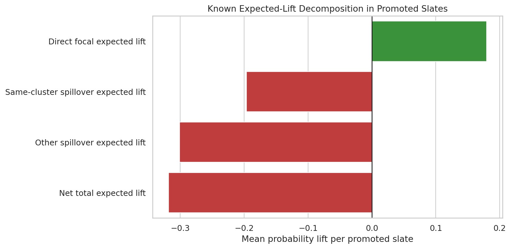

<figure class="project-page-figure">

<figcaption>Figure 1: Total effect decomposition separating direct exposure effects from spillover pathways.</figcaption>
</figure>

This lab studies settings where one unit's treatment can affect another unit's outcome. That matters in recommendation, marketplace, and networked systems because exposure can propagate through shared items, users, clusters, or local neighborhoods.

The workflow starts by defining exposure rather than assuming independent units. It then compares naive estimators with exposure-aware designs, separates direct and indirect effects, and studies how conclusions change when the spillover definition changes.

## Lab Sequence

<article class="notebook-guide-item">

<a href="../../notebooks/projects/project_4_interference_spillover_effects/01_movielens_interference_setup_eda.html" data-site-path="notebooks/projects/project_4_interference_spillover_effects/01_movielens_interference_setup_eda.html">01. MovieLens Interference Setup and EDA</a>

Introduces the user-item setting, constructs the networked structure, and explains why ordinary no-interference assumptions are too strong for this lab.

</article>
<article class="notebook-guide-item">

<a href="../../notebooks/projects/project_4_interference_spillover_effects/02_spillover_exposure_mapping.html" data-site-path="notebooks/projects/project_4_interference_spillover_effects/02_spillover_exposure_mapping.html">02. Spillover Exposure Mapping</a>

Defines exposure summaries that translate neighboring treatment assignments into measurable spillover conditions.

</article>
<article class="notebook-guide-item">

<a href="../../notebooks/projects/project_4_interference_spillover_effects/03_cluster_randomized_estimators.html" data-site-path="notebooks/projects/project_4_interference_spillover_effects/03_cluster_randomized_estimators.html">03. Cluster Randomized Estimators</a>

Uses clustered assignment logic to estimate effects when correlated exposure and spillover risk make individual assignment less credible.

</article>
<article class="notebook-guide-item">

<a href="../../notebooks/projects/project_4_interference_spillover_effects/04_direct_indirect_total_effects.html" data-site-path="notebooks/projects/project_4_interference_spillover_effects/04_direct_indirect_total_effects.html">04. Direct, Indirect, and Total Effects</a>

Decomposes the overall effect into direct treatment effects and spillover pathways, making the estimand match the system behavior.

</article>
<article class="notebook-guide-item">

<a href="../../notebooks/projects/project_4_interference_spillover_effects/05_advanced_spillover_models.html" data-site-path="notebooks/projects/project_4_interference_spillover_effects/05_advanced_spillover_models.html">05. Advanced Spillover Models</a>

Adds richer modeling and targeting analyses to study where spillovers are strongest and how policy value changes under network-aware estimation.

</article>

