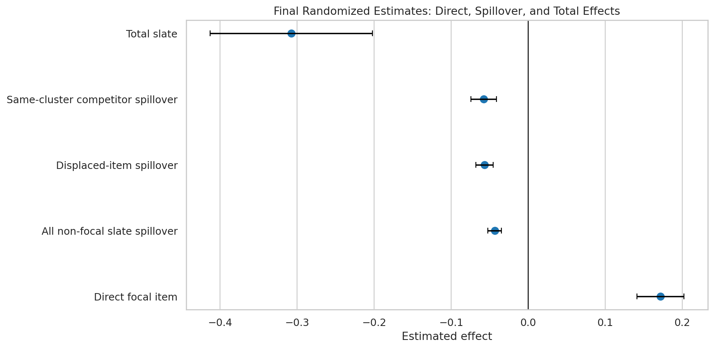
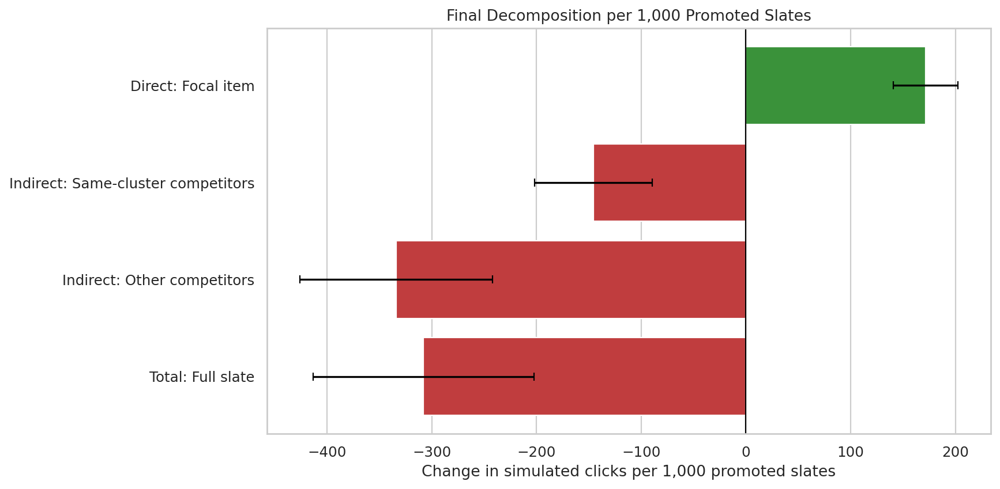
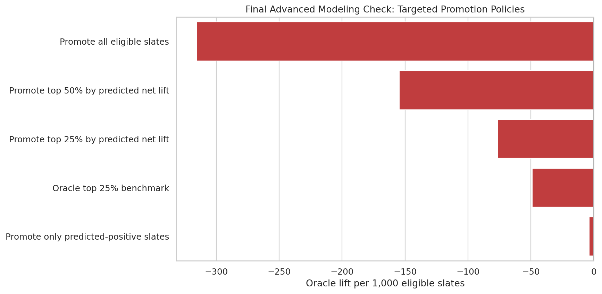

## Decision Question

How does promoting one item affect both that item and nearby competing items in the recommendation surface?

## Causal Setup

- Treatment is focal item promotion in simulated recommendation slates.
- Outcomes include direct item response plus nearby-item displacement or spillover response.
- The main design challenge is that standard no-interference assumptions do not hold.

## Methods

- Spillover exposure mapping
- Cluster-randomized estimators
- Direct, indirect, and total effects
- Advanced spillover models
- Sensitivity checks and decision-oriented interpretation

## Decision Takeaway

The project shows that causal claims in ranking and marketplace surfaces must account for displacement, spillovers, and constrained attention before they are used for policy decisions.

## Selected Figures

## Notebook Sequence

<ol class="notebook-sequence">
  <li><a href="../../notebooks/projects/project_4_interference_spillover_effects/01_movielens_interference_setup_eda.html" data-site-path="notebooks/projects/project_4_interference_spillover_effects/01_movielens_interference_setup_eda.html">MovieLens Interference Setup and EDA</a></li>
  <li><a href="../../notebooks/projects/project_4_interference_spillover_effects/02_spillover_exposure_mapping.html" data-site-path="notebooks/projects/project_4_interference_spillover_effects/02_spillover_exposure_mapping.html">Spillover Exposure Mapping</a></li>
  <li><a href="../../notebooks/projects/project_4_interference_spillover_effects/03_cluster_randomized_estimators.html" data-site-path="notebooks/projects/project_4_interference_spillover_effects/03_cluster_randomized_estimators.html">Cluster-Randomized Estimators for Direct and Spillover Effects</a></li>
  <li><a href="../../notebooks/projects/project_4_interference_spillover_effects/04_direct_indirect_total_effects.html" data-site-path="notebooks/projects/project_4_interference_spillover_effects/04_direct_indirect_total_effects.html">Direct, Indirect, and Total Effects</a></li>
  <li><a href="../../notebooks/projects/project_4_interference_spillover_effects/05_advanced_spillover_models.html" data-site-path="notebooks/projects/project_4_interference_spillover_effects/05_advanced_spillover_models.html">Advanced Spillover Models</a></li>
</ol>

## Generated Artifacts

- [Final Project Summary](../../notebooks/projects/project_4_interference_spillover_effects/writeup/final_project_summary.md)
- [Resume Bullets](../../notebooks/projects/project_4_interference_spillover_effects/writeup/resume_bullets.md)
- [Final Main Effects](../../notebooks/projects/project_4_interference_spillover_effects/writeup/tables/final_main_effects.csv)
- [Final Direct Indirect Total Decomposition](../../notebooks/projects/project_4_interference_spillover_effects/writeup/tables/final_direct_indirect_total_decomposition.csv)
- [Final Recommendations](../../notebooks/projects/project_4_interference_spillover_effects/writeup/tables/final_recommendations.csv)

## Limitations

These notebook-driven causal analyses should be read with their identification assumptions, support diagnostics, measurement choices, and sensitivity checks in view.
