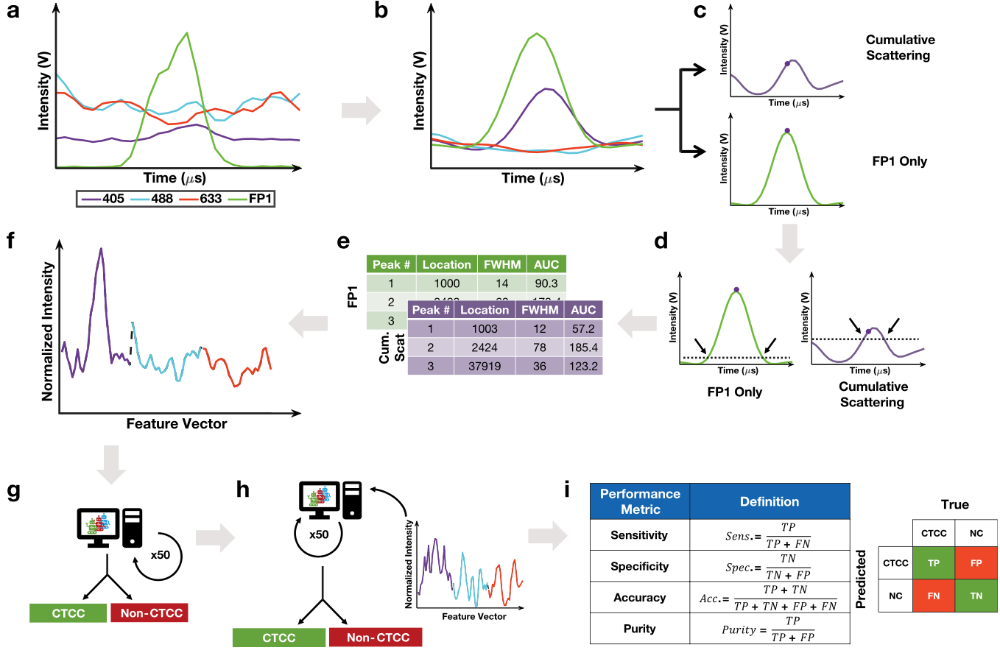

<figure class="project-page-figure">

<figcaption>Figure 1: Flow-cytometry and machine-learning workflow for detecting rare circulating tumor cell clusters in whole blood.</figcaption>
</figure>

## Problem

Circulating tumor cell clusters are rare events with clinical importance because they are associated with metastatic risk. Detecting them in whole blood is difficult. Label-based workflows can be limiting, while purely manual detection is not scalable.

This project studies whether optical signals from backscatter flow cytometry can support label-free detection of rare cell clusters with machine learning.

Figure 1 provides the overview of that sensing-to-decision pipeline. It connects whole-blood flow-cytometry signals to machine-learning detection and frames the project as rare-event evidence extraction from a difficult measurement system.

## Contribution

This project develops label-free statistical and machine-learning workflows for detecting rare circulating tumor cell clusters from flow-cytometry signals [1, 2, 3]. In particular, the project:

- Treats circulating tumor cell cluster detection as a rare-event classification problem in whole blood, where sensitivity, specificity, precision, and false-alarm rate all matter for downstream use.
- Uses fluorescence-labeled events as development-stage ground truth while training label-free classifiers on multiwavelength backscatter flow-cytometry signals.
- Builds peak-detection and event-classification models that separate cluster-associated events from background whole-blood signal variation.
- Evaluates performance through operating-characteristic quantities such as sensitivity, precision, specificity, overall accuracy, and false-alarm rate, rather than accuracy alone.
- Compares detected cluster counts with expected spike-in counts, using agreement measures such as Pearson correlation and Poisson variability to check whether the detection pipeline preserves count information.
- Extends the workflow with deep learning and transfer learning so that the statistical detection rule can adapt across cluster type, species, and cancer-cell context.

## Evidence

[2] reports that the label-free backscatter workflow detects about 93 percent of circulating tumor cell clusters larger than two cells, with precision above 82 percent and overall accuracy above 95 percent. That result matters because rare-event detection has to balance sensitivity against the follow-up burden created by false positives.

[3] studies a deep-learning version of the workflow. The reported false-alarm rate is 0.78 events per minute, and detected versus expected cluster counts have Pearson correlation 0.943. The reported precision is 72 percent, with 35.3 percent sensitivity for homotypic and heterotypic clusters starting at two cells. Transfer-learning experiments show that the approach can be adapted across species and cancer cell types.

The project is a biomedical anomaly-detection example where the sensing system, model threshold, false-alarm behavior, and downstream biological interpretation all matter. The goal is to classify the signal and produce rare-event evidence that can support monitoring, isolation, or further clinical investigation.

## Selected Publications

::: {.citation-list}
- **[1]** Vora, N., **Shekhar, P.**, Esmail, M., Patra, A., & Georgakoudi, I. (2022). Detection of rare circulating tumor cell clusters in whole blood using label-free, flow cytometry. In *Biophotonics Congress: Biomedical Optics 2022 (Translational, Microscopy, OCT, OTS, BRAIN), Technical Digest Series*, paper MW3A.3. Optica Publishing Group. <https://opg.optica.org/abstract.cfm?URI=Microscopy-2022-MW3A.3>
- **[2]** Vora, N., **Shekhar, P.**, Esmail, M., Patra, A., & Georgakoudi, I. (2022). Label-free flow cytometry of rare circulating tumor cell clusters in whole blood. *Scientific Reports, 12*, 10721. <https://doi.org/10.1038/s41598-022-14003-5>
- **[3]** Vora, N., **Shekhar, P.**, Hanulia, T., Esmail, M., Patra, A., & Georgakoudi, I. (2024). Deep learning-enabled detection of rare circulating tumor cell clusters in whole blood using label-free flow cytometry. *Lab on a Chip, 24*, 2237-2252. <https://doi.org/10.1039/d3lc00694h>
:::
