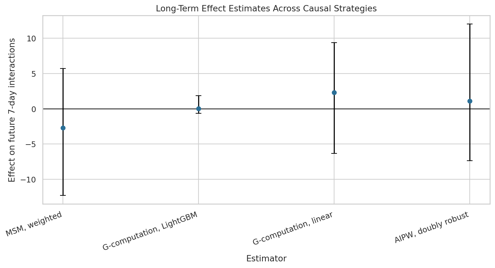
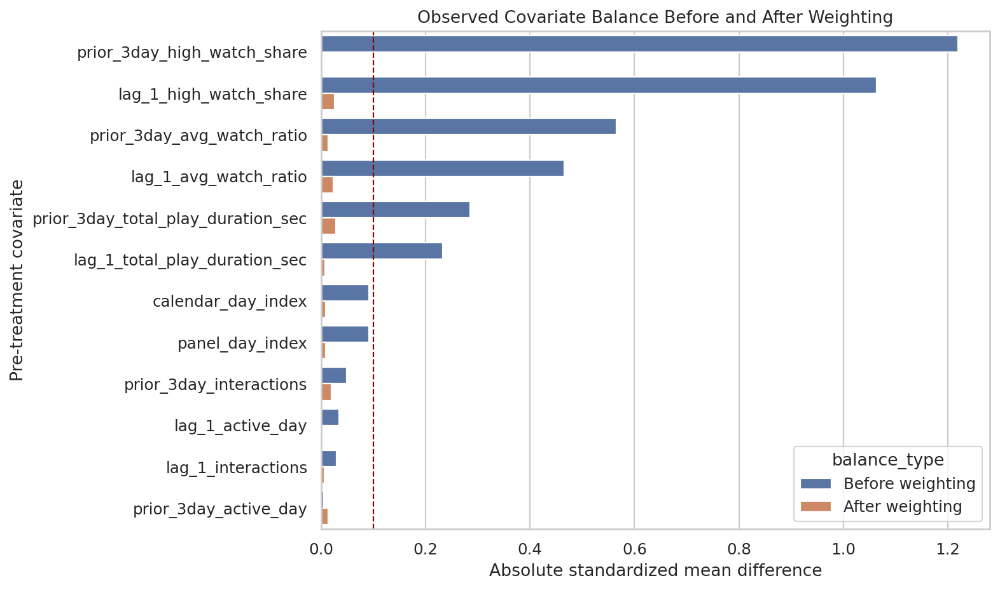

## Decision Question

How do sequential recommendation exposures affect future engagement or retention?

## Causal Setup

- Treatment is short-term recommendation exposure across time.
- Outcome is future engagement and retention-style behavior.
- The main design challenge is time-varying confounding affected by prior exposure.

## Methods

- Long-term outcome definition
- Time-dependent propensity weights
- Marginal structural models
- G-computation
- Doubly robust and heterogeneous effect analysis

## Decision Takeaway

The project shows that durable value often requires sequential estimands, time-varying diagnostics, and longer-horizon outcome definitions.

## Selected Figures

## Notebook Sequence

<ol class="notebook-sequence">
  <li><a href="../../notebooks/projects/project_3_long_term_causal_effects/01_kuairec_sequence_eda.html" data-site-path="notebooks/projects/project_3_long_term_causal_effects/01_kuairec_sequence_eda.html">Notebook 01: KuaiRec Sequence EDA for Long-Term Causal Effects</a></li>
  <li><a href="../../notebooks/projects/project_3_long_term_causal_effects/02_long_term_outcome_definition.html" data-site-path="notebooks/projects/project_3_long_term_causal_effects/02_long_term_outcome_definition.html">Notebook 02: Defining the Long-Term Causal Estimand</a></li>
  <li><a href="../../notebooks/projects/project_3_long_term_causal_effects/03_time_varying_confounding_and_propensity.html" data-site-path="notebooks/projects/project_3_long_term_causal_effects/03_time_varying_confounding_and_propensity.html">Notebook 03: Time-Varying Confounding and Propensity Weights</a></li>
  <li><a href="../../notebooks/projects/project_3_long_term_causal_effects/04_marginal_structural_model.html" data-site-path="notebooks/projects/project_3_long_term_causal_effects/04_marginal_structural_model.html">Notebook 04: Marginal Structural Model for Long-Term Effects</a></li>
  <li><a href="../../notebooks/projects/project_3_long_term_causal_effects/05_g_computation.html" data-site-path="notebooks/projects/project_3_long_term_causal_effects/05_g_computation.html">Notebook 05: G-Computation for Long-Term Effects</a></li>
  <li><a href="../../notebooks/projects/project_3_long_term_causal_effects/06_doubly_robust_heterogeneous_effects.html" data-site-path="notebooks/projects/project_3_long_term_causal_effects/06_doubly_robust_heterogeneous_effects.html">Notebook 06: Doubly Robust Heterogeneous Effects</a></li>
</ol>

## Generated Artifacts

- [Final Project Summary](../../notebooks/projects/project_3_long_term_causal_effects/writeup/final_project_summary.md)
- [Resume Bullets](../../notebooks/projects/project_3_long_term_causal_effects/writeup/resume_bullets.md)
- [Final Estimator Comparison](../../notebooks/projects/project_3_long_term_causal_effects/writeup/tables/final_estimator_comparison.csv)
- [Final Recommendation](../../notebooks/projects/project_3_long_term_causal_effects/writeup/tables/final_recommendation.csv)
- [Limitations](../../notebooks/projects/project_3_long_term_causal_effects/writeup/tables/limitations.csv)

## Limitations

These notebook-driven causal analyses should be read with their identification assumptions, support diagnostics, measurement choices, and sensitivity checks in view.
