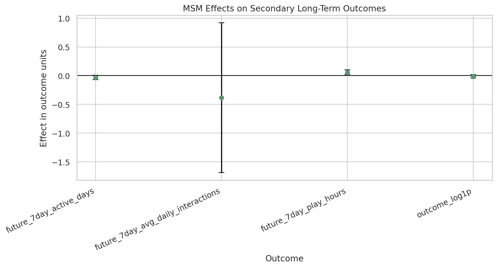

<figure class="project-page-figure">

<figcaption>Figure 1: Secondary outcome checks showing how recommender interventions can affect engagement beyond the immediate response.</figcaption>
</figure>

This lab studies the difference between immediate engagement and longer-term user response in recommender systems. A recommendation intervention can change what a user watches now and can also shape future exposure, future preferences, and later engagement. That makes the causal problem sequential and history-dependent.

The lab builds a time-indexed workflow with treatment history, outcome windows, time-varying confounders, and policy-relevant estimands. It introduces marginal structural models and g-computation as practical tools for reasoning about sequential effects when earlier exposure changes later context.

## Key Takeaway

Across marginal structural models, g-computation, and doubly robust estimation, the KuaiRec evidence is weak for a clear average long-term interaction-volume gain from short-term high-watch exposure. The project is most useful as a diagnostic workflow. Logged recommender data can identify where short-term engagement may be fragile, which user-history segments deserve follow-up tests, and what evidence should be collected before changing a ranking or recommendation policy.

## Lab Sequence

<article class="notebook-guide-item">

<a href="../../notebooks/projects/project_3_long_term_causal_effects/01_kuairec_sequence_eda.html" data-site-path="notebooks/projects/project_3_long_term_causal_effects/01_kuairec_sequence_eda.html">01. KuaiRec Sequence EDA</a>

Builds the sequential user-item setting and introduces the data structure needed to study effects that unfold over time.

</article>
<article class="notebook-guide-item">

<a href="../../notebooks/projects/project_3_long_term_causal_effects/02_long_term_outcome_definition.html" data-site-path="notebooks/projects/project_3_long_term_causal_effects/02_long_term_outcome_definition.html">02. Long-Term Outcome Definition</a>

Defines short- and long-term outcomes, clarifies the timing of treatment and response, and shows why outcome windows are design choices.

</article>
<article class="notebook-guide-item">

<a href="../../notebooks/projects/project_3_long_term_causal_effects/03_time_varying_confounding_and_propensity.html" data-site-path="notebooks/projects/project_3_long_term_causal_effects/03_time_varying_confounding_and_propensity.html">03. Time-Varying Confounding and Propensity</a>

Models treatment assignment across time and shows how prior behavior can affect both future exposure and future outcomes.

</article>
<article class="notebook-guide-item">

<a href="../../notebooks/projects/project_3_long_term_causal_effects/04_marginal_structural_model.html" data-site-path="notebooks/projects/project_3_long_term_causal_effects/04_marginal_structural_model.html">04. Marginal Structural Model</a>

Uses inverse probability weights to estimate sequential effects while accounting for time-varying confounders affected by earlier exposure.

</article>
<article class="notebook-guide-item">

<a href="../../notebooks/projects/project_3_long_term_causal_effects/05_g_computation.html" data-site-path="notebooks/projects/project_3_long_term_causal_effects/05_g_computation.html">05. G-Computation</a>

Builds outcome models for counterfactual trajectories and compares model-based sequential estimates with weighted approaches.

</article>
<article class="notebook-guide-item">

<a href="../../notebooks/projects/project_3_long_term_causal_effects/06_doubly_robust_heterogeneous_effects.html" data-site-path="notebooks/projects/project_3_long_term_causal_effects/06_doubly_robust_heterogeneous_effects.html">06. Doubly Robust Heterogeneous Effects</a>

Studies how longer-term effects vary across users and contexts while combining outcome and propensity information for more stable estimation.

</article>

