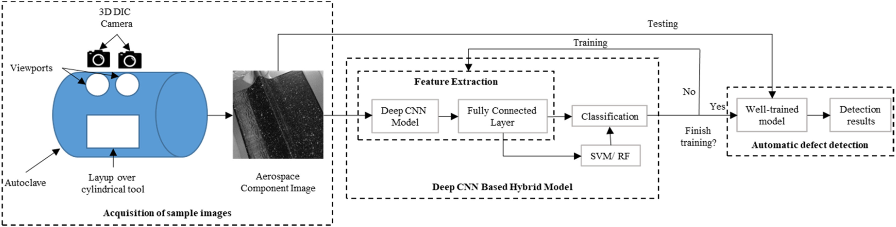
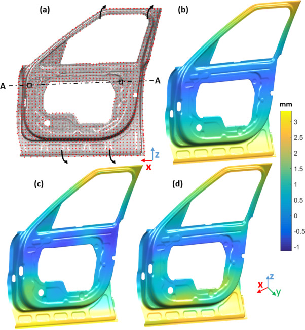

<figure class="project-page-figure">

<figcaption>Figure 1: Automated optical inspection workflow linking image acquisition, learned visual features, hybrid classification, and defect-detection decisions.</figcaption>
</figure>

## Problem

Aerospace manufacturing inspection requires consistent detection of defects under limited labeled data, class imbalance, and complex geometric variation. Manual inspection is slow and subjective, while rule-based inspection can fail when defects vary in shape or appearance.

The operational decision is whether a manufactured component is acceptable, needs rework, or requires further inspection. That decision has asymmetric costs. A missed defect can create reliability and safety risk, while excessive false alarms can slow production and reduce trust in the inspection system.

Figure 1 is important because it places the machine-learning model inside the manufacturing process. The input starts with a component over a cylindrical tool, camera-based acquisition, and a visible surface pattern where defects can be subtle. The classifier is therefore part of an inspection chain, and its output must be useful for deciding whether the part should move forward, be flagged, or be inspected more carefully.

<figure class="project-page-figure">

<figcaption>Figure 2: Global non-ideal part deformation on an automotive door inner panel. The panels show the key-point setting used to define the deformation axis, the generated mean part, and two simulated part instances with millimeter-scale spatial variation. Adapted from [2].</figcaption>
</figure>

Figure 2 adds the design-stage side of anomaly handling. Manufacturing anomalies are not only surface defects found after production. They also include plausible geometric deviations that engineers need to anticipate during design. The figure shows how spatially structured shape error can be generated on a realistic part geometry, which makes it possible to study tolerance, robustness, and inspection strategy before many physical examples are available.

## Contribution

This project develops two connected pieces of the manufacturing quality problem [1, 2].

- Creates a domain-specific automated optical inspection workflow for aerospace composite components.
- Combines convolutional feature learning with classical machine-learning classifiers such as support vector machines and random forests.
- Uses DCGAN-based data augmentation to address scarce and imbalanced defect examples.
- Evaluates the inspection workflow with five-fold cross-validation and reports very high defect-detection accuracy.
- Develops morphing Gaussian random fields for simulating spatially correlated shape errors during early design.
- Supports designer-centered what-if analysis by generating local and global deformations, technological patterns, and form-tolerance variation before production data are abundant.

## Evidence

[1] reports a DCNN-based automated optical inspection workflow for composite aerospace materials. The study builds defect and non-defect image datasets, uses generative augmentation to strengthen learning under data scarcity, and compares deep models, classical models, and hybrid workflows. The best reported defect-detection accuracy reaches 99.68 percent.

[2] extends the quality problem to early design by simulating non-ideal part geometry. Morphing Gaussian random fields capture spatially structured deviations such as global bending, local dents, flange variation, and form-tolerance patterns. That matters because manufacturing variation is rarely independent point noise. Where the deformation occurs can matter as much as its overall magnitude.

Together, these workstreams connect inspection after manufacturing with simulation before manufacturing. One side asks whether a visible component defect should trigger review or rework. The other side asks how plausible shape variation can be generated early enough for engineers to study tolerance, robustness, and inspection strategy.

## Selected Publications

::: {.citation-list}
- **[1]** Jha, S. B., Babiceanu, R. F., **Shekhar, P.**, & Namilae, S. (2025). Deep convolutional neural network-based automated optical inspection for aerospace components. *Digital Engineering, 7*, 100062. <https://doi.org/10.1016/j.dte.2025.100062>
- **[2]** Babu, M., Franciosa, P., **Shekhar, P.**, & Ceglarek, D. (2023). Object shape error modelling and simulation during early design phase by morphing Gaussian random fields. *Computer-Aided Design, 158*, 103481. <https://doi.org/10.1016/j.cad.2023.103481>
:::
