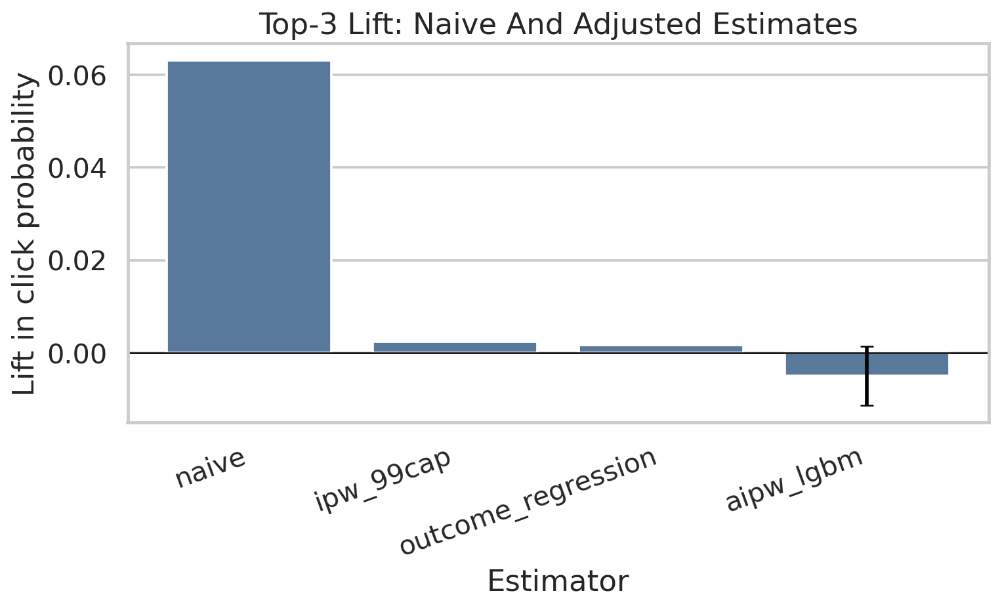
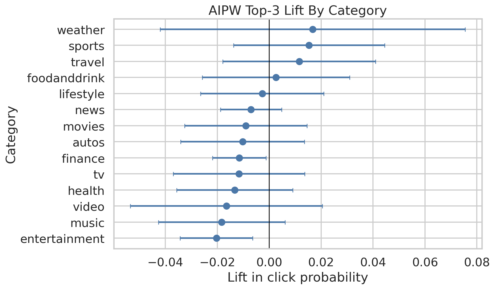
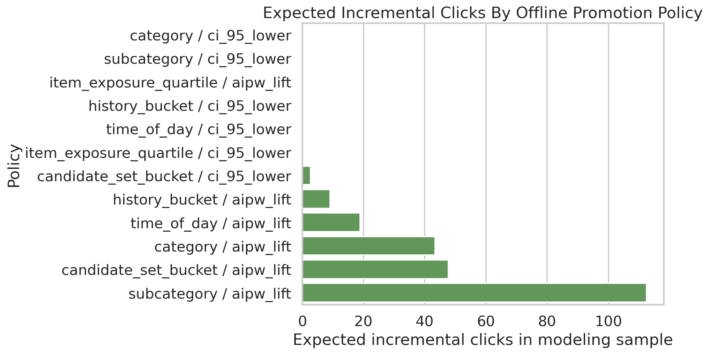

## Decision Question

Does placing a news item in the top 3 recommendation positions cause more clicks, or are top-ranked items simply more relevant and therefore more likely to be clicked anyway?

## Causal Setup

- Treatment is whether the item appears in the top 3 recommendation positions.
- Outcome is click on the displayed item.
- Adjustment uses user history, item metadata, slate size, time context, and item exposure features.

## Methods

- Propensity modeling and IPW
- Doubly robust / AIPW estimation
- Heterogeneous effects
- Policy simulation
- ML nuisance models and EconML extensions

## Decision Takeaway

The project demonstrates the full applied causal workflow, including confounding checks, adjustment, doubly robust estimation, heterogeneity, policy simulation, and sensitivity analysis for a ranking decision.

## Selected Figures

## Notebook Sequence

<ol class="notebook-sequence">
  <li><a href="../../notebooks/projects/project_1_ranking/01_eda_mind.html" data-site-path="notebooks/projects/project_1_ranking/01_eda_mind.html">01 - MIND Rank Position EDA</a></li>
  <li><a href="../../notebooks/projects/project_1_ranking/02_propensity_ipw.html" data-site-path="notebooks/projects/project_1_ranking/02_propensity_ipw.html">02 - Propensity Modeling And IPW</a></li>
  <li><a href="../../notebooks/projects/project_1_ranking/03_doubly_robust.html" data-site-path="notebooks/projects/project_1_ranking/03_doubly_robust.html">03 - Doubly Robust Estimation</a></li>
  <li><a href="../../notebooks/projects/project_1_ranking/04_heterogeneous_effects.html" data-site-path="notebooks/projects/project_1_ranking/04_heterogeneous_effects.html">04 - Heterogeneous Treatment Effects</a></li>
  <li><a href="../../notebooks/projects/project_1_ranking/05_policy_simulation.html" data-site-path="notebooks/projects/project_1_ranking/05_policy_simulation.html">05 - Policy Simulation</a></li>
  <li><a href="../../notebooks/projects/project_1_ranking/06_sensitivity_and_limitations.html" data-site-path="notebooks/projects/project_1_ranking/06_sensitivity_and_limitations.html">06 - Sensitivity And Limitations</a></li>
  <li><a href="../../notebooks/projects/project_1_ranking/07_ml_nuisance_models.html" data-site-path="notebooks/projects/project_1_ranking/07_ml_nuisance_models.html">07 - ML Nuisance Models With LightGBM And XGBoost</a></li>
  <li><a href="../../notebooks/projects/project_1_ranking/08_econml_causal_ml.html" data-site-path="notebooks/projects/project_1_ranking/08_econml_causal_ml.html">08 - EconML Causal ML Estimators</a></li>
</ol>

## Generated Artifacts

- [Resume Bullets](../../notebooks/projects/project_1_ranking/writeup/resume_bullets.md)
- [Estimator Comparison](../../notebooks/projects/project_1_ranking/writeup/tables/estimator_comparison.csv)
- [Policy Simulation Summary](../../notebooks/projects/project_1_ranking/writeup/tables/policy_simulation_summary.csv)
- [Limitations](../../notebooks/projects/project_1_ranking/writeup/tables/limitations.csv)

## Limitations

These notebook-driven causal analyses should be read with their identification assumptions, support diagnostics, measurement choices, and sensitivity checks in view.
