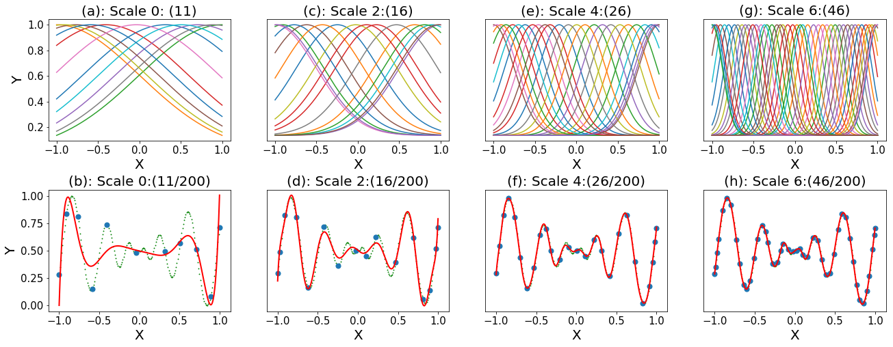
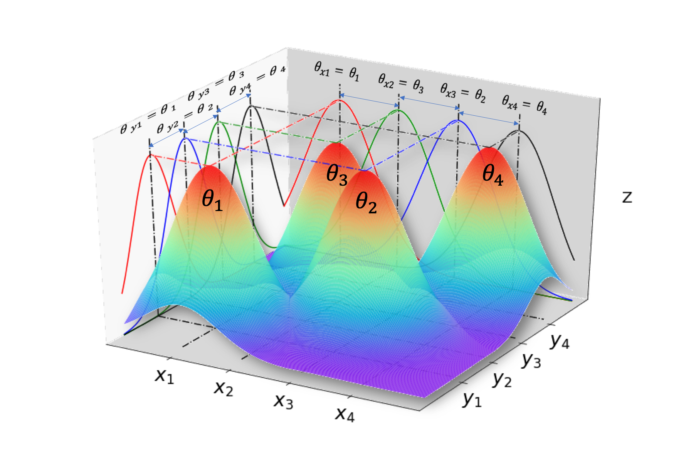
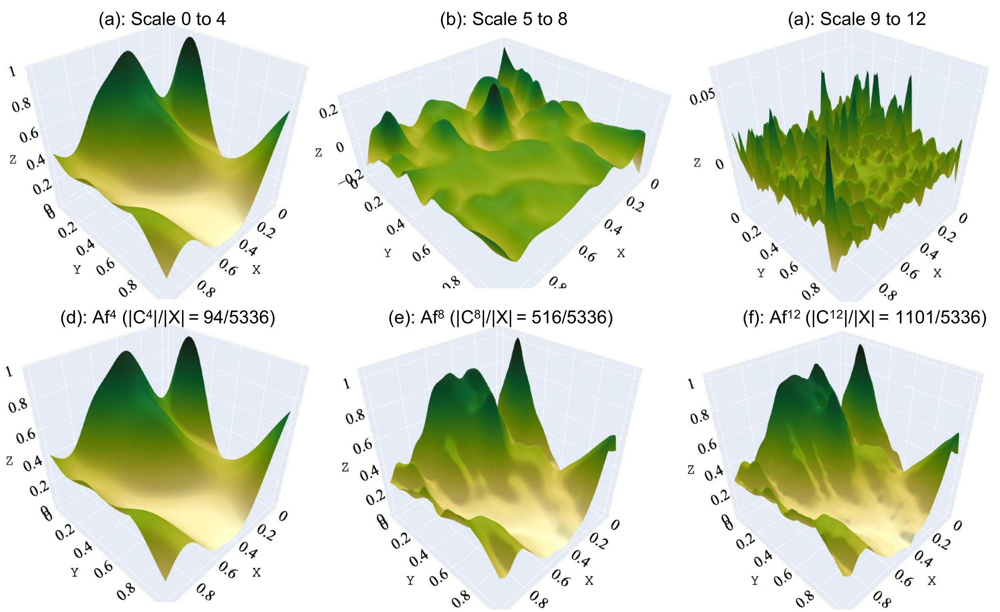

<figure class="project-page-figure">

<figcaption>Figure 1: Multiscale basis-learning structure for hierarchical data reduction and interpretable approximation.</figcaption>
</figure>

## Problem

Large scientific and engineering datasets often require compact representations before they can be learned from, explained, or used in downstream computation. A flat reduction can hide important structure. A hierarchical or multiscale representation can preserve scale-dependent information while still reducing complexity.

Figure 1 is a visual summary of that representation idea. It shows the project as a hierarchy of basis construction and approximation, where the learned structure is meant to be inspected.

<figure class="project-page-figure">

<figcaption>Figure 2: Penalty structure for two-dimensional basis functions. The same coefficient vector can be reordered along the x and y directions through permutation operators, so regularization can be imposed direction by direction while preserving the geometry of the basis layout. Adapted from [3].</figcaption>
</figure>

Figure 2 shows why the reduced representation is meant to remain interpretable. The basis weights are not treated as an opaque vector. They can be organized by spatial position, scale, and coordinate direction, which lets the model encode smoothness assumptions while keeping the approximation tied to geometry.

<figure class="project-page-figure">

<figcaption>Figure 3: Scale-wise multiscale reconstruction of a two-dimensional surface. The upper panels separate basis contributions over increasing scale ranges, while the lower panels show reconstructed approximations using progressively larger sparse representations, from 94 out of 5336 samples at scale 4 to 1101 out of 5336 samples at scale 12. Adapted from [1].</figcaption>
</figure>

Figure 3 makes the data-reduction story concrete. As the scale increases, the representation can recover finer local structure, but it does so by admitting more basis elements. The useful modeling question is therefore not only whether the reconstruction improves. It is also whether the added detail is worth the larger representation for the scientific or engineering task at hand.

## Contribution

This project develops scale-aware approximation and basis-learning methods for interpretable data reduction [1, 2, 3].

- Builds a sparse multiscale learning framework in reproducing-kernel Hilbert spaces, where basis elements can vary by support scale.
- Uses a forward-backward greedy strategy so the algorithm can add useful functions and remove earlier choices that become less useful after the representation changes.
- Provides conditioning and mean-squared-error reduction analysis for the selected basis.
- Develops hierarchical approximation for data reduction and learning at multiple scales, with theory for approximation operators and mean-error behavior.
- Introduces smoothing penalties using projection and permutation operators so the reduced representation can preserve structure in multiple dimensions.
- Extends the multiscale idea to noisy datasets through hierarchical regularization networks that combine sparsification and regularization.

## Evidence

[1] shows how sparse multiscale basis selection can reduce the size of a representation while retaining the scale and location information needed for prediction. The forward-backward step is important in practice because it lets the model revise early basis choices as the representation evolves.

[2] and [3] develop the same representational idea from complementary angles. [2] focuses on hierarchical approximation and data reduction, while [3] studies regularized learning on noisy data. Across this project, interpretability comes from the representation itself. The approximation is organized by scale, sparsity, and geometry, which lets a user inspect whether a prediction is driven by broad structure or local detail.

This project treats representation learning as part of the scientific decision pipeline. A compact model is useful when it is also organized enough for downstream modeling choices, uncertainty assessment, and explanation.

## Selected Publications

::: {.citation-list}
- **[1]** **Shekhar, P.**, & Patra, A. (2022). A forward-backward greedy approach for sparse multiscale learning. *Computer Methods in Applied Mechanics and Engineering, 400*, 115420. <https://doi.org/10.1016/j.cma.2022.115420>
- **[2]** **Shekhar, P.**, & Patra, A. (2020). Hierarchical approximations for data reduction and learning at multiple scales. *Foundations of Data Science*. <https://doi.org/10.3934/fods.2020008>
- **[3]** **Shekhar, P.**, Babu, M., & Patra, A. (2023). Hierarchical regularization networks for sparsification based learning on noisy datasets. *Foundations of Data Science, 5*(4), 520-557. <https://doi.org/10.3934/fods.2023009>
:::
