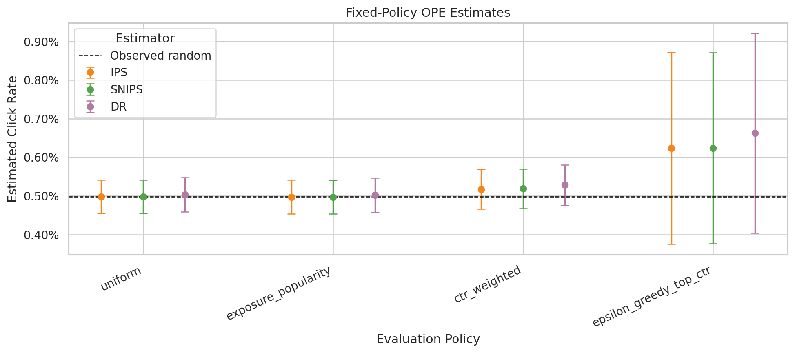
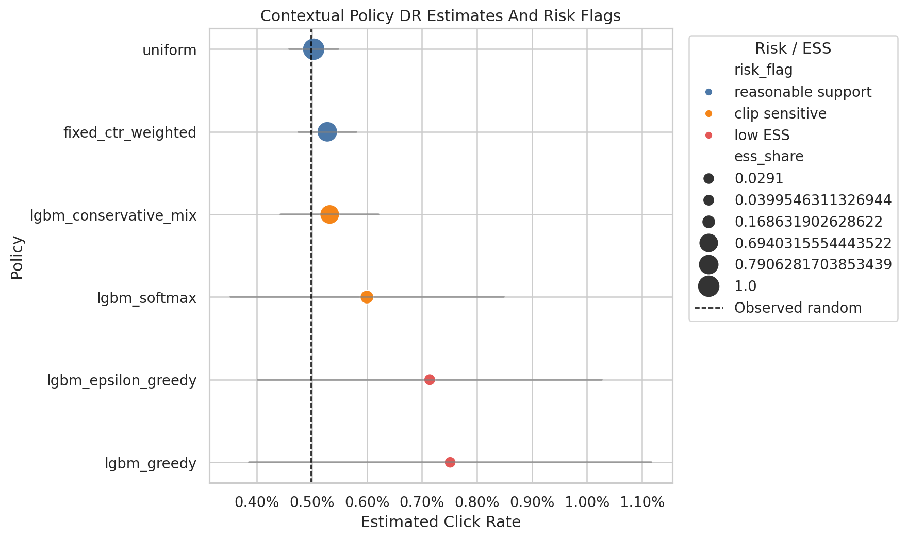
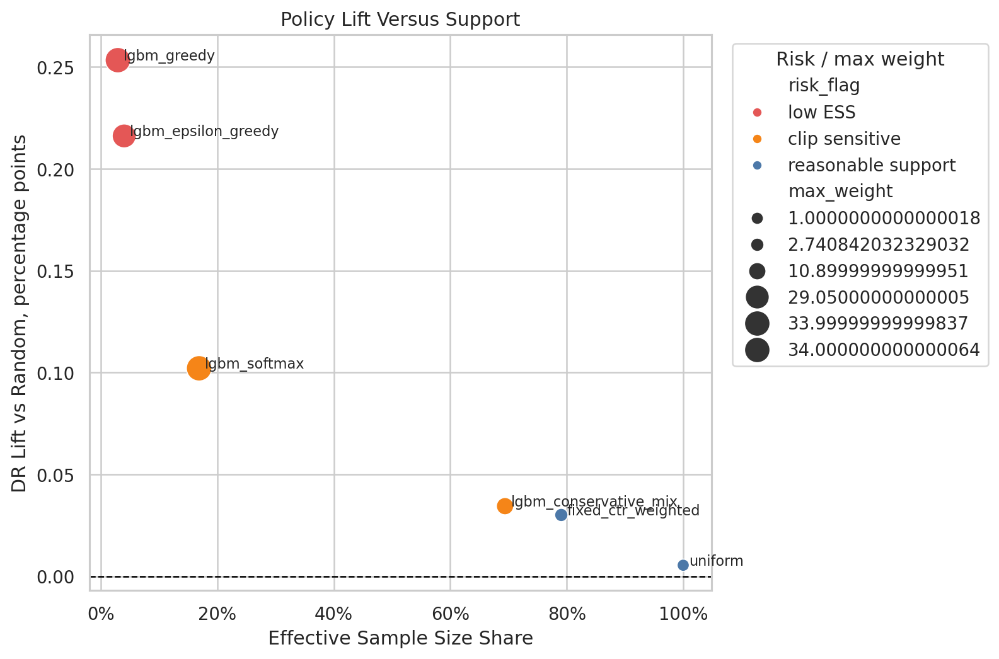

## Decision Question

Which recommendation policy is credible enough to move from offline analysis into an online A/B test?

## Causal Setup

- Context contains user, item, position, and time features available before recommendation.
- Action is the recommended item.
- Reward is the observed click.
- Behavior policy is the logged policy that generated historical data.

## Methods

- IPS and self-normalized IPS
- Direct method reward modeling
- Doubly robust off-policy evaluation
- Effective sample size and weight-tail diagnostics
- Contextual policy learning

## Decision Takeaway

The project shows how to separate high point estimates from credible offline policy candidates by auditing support, clipping sensitivity, and reward-model stability.

## Selected Figures

## Notebook Sequence

<ol class="notebook-sequence">
  <li><a href="../../notebooks/projects/project_2_off_policy_evaluation/01_open_bandit_eda.html" data-site-path="notebooks/projects/project_2_off_policy_evaluation/01_open_bandit_eda.html">01 Open Bandit EDA</a></li>
  <li><a href="../../notebooks/projects/project_2_off_policy_evaluation/02_behavior_policy_and_propensities.html" data-site-path="notebooks/projects/project_2_off_policy_evaluation/02_behavior_policy_and_propensities.html">02 Behavior Policy And Propensity Diagnostics</a></li>
  <li><a href="../../notebooks/projects/project_2_off_policy_evaluation/03_ips_and_snips.html" data-site-path="notebooks/projects/project_2_off_policy_evaluation/03_ips_and_snips.html">03 IPS And SNIPS Policy Evaluation</a></li>
  <li><a href="../../notebooks/projects/project_2_off_policy_evaluation/04_doubly_robust_ope.html" data-site-path="notebooks/projects/project_2_off_policy_evaluation/04_doubly_robust_ope.html">04 Doubly Robust Off-Policy Evaluation</a></li>
  <li><a href="../../notebooks/projects/project_2_off_policy_evaluation/05_policy_comparison_and_sensitivity.html" data-site-path="notebooks/projects/project_2_off_policy_evaluation/05_policy_comparison_and_sensitivity.html">05 Policy Comparison And Sensitivity</a></li>
  <li><a href="../../notebooks/projects/project_2_off_policy_evaluation/06_contextual_policy_learning.html" data-site-path="notebooks/projects/project_2_off_policy_evaluation/06_contextual_policy_learning.html">06 Contextual Policy Learning</a></li>
</ol>

## Generated Artifacts

- [Final Project Summary](../../notebooks/projects/project_2_off_policy_evaluation/writeup/final_project_summary.md)
- [Resume Bullets](../../notebooks/projects/project_2_off_policy_evaluation/writeup/resume_bullets.md)
- [Final Recommendation](../../notebooks/projects/project_2_off_policy_evaluation/writeup/tables/final_recommendation.csv)
- [Contextual Policy Decision Table](../../notebooks/projects/project_2_off_policy_evaluation/writeup/tables/contextual_policy_decision_table.csv)
- [Policy Risk Table](../../notebooks/projects/project_2_off_policy_evaluation/writeup/tables/policy_risk_table.csv)

## Limitations

These notebook-driven causal analyses should be read with their identification assumptions, support diagnostics, measurement choices, and sensitivity checks in view.
