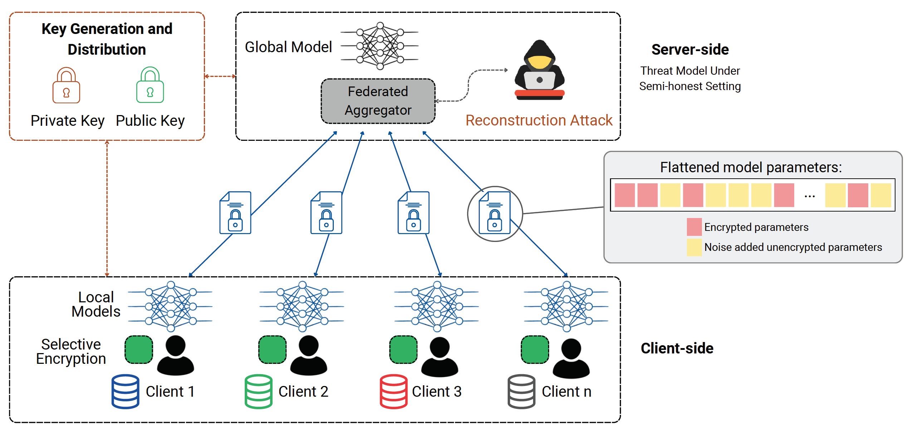
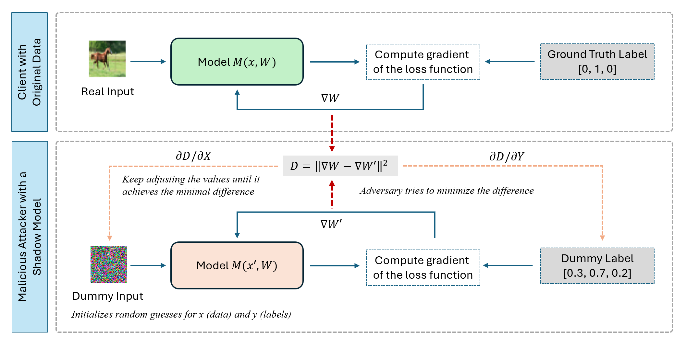

<figure class="project-page-figure">

<figcaption>Figure 1: Selective homomorphic encryption workflow for reducing gradient leakage in distributed learning.</figcaption>
</figure>

## Problem

Federated learning keeps raw data on local devices, but gradients and model updates can still leak sensitive information. Reconstruction attacks and model-inversion attacks turn the communication step itself into part of the privacy risk.

This project studies privacy protection at the communication layer of distributed learning, with connected and autonomous vehicle systems as a motivating setting [1] and selective encryption as a broader federated-learning defense [2].

Figure 1 places selective homomorphic encryption inside the federated aggregation workflow. It shows the key design issue. Collaborative training has to preserve accuracy while controlling what gradients reveal and how much encryption cost the deployment can afford.

<figure class="project-page-figure">

<figcaption>Figure 2: Adversarial reconstruction of sensitive input data from shared gradients, beginning with random input initialization. Adapted from [1].</figcaption>
</figure>

Figure 2 makes the privacy failure mode concrete. The attacker does not need direct access to the original client data. Shared gradients can be matched against gradients from dummy inputs and labels, allowing the attacker to iteratively reconstruct a plausible private example. This is why the project studies encrypted aggregation and selective encryption as part of distributed training, rather than treating federated learning as private simply because raw data remain local.

## Contribution

The work develops encrypted and selectively encrypted federated-learning workflows that balance reconstruction risk, accuracy, and computational cost [1, 2].

- Evaluates leveled homomorphic encryption for secure distributed learning in connected and autonomous vehicle settings.
- Studies selective encryption as a practical alternative to fully encrypted training, where sensitive gradient components receive stronger protection while less sensitive components remain cheaper to communicate and aggregate.
- Builds an end-to-end privacy-preserving pipeline for mitigating Deep Leakage from Gradients style attacks while preserving model utility.
- Develops a theoretical framework for selective encryption against reconstruction and model-inversion attacks.
- Identifies encryption ratio, model complexity, and exposed-gradient structure as key drivers of privacy risk.
- Uses Bayesian Cramer-Rao lower-bound analysis to connect selective encryption decisions with risk quantification.

## Evidence

[1] evaluates homomorphic-encryption defenses under a gradient-reconstruction threat model. The study compares protected and unprotected training workflows, examines the cost of full encryption, and tests selective encryption as a way to reduce overhead while keeping sensitive update information hidden from the server or an attacker.

[2] adds the risk-analysis layer. It studies how reconstruction risk changes with the encryption ratio, the complexity of the learning model, and the amount of gradient information exposed. That makes the privacy mechanism continuous and tunable. A deployment can ask how much protection is needed for a given communication budget and threat model.

Across this project, privacy is treated as an engineering constraint in the learning system. Raw data locality is the starting point, while gradient protection, efficiency, and theoretical risk bounds determine whether the federated workflow is actually safe enough to deploy.

## Selected Publications

::: {.citation-list}
- **[1]** Najjar, M. A., Huang, R.-Y., Samaraweera, D., & **Shekhar, P.** (2025). *Secure distributed learning for CAVs: Defending against gradient leakage with leveled homomorphic encryption*. arXiv. <https://doi.org/10.48550/arXiv.2506.07894>
- **[2]** Huang, R.-Y., Samaraweera, D., **Shekhar, P.**, & Chang, J. M. (2025). *Advancing practical homomorphic encryption for federated learning: Theoretical guarantees and efficiency optimizations*. arXiv. <https://doi.org/10.48550/arXiv.2509.20476>
:::
