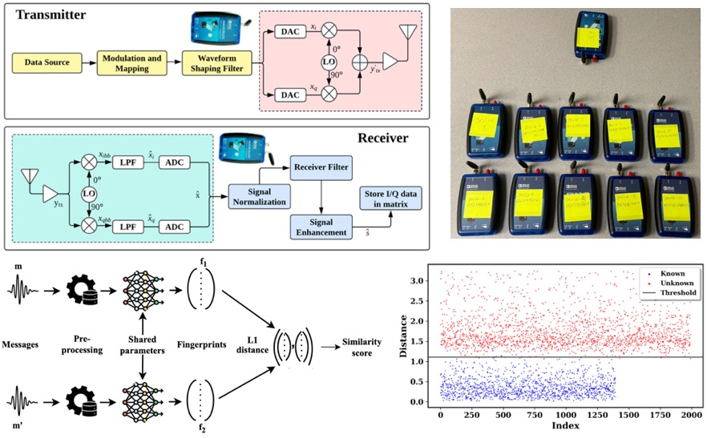

<figure class="project-page-figure">

<figcaption>Figure 1: RF fingerprinting workflow that uses signal imperfections for device authentication and rogue-transmitter detection.</figcaption>
</figure>

## Problem

IoT networks need lightweight ways to authenticate devices, especially when large fleets make retraining and manual trust management difficult. Radio-frequency fingerprinting uses hardware-level imperfections in transmitted signals as a device signature, but the system must also handle new devices and adversarial attempts to mimic known transmitters.

Figure 1 frames RF fingerprinting as a decision workflow in which raw wireless signals become learned fingerprints, fingerprints become similarity evidence, and the authentication system decides whether a transmitter should be trusted or treated as unknown.

## Contribution

The RF fingerprinting projects develop two complementary authentication workflows for wireless security decisions [1, 2].

- Constructs a public RF-fingerprinting dataset from ten ADALM-PLUTO software-defined radios and uses the received I/Q signal as the device-identification evidence.
- Trains a Siamese network to learn similarity embeddings, which helps compare transmitters without retraining a standard classifier every time a new device is introduced.
- Proposes Similarity-Based Embedding Classification to identify in-library devices and reject out-of-library devices.
- Develops a CNN-GAN framework for adversarial-resilient RF fingerprinting, where synthetic rogue signals are generated to mimic genuine transmitters.
- Uses thresholded CNN confidence to separate trusted, rogue, and adversarially generated transmissions.
- Turns authentication into a stress-tested decision problem, where the system has to remain reliable under signal noise and adaptive attack pressure.

## Evidence

[1] reports experiments using ten ADALM-PLUTO radios and 19,920 frames. The Siamese-network setup trains on seven devices, reserves one device as unknown, and uses another device for validation. The Similarity-Based Embedding Classification workflow identifies both in-library and out-of-library devices with approximately 98 percent accuracy.

[2] extends the setting to adversarial rogue-transmitter detection. The CNN-GAN workflow uses seven genuine devices, two rogue devices, and one validation device. GAN-generated I/Q samples are used to emulate attackers that resemble trusted devices, which makes the detection task more realistic than a clean known-versus-unknown classification benchmark.

Across this project, the operational point is consistent. RF authentication needs learned representations, but it also needs decision thresholds that can handle unknown devices and attacker-generated signals. A high clean-data score is useful only when the accept, reject, and review decisions are stable under deployment conditions.

## Selected Publications

::: {.citation-list}
- **[1]** Dhakal, R., Kandel, L. N., & **Shekhar, P.** (2025). Radio frequency fingerprinting authentication for IoT networks using Siamese networks. *IoT, 6*(3), 47. <https://doi.org/10.3390/iot6030047>
- **[2]** Dhakal, R., **Shekhar, P.**, & Kandel, L. N. (2025). *Adversarial-resilient RF fingerprinting: A CNN-GAN framework for rogue transmitter detection*. arXiv. <https://doi.org/10.48550/arXiv.2510.09663>
:::
