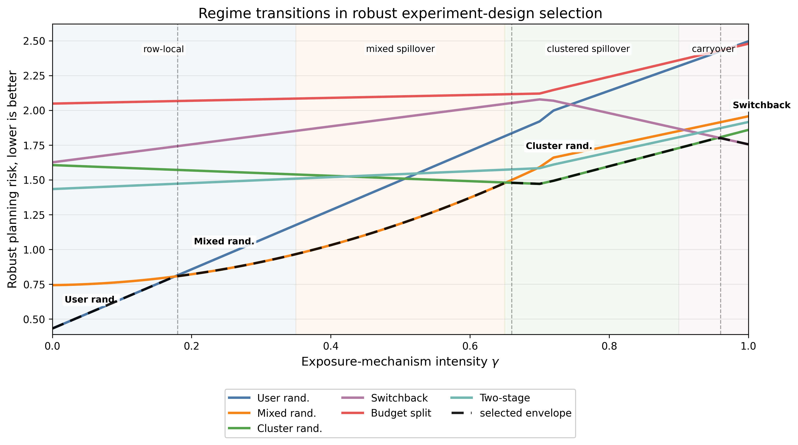

<figure class="project-page-figure">

<figcaption>Figure 1: Regime-transition diagnostic from the robust experiment-design framework in [1]. The figure uses the same six implementable designs, normalized risk components, and planning weights as the empirical selector, while sweeping exposure-mechanism intensity from weak row-local interference to mixed spillover, clustered spillover, and carryover-dominant interference.</figcaption>
</figure>

## Problem

Online experiments in ads, recommendations, and member-experience systems are often planned before the platform team knows which interference mechanism will dominate. Treatment can propagate through budgets, shared inventory, producer exposure, graph neighbors, or temporal carryover. A design that is credible under one mechanism can become biased, underpowered, or operationally expensive under another.

This project studies the design decision that comes before estimation. The question is which experiment should be run when several exposure mechanisms are plausible and each one stresses a different design.

Figure 1, adapted from [1], shows the regime-transition diagnostic used by the robust design framework. The bottom of the figure keeps the implementable design catalog fixed, while the exposure-mechanism intensity is swept from weak row-local interference through mixed spillover, clustered spillover, and carryover-dominant settings. The dashed envelope marks the lowest-risk design in each regime.

Experiment design is a launch decision made before data are collected, so the design record has to explain which exposure risks are being protected against.

## Contribution

The project formulates online experiment design as robust decision-making over an ambiguity set of exposure mechanisms [1]. In particular, the project:

- Builds a deployable robust design selector that takes a finite design catalog, an exposure ambiguity set, historical logs, planning weights, and a shortlist tolerance as inputs.
- Compares feasible designs using a risk function that combines exposure bias, assignment-unit variance, minimum detectable effect, contamination, carryover, operational cost, and estimand mismatch.
- Uses Wasserstein geometry to put exposure-mechanism misspecification on a common scale and proves that design bias can be controlled by distance to the eventual launch exposure distribution.
- Justifies finite design catalogs through approximation results, which is important because platform teams usually choose among a small number of implementable designs.
- Provides excess-risk control for the robust selector, exact recovery when the best design is separated, and certified shortlists when several designs are practically close.

## Evidence

[1] evaluates six implementable designs across public-data examples that mimic advertising, recommendation, and member-experience settings. The selector chooses user randomization on Criteo ads with dimensionless robust risk 1.295, switchbacks on Open Bandit `bts/men` with risk 2.105, and cluster randomization on KuaiRand with risk 2.240.

The Open Bandit case illustrates why the design problem has to be treated carefully. Logged propensities range from 0.00006 to 0.594, and the IPS effective-sample share is only 5.17 percent. That weak support makes some designs look attractive in a simple comparison while leaving the experiment exposed to variance, contamination, or estimand mismatch.

A controlled regime sweep shows phase transitions among user randomization, mixed randomization, cluster randomization, and switchbacks as the assumed interference mechanism changes, thereby supporting the main idea of the project.

## Selected Publications

::: {.citation-list}
- **[1]** **Shekhar, P.**, & Howard, C. (2026). *Choosing online experiment designs under interference in ads, recommendations, and member-experience systems*. arXiv. <https://doi.org/10.48550/arXiv.2605.25290>
:::
