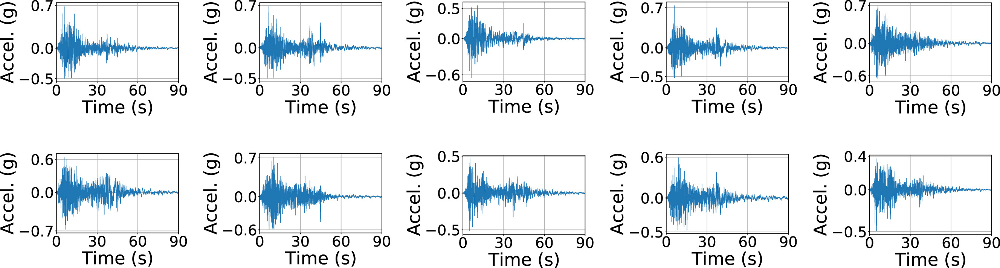

<figure class="project-page-figure">

<figcaption>Figure 1: Idealized one-story and two-story nonlinear structural systems used to study surrogate prediction of earthquake engineering demand parameters.</figcaption>
</figure>

## Problem

Performance-based earthquake engineering uses nonlinear simulations to estimate engineering demand parameters under uncertainty in earthquakes, material behavior, and structural properties. These simulations are expensive, and surrogates trained only on structural parameters can have limited reuse when the ground-motion suite changes.

This project treats the earthquake record itself as part of the model input. The SVD basis acts as an explainable generative model for earthquakes. It represents ground-motion time histories through interpretable basis coordinates, uses those coordinates to generate additional earthquake scenarios, and then combines them with structural parameters so the surrogate learns nonlinear response as a function of both the structure and the excitation.

Figure 1 shows the structural systems behind the surrogate-modeling problem. The one-story and two-story spring-mass-damper systems are simplified enough to support controlled experimentation, while still exposing the central challenge. Structural response depends jointly on uncertain model parameters and uncertain dynamic forcing, so a useful surrogate has to preserve information from both sources.

<figure class="project-page-figure">

<figcaption>Figure 2: Model-generated earthquake signatures shown as acceleration time histories. These realizations are produced by multiplying random samples of the SVD ground-motion weight vector with the learned basis, creating new earthquake inputs that remain tied to observed motion structure. Adapted from [1].</figcaption>
</figure>

Figure 2 makes the generative part of the workflow visible. The project does not treat synthetic earthquakes as arbitrary time-series samples. They are generated through an SVD coordinate system learned from recorded far-field ground motions, which gives the augmentation a clear connection to the original earthquake suite.

## Contribution

This project develops an explainable generative modeling and surrogate-learning workflow for nonlinear structural response under uncertain earthquake excitation [1, 2]. In particular, the project:

- Represents earthquake ground-motion time histories through projections onto an orthonormal SVD basis computed from a representative suite of motions.
- Treats SVD basis weights as a low-dimensional, auditable generative coordinate system for producing additional earthquake scenarios.
- Combines ground-motion basis weights with material and structural parameters to predict engineering demand parameters.
- Compares multiple machine-learning models and reports that a deep neural network gives the most accurate prediction in the tested nonlinear systems.
- Validates the surrogate on unseen far-field ground motions for one-story and three-story nonlinear spring-mass-damper systems.
- Presents the related surrogate-modeling workflow for predicting engineering demand parameters in earthquake engineering.

## Evidence

[1] uses the FEMA P695 far-field ground-motion suite to build the SVD basis, then generates additional ground motions by sampling the learned basis weights. This is the explainable generative part of the project. Each generated earthquake input is tied to coordinates in a basis learned from observed ground motions, so the augmentation remains connected to the recorded motion suite. The surrogate inputs remain interpretable because they consist of structural parameters and ground-motion coordinates with clear physical meaning.

The reported experiments compare logistic regression, decision trees, random forests, support vector regression, and deep neural networks. The deep neural network gives the strongest prediction performance for the nonlinear one-story and three-story systems, including validation on unseen ground motions and material-parameter combinations.

The project is an interpretable surrogate-modeling example because the representation design carries physical meaning. Fast prediction is paired with inputs that an engineer can audit: structural parameters, ground-motion basis weights, and engineering demand parameters.

## Selected Publications

::: {.citation-list}
- **[1]** Parida, S. S., Bose, S., Butcher, M., Apostolakis, G., & **Shekhar, P.** (2023). SVD enabled data augmentation for machine learning based surrogate modeling of non-linear structures. *Engineering Structures, 280*, 115600. <https://doi.org/10.1016/j.engstruct.2023.115600>
- **[2]** Parida, S. S., Butcher, M., Bose, S., Apostolakis, G., & **Shekhar, P.** (2022). Machine learning based surrogate model to predict engineering demand parameters. In *12th National Conference on Earthquake Engineering, Salt Lake City, Utah, USA*.
:::
