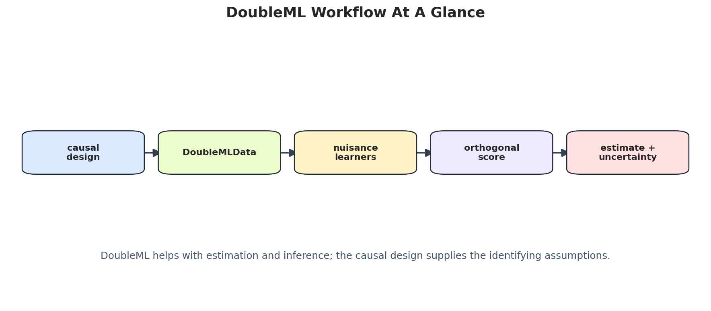

DoubleML is the tutorial track for orthogonal scores, sample splitting, flexible nuisance models, and transparent treatment-effect inference.

<figure class="course-page-figure">

<figcaption>Figure: DoubleML workflow diagram showing how nuisance learning, orthogonalization, cross-fitting, and inference fit together (adapted from Tutorial 00: Environment And Library Tour).</figcaption>
</figure>

## Tutorial Sequence

<article class="notebook-guide-item">

<a href="../../notebooks/tutorials/doubleml/00_environment_and_library_tour.html" data-site-path="notebooks/tutorials/doubleml/00_environment_and_library_tour.html">00: Environment And Library Tour</a>

Introduces DoubleML, orthogonal-score workflows, synthetic PLR examples, and the package objects used throughout the tutorial series.

</article>
<article class="notebook-guide-item">

<a href="../../notebooks/tutorials/doubleml/01_dml_theory_orthogonalization_and_cross_fitting.html" data-site-path="notebooks/tutorials/doubleml/01_dml_theory_orthogonalization_and_cross_fitting.html">01: DML Theory, Orthogonalization, And Cross-Fitting</a>

Builds the mathematical intuition for orthogonal scores and cross-fitting, then shows why nuisance-model errors should have limited first-order impact.

</article>
<article class="notebook-guide-item">

<a href="../../notebooks/tutorials/doubleml/02_data_backend_doublemldata_and_design_setup.html" data-site-path="notebooks/tutorials/doubleml/02_data_backend_doublemldata_and_design_setup.html">02: Data Backend, DoubleMLData, And Design Setup</a>

Explains how to prepare treatment, outcome, controls, instruments, and sample-selection variables so the statistical design is visible before fitting models.

</article>
<article class="notebook-guide-item">

<a href="../../notebooks/tutorials/doubleml/03_partially_linear_regression_plr.html" data-site-path="notebooks/tutorials/doubleml/03_partially_linear_regression_plr.html">03: Partially Linear Regression PLR</a>

Covers the PLR model for continuous outcomes and treatments, including residualization, nuisance prediction quality, score behavior, and repeated-split stability.

</article>
<article class="notebook-guide-item">

<a href="../../notebooks/tutorials/doubleml/04_partially_linear_iv_pliv.html" data-site-path="notebooks/tutorials/doubleml/04_partially_linear_iv_pliv.html">04: Partially Linear IV PLIV</a>

Adds instrumental variables to the partially linear setup, highlighting first-stage relevance, exclusion-risk stress tests, and residualized IV diagnostics.

</article>
<article class="notebook-guide-item">

<a href="../../notebooks/tutorials/doubleml/05_interactive_regression_model_irm.html" data-site-path="notebooks/tutorials/doubleml/05_interactive_regression_model_irm.html">05: Interactive Regression Model IRM</a>

Introduces binary-treatment IRM estimation, propensity modeling, outcome nuisance functions, overlap diagnostics, and ATE interpretation.

</article>
<article class="notebook-guide-item">

<a href="../../notebooks/tutorials/doubleml/06_interactive_iv_model_iivm.html" data-site-path="notebooks/tutorials/doubleml/06_interactive_iv_model_iivm.html">06: Interactive IV Model IIVM</a>

Uses binary instruments and treatment take-up to estimate local causal effects, with attention to compliance, weak instruments, and exclusion violations.

</article>
<article class="notebook-guide-item">

<a href="../../notebooks/tutorials/doubleml/07_difference_in_differences_did.html" data-site-path="notebooks/tutorials/doubleml/07_difference_in_differences_did.html">07: Difference-In-Differences DID</a>

Connects DoubleML to panel-style causal designs by combining DiD logic, nuisance adjustment, parallel-trend diagnostics, and treatment-effect estimation.

</article>
<article class="notebook-guide-item">

<a href="../../notebooks/tutorials/doubleml/08_sample_selection_models.html" data-site-path="notebooks/tutorials/doubleml/08_sample_selection_models.html">08: Sample Selection Models</a>

Studies missing or selectively observed outcomes, separating selection mechanisms from treatment effects and auditing positivity for observed samples.

</article>
<article class="notebook-guide-item">

<a href="../../notebooks/tutorials/doubleml/09_regression_discontinuity_design_rdd.html" data-site-path="notebooks/tutorials/doubleml/09_regression_discontinuity_design_rdd.html">09: Regression Discontinuity Design RDD</a>

Frames sharp and fuzzy RDD as local causal designs, with running-score plots, bandwidth sensitivity, first-stage checks, and local effect interpretation.

</article>
<article class="notebook-guide-item">

<a href="../../notebooks/tutorials/doubleml/10_learners_hyperparameters_and_tuning.html" data-site-path="notebooks/tutorials/doubleml/10_learners_hyperparameters_and_tuning.html">10: Learners, Hyperparameters, And Tuning</a>

Shows how learner choice and tuning affect nuisance quality, bias, and stability, with emphasis on tuning safely within the DML workflow.

</article>
<article class="notebook-guide-item">

<a href="../../notebooks/tutorials/doubleml/11_sample_splitting_cross_fitting_and_repeated_cross_fitting.html" data-site-path="notebooks/tutorials/doubleml/11_sample_splitting_cross_fitting_and_repeated_cross_fitting.html">11: Sample Splitting, Cross-Fitting, And Repeated Cross-Fitting</a>

Explores fold construction, group-aware splitting, repeated cross-fitting, and why data reuse can quietly damage causal inference.

</article>
<article class="notebook-guide-item">

<a href="../../notebooks/tutorials/doubleml/12_inference_bootstrap_and_confidence_bands.html" data-site-path="notebooks/tutorials/doubleml/12_inference_bootstrap_and_confidence_bands.html">12: Inference, Bootstrap, And Confidence Bands</a>

Moves from point estimates to uncertainty, covering confidence intervals, bootstrap distributions, simultaneous bands, multiple testing, and coverage diagnostics.

</article>
<article class="notebook-guide-item">

<a href="../../notebooks/tutorials/doubleml/13_sensitivity_analysis_for_unobserved_confounding.html" data-site-path="notebooks/tutorials/doubleml/13_sensitivity_analysis_for_unobserved_confounding.html">13: Sensitivity Analysis For Unobserved Confounding</a>

Uses sensitivity bounds and benchmark scenarios to ask how strong unobserved confounding would need to be to change the substantive conclusion.

</article>
<article class="notebook-guide-item">

<a href="../../notebooks/tutorials/doubleml/14_heterogeneous_treatment_effects_gate_cate_blp.html" data-site-path="notebooks/tutorials/doubleml/14_heterogeneous_treatment_effects_gate_cate_blp.html">14: Heterogeneous Treatment Effects, GATE, CATE, And BLP</a>

Introduces heterogeneous-effect summaries in DoubleML, including GATE, CATE, and best linear projection views for segment-level decision support.

</article>
<article class="notebook-guide-item">

<a href="../../notebooks/tutorials/doubleml/15_policy_learning_weighted_ates_quantiles_and_cvar.html" data-site-path="notebooks/tutorials/doubleml/15_policy_learning_weighted_ates_quantiles_and_cvar.html">15: Policy Learning, Weighted ATEs, Quantiles, And CVaR</a>

Translates treatment-effect estimates into policy comparisons, weighted estimands, distributional targets, and downside-risk measures such as CVaR.

</article>
<article class="notebook-guide-item">

<a href="../../notebooks/tutorials/doubleml/16_custom_scores_and_advanced_api.html" data-site-path="notebooks/tutorials/doubleml/16_custom_scores_and_advanced_api.html">16: Custom Scores And Advanced API</a>

Looks under the hood at custom scores, advanced API patterns, and how to extend DoubleML while preserving the statistical logic of the estimator.

</article>
<article class="notebook-guide-item">

<a href="../../notebooks/tutorials/doubleml/17_common_pitfalls_diagnostics_and_reporting.html" data-site-path="notebooks/tutorials/doubleml/17_common_pitfalls_diagnostics_and_reporting.html">17: Common Pitfalls, Diagnostics, And Reporting</a>

Reviews leakage, weak overlap, poor nuisance fits, invalid splits, fragile inference, and reporting checks that make DML results defensible.

</article>
<article class="notebook-guide-item">

<a href="../../notebooks/tutorials/doubleml/18_end_to_end_doubleml_case_study.html" data-site-path="notebooks/tutorials/doubleml/18_end_to_end_doubleml_case_study.html">18: End-To-End DoubleML Case Study</a>

Completes the series with a full applied workflow from design setup and nuisance modeling through estimates, diagnostics, sensitivity, and final communication.

</article>

