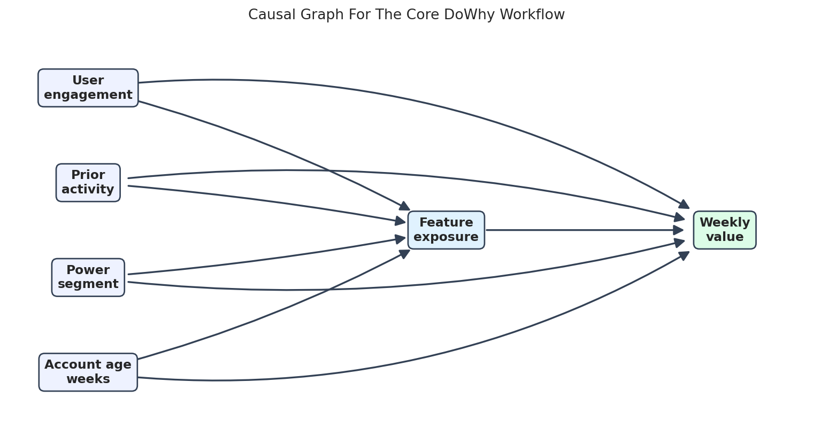
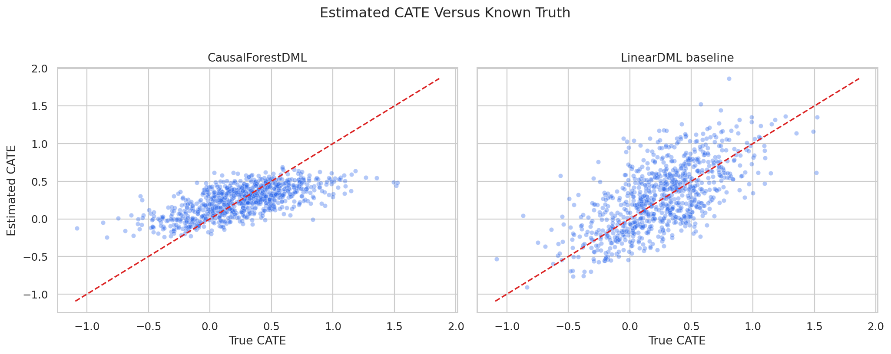
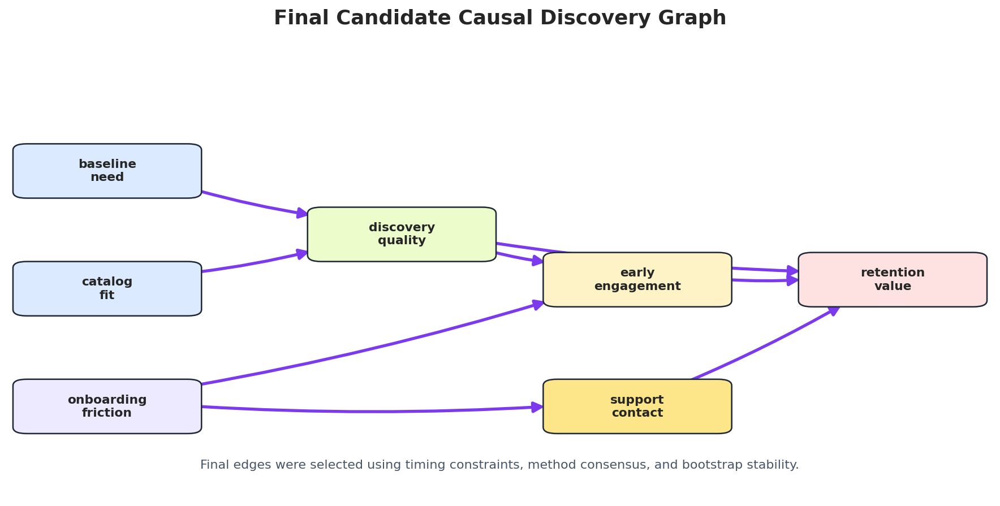

These tutorials complement the lecture notes by turning the main ideas into package-level workflows. Each track walks through a Python ecosystem in depth, with code, diagnostics, mathematical context, assumptions, and practical interpretation for applied causal and decision-science work.

If you notice an error or typo, please let me know.

## Tutorial Series {.visually-hidden-page-heading}

::: {.module-course-list}
::: {.course-preview-row}
### [DoWhy Tutorial Series](dowhy/)

<figure class="course-preview-figure">

<figcaption>Figure: A DoWhy causal workflow DAG used to connect assumptions, identification, estimation, and refutation (adapted from Tutorial 01: Core Workflow, From Question To Refutation).</figcaption>
</figure>

::: {.course-preview-copy}
DoWhy supports causal workflows that start by making assumptions explicit. The tutorials show how to define causal graphs, identify estimands, estimate effects, run refutation checks, work with graphical causal models, and report evidence responsibly.

::: {.project-methods}
**Keywords:** causal graphs, estimands, identification, backdoor adjustment, propensity methods, refuters, graphical causal models, mediation, anomaly attribution, and responsible causal reporting.
:::
:::
:::

::: {.course-preview-row}
### [EconML Tutorial Series](econml/)

<figure class="course-preview-figure">

<figcaption>Figure: CATE recovery diagnostics from the EconML causal forest workflow, showing how heterogeneous-effect estimates are evaluated (adapted from Tutorial 04: CausalForestDML).</figcaption>
</figure>

::: {.course-preview-copy}
Causal machine learning workflow for heterogeneous treatment effects: CATE estimation, orthogonal learners, causal forests, meta-learners, policy learning, interval thinking, and treatment targeting.

::: {.project-methods}
**Keywords:** CATE estimation, double machine learning, orthogonal learners, causal forests, DRLearner, meta-learners, policy learning, treatment targeting, SHAP, and uncertainty intervals.
:::
:::
:::

::: {.course-preview-row}
### [DoubleML Tutorial Series](doubleml/)

<figure class="course-preview-figure">

<figcaption>Figure: DoubleML workflow diagram showing how nuisance learning, orthogonalization, cross-fitting, and inference fit together (adapted from Tutorial 00: Environment And Library Tour).</figcaption>
</figure>

::: {.course-preview-copy}
Double and debiased machine learning workflow for valid inference with flexible nuisance models: orthogonal scores, cross-fitting, sample splitting, sensitivity analysis, and policy evaluation.

::: {.project-methods}
**Keywords:** orthogonal scores, cross-fitting, PLR, PLIV, IRM, IIVM, difference-in-differences, RDD, sensitivity analysis, heterogeneous effects, policy learning, and valid inference.
:::
:::
:::

::: {.course-preview-row}
### [causal-learn Tutorial Series](causal-learn/)

<figure class="course-preview-figure">

<figcaption>Figure: A final candidate graph from the causal-learn case study, used to discuss discovery, constraints, stability, and interpretation (adapted from Tutorial 16: End-To-End Causal Discovery Case Study).</figcaption>
</figure>

::: {.course-preview-copy}
Causal discovery workflow for learning candidate graph structure: PC, FCI, CD-NOD, GES, LiNGAM, functional causal models, time-series discovery, stability checks, and limitations.

::: {.project-methods}
**Keywords:** causal discovery, DAGs, CPDAGs, PAGs, conditional independence tests, PC, FCI, CD-NOD, GES, LiNGAM, functional causal models, time-series discovery, and stability checks.
:::
:::
:::
:::
